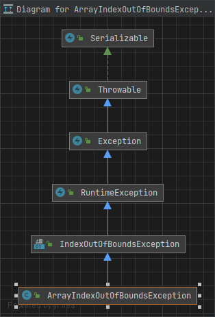
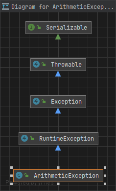

# CheckPoint Answers

## Table of Contents

* [12.2 Exception-Handling Overview](#122-exception-handling-overview)
  * [12.2.1](#1221)
  * [12.2.2](#1222)
  * [12.2.3](#1223)
  * [12.2.4](#1224)
  * [12.2.5](#1225)
  * [12.2.6](#1226)
* [12.3 Exception Types](#123-exception-types)
  * [12.3.1](#1231)
  * [12.3.2](#1232)
  * [12.3.3](#1233-)
* [12.4 Declaring, Throwing, and Catching Exceptions](#124-declaring-throwing-and-catching-exceptions)
  * [12.4.1](#1241)
  * [12.4.2](#1242)
  * [12.4.3](#1243)
  * [12.4.4](#1244)
  * [12.4.5](#1245)
  * [12.4.6](#1246)
  * [12.4.7](#1247)
  * [12.4.8](#1248)
  * [12.4.9](#1249)
  * [12.4.10](#12410)
  * [12.4.11](#12411)
* [12.5 The `finally` Clause](#125-the-finally-clause)
  * [12.5.1](#1251)
* [12.6 When to Use Exceptions](#126-when-to-use-exceptions)
  * [12.6.1](#1261)
* [12.7 Rethrowing Exceptions](#127-rethrowing-exceptions)
  * [12.7.1](#1271)
* [12.8 Chained Exceptions](#128-chained-exceptions)
  * [12.8.1](#1281)
* [12.9 Defining Custom Exception Classes](#129-defining-custom-exception-classes)
  * [12.9.1](#1291)
  * [12.9.2](#1292)
* [12.10 The `File` Class](#1210-the-file-class)
  * [12.10.1](#12101)
  * [12.10.2](#12102)
  * [12.10.3](#12103)
* [12.11 File Input and Output](#1211-file-input-and-output)
  * [12.11.1](#12111)
  * [12.11.2](#12112)
  * [12.11.3](#12113)
  * [12.11.4](#12114)
  * [12.11.5](#12115)
  * [12.11.6](#12116)
  * [12.11.7](#12117)
  * [12.11.8](#12118)
* [12.12 Reading Data from the Web](#1212-reading-data-from-the-web)
  * [12.12.1](#12121)
* [12.13 Case Study: Web Crawler](#1213-case-study-web-crawler)
  * [12.13.1](#12131)
  * [12.13.2](#12132)

## 12.2 Exception-Handling Overview

### 12.2.1

> What is the advantage of using exception handling?

Exception handling in Java provides several advantages:

1. Error handling: Exception handling allows you to gracefully handle errors and exceptional situations that may occur during the execution of a program. Instead of abruptly terminating the program, exceptions can be caught, handled, and appropriate actions can be taken.

2. Program flow control: Exception handling enables you to control the flow of your program even in the presence of errors. By catching and handling exceptions, you can guide the program's execution path and ensure that necessary actions are taken to recover from errors.

3. Debugging and troubleshooting: Exception handling helps in identifying and locating errors by providing detailed information about the exception that occurred. The exception stack trace provides valuable information about the sequence of method calls leading up to the error, aiding in debugging and troubleshooting.

Here are some code examples demonstrating the use of exception handling in Java:

Example 1: Handling a specific exception

```java
try {
    // Code that may throw a specific exception
    FileReader fileReader = new FileReader("myfile.txt");
    // Perform operations with the file
} catch (FileNotFoundException e) {
    // Handle the exception
    System.out.println("File not found: " + e.getMessage());
    // Take appropriate actions, such as logging or displaying an error message
}
```

Example 2: Handling multiple exceptions

```java
try {
    // Code that may throw different exceptions
    int[] numbers = {1, 2, 3};
    System.out.println(numbers[5]); // Accessing an out-of-bounds index
    int result = 10 / 0; // Division by zero
} catch (ArrayIndexOutOfBoundsException e) {
    System.out.println("Array index out of bounds: " + e.getMessage());
} catch (ArithmeticException e) {
    System.out.println("Arithmetic exception: " + e.getMessage());
}
```

Example 3: Using finally block

```java
try {
    // Code that may throw an exception
    // ...
} catch (SomeException e) {
    // Handle the exception
    // ...
} finally {
    // Code that always executes, regardless of whether an exception occurred or not
    // Commonly used for cleanup tasks, such as closing resources
    // ...
}
```

In these examples, exceptions are caught using the `try-catch` block, allowing you to handle specific exceptions or multiple exceptions separately. The `finally` block is used to execute code that should always run, whether an exception occurred or not, such as resource cleanup.

[Back to Table of Contents 👆](#table-of-contents)

### 12.2.2

> Which of the following statements will throw an exception?
> ```java
> System.out.println(1 / 0);   // => Exception in thread "main" java.lang.ArithmeticException: / by zero
> System.out.println(1.0 / 0); // => Infinity 
> ```

[Back to Table of Contents 👆](#table-of-contents)

### 12.2.3

> Point out the problem in the following code. Does the code throw any exceptions?
> ```java
> long value = Long.MAX_VALUE + 1;
> System.out.println(value);
> ```

No, the code does not throw exception but long data type overflow is happening.  
This can be demonstrated using the following code snippet:

```java
public class Main {
   public static void main(String[] args) {
      long value = Long.MAX_VALUE + 1;
      System.out.println(value); // Long.MIN_VALUE
      System.out.println("value == Long.MIN_VALUE = " + (value == Long.MIN_VALUE)); // true

      try {
         Math.addExact(Long.MAX_VALUE, 1);
      } catch (Exception e) {
         System.out.println(e); // => java.lang.ArithmeticException: long overflow
      }
   }
}
```

[Back to Table of Contents 👆](#table-of-contents)

### 12.2.4

> What does the JVM do when an exception occurs?
> How do you catch an exception?

When an exception occurs in a Java application, the Java Virtual Machine (JVM) takes the following steps:

1. The JVM halts the normal flow of program execution and looks for an appropriate exception handler to handle the exception. If the exception is not caught and handled, the JVM's default behavior is to terminate the program and print a stack trace of the exception.

2. The JVM starts unwinding the method call stack, searching for an exception handler in the current method. If it doesn't find one, it moves up the call stack to the calling method and continues this process until it finds an appropriate exception handler or reaches the top-level of the program.

3. Once an appropriate exception handler is found, the JVM transfers control to the corresponding `catch` block associated with the caught exception. The `catch` block contains code to handle the exception, such as error recovery, logging, or displaying an error message.

To catch an exception in Java, you use the `try-catch` block. The `try` block contains the code that may potentially throw an exception. The `catch` block follows the `try` block and specifies the type of exception to catch and the code to be executed when that exception occurs.

Here's an example demonstrating how to catch an exception:

```java
try {
    // Code that may throw an exception
    int result = divide(10, 0); // Example division by zero
    System.out.println("Result: " + result);
} catch (ArithmeticException e) {
    // Code to handle the caught exception
    System.out.println("An arithmetic exception occurred: " + e.getMessage());
}
```

In this example, the `try` block contains the division operation, which may result in an `ArithmeticException` if the divisor is zero. If such an exception occurs, the program flow transfers to the `catch` block, which handles the exception by printing an error message. You can catch multiple exceptions by chaining multiple `catch` blocks with different exception types.

By catching exceptions, you can handle them gracefully, perform appropriate error handling actions, and allow the program to continue executing rather than terminating abruptly.

[Back to Table of Contents 👆](#table-of-contents)

### 12.2.5

> What is the output of the following code?
> ```java
> public class Test {
>     public static void main(String[] args) {
>         try {
>             int value = 30;
>             if (value < 40)
>                 throw new Exception("value is too small");
>         } catch (Exception ex) {
>             System.out.println(ex.getMessage());
>         }
>         System.out.println("Continue after the catch block");
>     }
> }
> ``` 
> What would be the output if the line
> `int value = 30;` were changed to `int value = 50;`

```text
value is too small
Continue after the catch block
```

```text
Continue after the catch block
```

[Back to Table of Contents 👆](#table-of-contents)

### 12.2.6

> Show the output of the following code:
> (a)
>
> ```java
> public class Test {
>     public static void main(String[] args) {
>         for (int i = 0; i < 2; i++) {
>             System.out.print(i + " ");
>             try {
>                 System.out.println(1 / 0);
>             } catch (Exception ex) {
>             }
>         }
>     }
> }
> ```
> (b)
>
> ```java
> public class Test {
>     public static void main(String[] args) {
>         try {
>             for (int i = 0; i < 2; i++) {
>                 System.out.print(i + " ");
>                 System.out.println(1 / 0);
>             }
>         } catch (Exception ex) {
>         }
>     }
> }
> ```

(a)

```text
0 1
```

(b)

```text
0
```

[Back to Table of Contents 👆](#table-of-contents)

## 12.3 Exception Types

### 12.3.1

> Describe the Java Throwable class, its subclasses, and the types of exceptions.

In Java, the `Throwable` class is the root class of all exceptions and errors. It serves as the base class for exception handling in Java and provides common functionality and properties shared by all exception classes. `Throwable` has two direct subclasses: `Exception` and `Error`.

1. `Exception` class: The `Exception` class represents exceptional conditions that can occur during the execution of a program but can be anticipated and handled. It is further divided into two main categories:

   a. Checked Exceptions: Checked exceptions are exceptions that must be declared or caught by the calling method. These exceptions are checked at compile-time, ensuring that they are handled appropriately. Examples include `IOException`, `SQLException`, and `ClassNotFoundException`.

   b. Runtime Exceptions: Runtime exceptions are exceptions that do not need to be declared or caught explicitly. They are unchecked exceptions that occur due to programming errors or unexpected conditions within the code itself. Examples include `NullPointerException`, `ArrayIndexOutOfBoundsException`, and `IllegalArgumentException`. Runtime exceptions are typically caused by issues that could have been prevented through better coding practices or input validation.

2. `Error` class: The `Error` class represents serious, unrecoverable problems that typically occur at the JVM level or in the underlying system. These errors are generally caused by issues outside the control of the application and usually cannot be caught or recovered from. Examples include `OutOfMemoryError`, `StackOverflowError`, and `LinkageError`.

It's important to note that both `Exception` and `Error` classes inherit from the `Throwable` class, allowing for a unified approach to handling exceptions and errors in Java. Additionally, developers can create custom exception classes by extending either `Exception` or one of its subclasses, allowing for more specific and tailored exception handling within their applications.

By categorizing exceptions into checked exceptions, runtime exceptions, and errors, Java provides a flexible and structured approach to exception handling, enabling developers to handle exceptional situations appropriately and promote robust and reliable code.

[Back to Table of Contents 👆](#table-of-contents)

### 12.3.2

> What RuntimeException will the following programs throw, if any?
>
> ```java
> // (a)
> public class Test {
>     public static void main(String[] args) {
>         System.out.println(1 / 0); // => ArithmaticException divison by zero
>     }
> }
> 
> // (b)
> public class Test {
>     public static void main(String[] args) {
>         int[] list = new int[5];      // [0, 0, 0, 0, 0]
>                                       //  0  1  2  3  4
>         System.out.println(list[5]); // => ArrayIndexOutOfBounds there is not element t index 5
>     }
> }
> 
> // (c)
> public class Test {
>     public static void main(String[] args) {
>         String s = "abc";                // "abc"
>                                          //  012
>         System.out.println(s.charAt(3)); // => StringIndexOutOfBounds, there is not character at index 4
>     }
> }
> 
> // (d)
> public class Test {
>     public static void main(String[] args) {
>         Object o = new Object();
>         String d = (String) o; // => ClassCastException, actual object created at runtime is Object which is superclass of String
>     }
> }
> 
> // (e)
> public class Test {
>     public static void main(String[] args) {
>         Object o = null;
>         System.out.println(o.toString()); // => java.lang.NullPointerException: Cannot invoke "Object.toString()" because "o" is null
>     }
> }
> 
> // (f)
> public class Test {
>     public static void main(String[] args) {
>         System.out.println(1.0 / 0); // => java.lang.ArithmeticException: / by zero
>     }
> }
> ```

[Back to Table of Contents 👆](#table-of-contents)

### 12.3.3

> What is a checked exception and what is an unchecked exception?

In Java, exceptions are categorized into two types: checked exceptions and unchecked exceptions. These categories determine how exceptions are handled in the code and whether they need to be explicitly declared or caught.

1. Checked Exceptions:
   Checked exceptions are exceptions that must be declared or caught by the calling method. These exceptions are checked at compile-time, meaning the Java compiler ensures that they are handled appropriately. If a method can throw a checked exception, it must either catch and handle the exception using a `try-catch` block or declare the exception in its method signature using the `throws` keyword.

Checked exceptions are typically used to represent exceptional conditions that can occur during the execution of a program, such as I/O errors, network connectivity issues, or database access problems. By forcing the developer to handle or declare these exceptions, checked exceptions promote more robust error handling and help prevent the propagation of unhandled exceptions throughout the codebase.

Examples of checked exceptions in Java include `IOException`, `SQLException`, `ClassNotFoundException`, and `FileNotFoundException`.

1. Unchecked Exceptions:
   Unchecked exceptions, also known as runtime exceptions, are exceptions that do not need to be declared or caught explicitly. Unlike checked exceptions, unchecked exceptions are not checked at compile-time. These exceptions occur due to programming errors or unexpected conditions within the code itself.

Runtime exceptions are generally caused by issues that could have been prevented through better coding practices or input validation. They are not required to be explicitly caught or declared because they are typically indicative of logical errors or exceptional conditions that should be fixed during development.

Examples of runtime exceptions in Java include `NullPointerException`, `ArrayIndexOutOfBoundsException`, `IllegalArgumentException`, and `ArithmeticException`.

The distinction between checked and unchecked exceptions allows developers to differentiate between exceptional conditions that are anticipated and should be handled explicitly (checked exceptions) and exceptional conditions that indicate programming errors or unexpected situations (unchecked exceptions). By adhering to this distinction, developers can write more robust and maintainable code that gracefully handles expected exceptional conditions while allowing runtime exceptions to propagate and potentially indicate bugs that need fixing.

[Back to Table of Contents 👆](#table-of-contents)

## 12.4 Declaring, Throwing, and Catching Exceptions

### 12.4.1

> What is the purpose of declaring exceptions?  
> How do you declare an exception and where?  
> Can you declare multiple exceptions in a method header?

1. The purpose of declaring exceptions:
   Declaring exceptions serves two main purposes:
   a) It indicates that a method may potentially encounter exceptional circumstances or errors during its execution.
   b) It specifies that the method does not handle the exceptions internally and expects the calling code to handle or propagate them.

By declaring exceptions, you make the calling code aware of the possible exceptional situations that can occur while invoking the method.  
This promotes code reliability and enables proper error handling and recovery strategies.

2. How to declare an exception and where:
   Exceptions are declared in the method signature using the `throws` keyword.  
   The `throws` clause is used to specify the types of exceptions that a method can throw.

The syntax for declaring an exception in a method signature is as follows:

```java
modifier returnType methodName(parameters) throws ExceptionType1, ExceptionType2, ... {
    // method body
}
```

Here, `ExceptionType1`, `ExceptionType2`, etc., are the types of exceptions that the method can throw.  
You can specify multiple exceptions by separating them with commas.

Example:

```java
public void readFile(String fileName) throws FileNotFoundException, IOException {
    // method body
}
```

In the above example, the `readFile` method declares that it can potentially throw a `FileNotFoundException` or an `IOException`.

3. Declaring multiple exceptions in a method header:
   Yes, it is possible to declare multiple exceptions in a method header. You can list multiple exception types separated by commas in the `throws` clause of the method signature.

Example:

```java
public void processData() throws IOException, SQLException {
    // method body
}
```

In the above example, the `processData` method declares that it can potentially throw an `IOException` or a `SQLException`. If either of these exceptions occurs within the method, they will need to be handled or propagated by the calling code.

[Back to Table of Contents 👆](#table-of-contents)

### 12.4.2

> How do you throw an exception? Can you throw multiple exceptions in one throw statement?

1. How to throw an exception:
   To throw an exception in Java, you use the `throw` keyword followed by an instance of an exception class. This raises an exception and interrupts the normal flow of execution.

Syntax for throwing an exception:

```java
throw exceptionObject;
```

Here, `exceptionObject` is an instance of any exception class that extends the `Throwable` class or one of its subclasses.

Example:

```java
public int divide(int dividend, int divisor) {
    if (divisor == 0) {
        throw new ArithmeticException("Cannot divide by zero");
    }

    return dividend / divisor;
}
```

In the above example, if the `divisor` is zero, the method throws an `ArithmeticException` with a custom error message.

2. Throwing multiple exceptions in one `throw` statement:
   No, you cannot throw multiple exceptions in a single `throw` statement. The `throw` statement is used to throw a single exception at a time. If you need to throw multiple exceptions, you need to use separate `throw` statements for each exception.

Example:

```java
public void process(int value) {
    if (value < 0) {
        throw new IllegalArgumentException("Invalid value");
    }

    if (value > 100) {
        throw new RuntimeException("Value out of range");
    }

    // rest of the method
}
```

In the above example, depending on the value provided, the method throws either an `IllegalArgumentException` or a `RuntimeException`. Each exception is thrown using a separate `throw` statement.

[Back to Table of Contents 👆](#table-of-contents)

### 12.4.3

> What is the keyword throw used for? What is the keyword throws used for?

1. The keyword `throw` is used for:
   The `throw` keyword is used to explicitly throw an exception in Java. It is followed by an instance of an exception class or one of its subclasses. When the `throw` statement is executed, it interrupts the normal flow of execution and transfers the control to the nearest suitable exception handler.

Example:

```java
throw new IllegalArgumentException("Invalid input");
```

In the above example, the `throw` keyword is used to throw an instance of the "IllegalArgumentException" class with a custom error message.

2. The keyword `throws` is used for:
   The `throws` keyword is used in a method signature to declare that the method may potentially throw one or more types of exceptions. It is used to specify the exception types that the method can throw, allowing the caller to handle or propagate those exceptions.

Example:

```java
public void readFile(String fileName) throws IOException{
    // method body
}
```

In the above example, the `throws` keyword is used to declare that the "readFile" method may throw an "IOException". It informs the caller that this exception needs to be handled or declared to be thrown by the calling code.

Note: The `throws` keyword is used in the method signature, while the `throw` keyword is used within the method body to actually throw an exception.

[Back to Table of Contents 👆](#table-of-contents)

### 12.4.4

> Suppose `statement2` causes an exception in the following try-catch block:
> ```java
> try {
>     statement1;
>     statement2;
>     statement3;
> } catch (Exception1 ex1) { } 
> catch (Exception2 ex2) { }
> statement4;
> ```
> Answer the following questions:
> ■ Will `statement3` be executed?
> ■ If the exception is not caught, will `statement4` be executed?
> ■ If the exception is caught in the catch block, will `statement4` be executed?

To answer the questions regarding the given try-catch block:

■ Will statement3 be executed?
No, statement3 will not be executed if an exception occurs at statement2. Once an exception is thrown, the program flow jumps directly to the corresponding catch block, bypassing any remaining statements within the try block.

■ If the exception is not caught, will statement4 be executed?
Yes, if the exception is not caught by any of the catch blocks, statement4 will be executed. After the try-catch block, the program continues its normal execution flow.

■ If the exception is caught in the catch block, will statement4 be executed?
It depends on how the catch block handles the exception. If the catch block successfully handles the exception and does not throw any other exception, statement4 will be executed. However, if the catch block rethrows the exception or throws a new exception, statement4 will not be executed.

Example:

```java
try {
    // statement1;
    // statement2;
    // statement3;
} catch (Exception1 ex1) {
    // Handle Exception1
    // statement4; (executed if no further exception is thrown)
} catch (Exception2 ex2) {
    // Handle Exception2
    // statement4; (executed if no further exception is thrown)
} finally {
    // Optional finally block
}
```

In the example above, statement3 will not be executed if an exception occurs at statement2. If the caught exception is successfully handled within the catch block, statement4 will be executed. However, if an exception is thrown or rethrown within the catch block, statement4 will not be executed. The finally block, if present, will always be executed regardless of whether an exception is caught or not.

[Back to Table of Contents 👆](#table-of-contents)

### 12.4.5

> What is displayed when running the following program?
> ```java
> public class Test {
>    public static void main(String[] args) {
>       try {
>          int[] list = new int[10];
>          System.out.println("list[10] is " + list[10]); 
>       } catch (ArithmeticException ex) {
>          System.out.println("ArithmeticException");
>       } catch (RuntimeException ex) {
>          System.out.println("RuntimeException"); // => RuntimeException, because ArrayIndexOutOfBoundsException is subclass of RuntimeException
>       } catch (Exception ex) {
>          System.out.println("Exception");
>       }
>    }
> }
> ```

```text
RuntimeException
```



[Back to Table of Contents 👆](#table-of-contents)

### 12.4.6

> What is displayed when running the following program?
> ```java
> public class Test {
>    public static void main(String[] args) {
>       try {
>          method();
>          System.out.println("After the method call");
>       } catch (ArithmeticException ex) {
>          System.out.println("ArithmeticException");
>       } catch (RuntimeException ex) {
>          System.out.println("RuntimeException");
>       } catch (Exception e) {
>          System.out.println("Exception");
>       }
>    }
> 
>    static void method() throws Exception {
>       System.out.println(1 / 0);
>    }
> }
> ```

```text
ArithmeticException
```



[Back to Table of Contents 👆](#table-of-contents)

### 12.4.7

> What is displayed when running the following program?
> ```java
> public class Test {
>    public static void main(String[] args) {
>       try {
>          method();
>          System.out.println("After the method call"); // => (2) After the method call
>       } catch (RuntimeException ex) {
>          System.out.println("RuntimeException in main");
>       } catch (Exception ex) {
>          System.out.println("Exception in main");
>       }
>    }
> 
>    static void method() throws Exception {
>       try {
>          String s = "abc";
>          System.out.println(s.charAt(3));
>       } catch (RuntimeException ex) {
>          System.out.println("RuntimeException in method()"); // => (1) RuntimeException in method()
>       } catch (Exception ex) {
>          System.out.println("Exception in method()");
>       }
>    }
> }
> ```

```text
RuntimeException in method()
After the method call
```

[Back to Table of Contents 👆](#table-of-contents)

### 12.4.8

> What does the method `getMessage(): String` do?

The method `getMessage(): String` is a method defined in the `Throwable` class, the base class for all exceptions in Java. It is used to retrieve the message associated with an exception object.

When an exception is thrown, it can be accompanied by a message that provides additional information about the exceptional situation. This message is typically passed as an argument to the exception's constructor.

The `getMessage()` method allows you to access this message and retrieve it as a string. It returns the message associated with the exception object as a string.

Example:

```java
try {
    // Some code that may throw an exception
} catch (Exception ex) {
    String errorMessage = ex.getMessage();
    System.out.println("Error Message: " + errorMessage);
}
```

In the example above, if an exception is caught, the `getMessage()` method is called on the exception object `ex` to retrieve the associated message. This message can then be used for logging, displaying error information, or any other desired purpose.

[Back to Table of Contents 👆](#table-of-contents)

### 12.4.9

> What does the method `printStackTrace()` do?

The method `printStackTrace()` is a method defined in the `Throwable` class in Java. It is used to print the stack trace information of an exception object to the standard error stream (usually the console).

The stack trace provides valuable information about the sequence of method calls that led to the occurrence of the exception. It includes the class names, method names, and line numbers of the code that was executing when the exception was thrown. This information helps in understanding the flow of execution and diagnosing the cause of the exception.

The `printStackTrace()` method outputs the stack trace information in a human-readable format. It prints each element of the stack trace, starting from the method that threw the exception and going back to the initial method call.

Example:

```java
try {
    // Some code that may throw an exception
} catch (Exception ex) {
    ex.printStackTrace();
}
```

In the example above, if an exception is caught, the `printStackTrace()` method is called on the exception object `ex`. This will print the stack trace information of the exception to the console. It can be helpful for debugging purposes, as it shows the exact path the program took before encountering the exception.

[Back to Table of Contents 👆](#table-of-contents)

### 12.4.10

> Does the presence of a try-catch block impose overhead when no exception occurs?

Yes, the presence of a try-catch block can impose some overhead even when no exception occurs.

In Java, the `try-catch` block introduces a mechanism for handling exceptions. When the code inside the try block encounters an exception, the execution flow is transferred to the corresponding catch block. However, even when no exception occurs, the JVM (Java Virtual Machine) still needs to perform some additional bookkeeping operations to support the exception handling mechanism.

These operations include setting up the necessary data structures to handle exceptions, tracking the mappings between the try block and the catch block, and maintaining information about the call stack. These tasks incur a small amount of overhead in terms of performance and memory usage.

However, it's important to note that the overhead of a `try-catch` block is typically minimal and negligible in most cases. The benefits of using proper exception handling to handle exceptional conditions far outweigh the small overhead introduced by the `try-catch` block.

It is generally recommended to use `try-catch` blocks wherever exceptions can occur, even if it means incurring a small overhead. The robustness and maintainability provided by proper exception handling outweigh the potential performance impact.

[Back to Table of Contents 👆](#table-of-contents)

### 12.4.11

> Correct a compile error in the following code:
> ```java
> public void m(int value) {
>     if (value < 40) {
>         throw new Exception("value is too small");
>     }
> }
> ```

Unhandled exception: java.lang.Exception:

```java
public void m(int value) throws Exception {
    if (value < 40) {
        throw new Exception("value is too small");
    }
}
```

[Back to Table of Contents 👆](#table-of-contents)

## 12.5 The `finally` Clause

### 12.5.1

> Suppose you run the following code:
>
> ```java
> class Test {
>    public static void main(String[] args) throws Exception2 {
>       m();
>       statement7;
>    }
> 
>    public static void m() {
>       try {
>          statement1;
>          statement2;
>          statement3;
>       } catch (Exception1 ex1) {
>          statement4;
>       } finally {
>          statement5;
>       }
>       statement6;
>    }
> }
> ```
>
> Answer the following questions:  
> a. If no exception occurs, which statements are executed?  
> b. If statement2 throws an exception of type Exception1, which statements are executed?  
> c. If statement2 throws an exception of type Exception2, which statements are executed?  
> d. If statement2 throws an exception that is neither Exception1 nor Exception2, which statements are executed?

a. If no exception occurs, which statements are executed?

- `statement1`, `statement2`, `statement3`, `statement5`, and `statement6` are executed.

b. If `statement2` throws an exception of type `Exception1`, which statements are executed?

- `statement1`, `statement2`, `statement4`, `statement5`, and `statement6` are executed.

c. If `statement2` throws an exception of type `Exception2`, which statements are executed?

- `statement1`, `statement2`, `statement5`, and an uncaught exception `Exception2` will be propagated to the caller of `m()`.

d. If `statement2` throws an exception that is neither `Exception1` nor `Exception2`, which statements are executed?

- `statement1`, `statement2`, `statement5`, and an uncaught exception (other than `Exception1` or `Exception2`) will be propagated to the caller of `m()`.

Please note that these answers still depend on the actual code implementation and the exception handling mechanisms applied.

[Back to Table of Contents 👆](#table-of-contents)

## 12.6 When to Use Exceptions

### 12.6.1

> The following method checks whether a string is a numeric string:
>
> ```java
> class IsNumericRunner {
>     public static boolean isNumeric(String token) {
>         try {
>             Double.parseDouble(token);
>             return true;
>         } catch (java.lang.NumberFormatException ex) {
>             return false;
>         }
>     }
> }
> ```
>
> Is it correct? Rewrite it without using exceptions.

The provided implementation using exceptions to check whether a string is a numeric string is correct. However, if you prefer to rewrite it without using exceptions, you can use regular expressions to achieve the same result. Here's an alternative implementation:

```java
class IsNumericRunner {
   public static boolean isNumeric(String token) {
      return token.matches("-?\\d+(\\.\\d+)?");
   }
}
```

In this version, the `matches` method is used with a regular expression pattern that checks if the string matches a numeric format. The pattern `"-?\\d+(\\.\\d+)?"` allows for an optional minus sign (`-`) at the beginning, followed by one or more digits (`\\d+`). It also allows for an optional decimal part (`\\.\\d+`), represented by a period (`.`) followed by one or more digits.

[Back to Table of Contents 👆](#table-of-contents)

## 12.7 Rethrowing Exceptions

### 12.7.1

> Suppose that statement2 may cause an exception in the following code:
>
> ```java
> class RethrowRunner {
>    void m() {
>       try {
>          statement1;
>          statement2;
>          statement3;
>       } catch (Exception1 ex1) {
>       } catch (Exception2 ex2) {
>          throw ex2;
>       } finally {
>          statement4;
>       }
>       statement5;
>    }
> }
> ```
>
> Answer the following questions:  
> a. If no exception occurs, will statement4 or statement5 be executed?  
> b. If the exception is of type Exception1, will statement4 or statement5 be executed?  
> c. If the exception is of type Exception2, will statement4 or statement5 be executed?  
> d. If the exception is not Exception1 nor Exception2, will statement4 or statement5 be executed?

a. If no exception occurs, both `statement4` and `statement5` will be executed. The control will flow through the try block, and since no exception is thrown, it will proceed to the `finally` block, where `statement4` will be executed. After that, the control will continue to `statement5`.

b. If the exception is of type `Exception1`, both `statement4` and `statement5` will be executed. The `Exception1` will be caught by the first catch block, and `statement4` will be executed. Since there is no rethrow in the catch block, the control will proceed to the `finally` block, where `statement4` will be executed. After that, the control will continue to `statement5`.

c. If the exception is of type `Exception2`, only `statement4` will be executed. The `Exception2` will be caught by the second catch block, and `statement4` will be executed. Since there is a rethrow of `ex2` in the catch block, the control will not continue to the `finally` block or `statement5`.

d. If the exception is neither `Exception1` nor `Exception2`, only `statement4` will be executed. Since there is no matching catch block for the exception, the exception will not be caught within the try-catch structure. The control will proceed directly to the `finally` block, where `statement4` will be executed. After that, the control will not continue to `statement5`.

[Back to Table of Contents 👆](#table-of-contents)

## 12.8 Chained Exceptions

### 12.8.1

> What would be the output if line 16 of Listing 12.9 is replaced by the following line?  
> `throw new Exception("New info from method1");`
> ```java
> package chapter_12_exception_handling_and_text_io;
> 
> public class ChainedExceptionDemo {
>    public static void main(String[] args) {
>       try {
>          method1();
>       } catch (Exception ex) {
>          ex.printStackTrace();
>       }
>    }
> 
>    public static void method1() throws Exception {
>       try {
>          method2();
>       } catch (Exception ex) {
>          throw new Exception("New info from method1", ex); // LINE 16
>       }
>    }
> 
>    public static void method2() throws Exception {
>       throw new Exception("New info from method2");
>    }
> }
> ```

Without replacing LINE 16 we get the following stack trace error:

```text
java.lang.Exception: New info from method1
	at chapter_12_exception_handling_and_text_io.ChainedExceptionDemo.method1(ChainedExceptionDemo.java:16)
	at chapter_12_exception_handling_and_text_io.ChainedExceptionDemo.main(ChainedExceptionDemo.java:6)
Caused by: java.lang.Exception: New info from method2
	at chapter_12_exception_handling_and_text_io.ChainedExceptionDemo.method2(ChainedExceptionDemo.java:22)
	at chapter_12_exception_handling_and_text_io.ChainedExceptionDemo.method1(ChainedExceptionDemo.java:14)
	... 1 more

```

Replacing LINE 16 using the `Exception(String)` constructor rather then the `Exception(String, Throwable)` constructor:

```text
java.lang.Exception: New info from method2
	at chapter_12_exception_handling_and_text_io.ChainedExceptionDemo.method1(ChainedExceptionDemo.java:17)
	at chapter_12_exception_handling_and_text_io.ChainedExceptionDemo.main(ChainedExceptionDemo.java:6)
```

[Back to Table of Contents 👆](#table-of-contents)

## 12.9 Defining Custom Exception Classes

### 12.9.1

> How do you define a custom exception class?

To define a custom exception class in Java, you need to create a new class that extends either the `Exception` class or one of its subclasses. Here are the steps to define a custom exception class:

1. Create a new Java class file for your custom exception. For example, you can create a file named `CustomException.java`.

2. Define your custom exception class by extending the appropriate base class. For example, if you want to create a checked exception, you can extend the `Exception` class. If you want to create an unchecked exception, you can extend the `RuntimeException` class. Here's an example of a custom
   **checked** exception:

   ```java
   public class CustomException extends Exception {
       // constructor(s) and additional methods
   }
   ```

   And here's an example of a custom **unchecked** exception:

   ```java
   public class CustomException extends RuntimeException {
       // constructor(s) and additional methods
   }
   ```

   Note: It's important to provide appropriate constructors and additional methods in your custom exception class, depending on your requirements.

3. You can add constructors and additional methods to your custom exception class as needed. For example, you might want to provide constructors that accept specific parameters or define methods for additional functionality.

4. To use your custom exception, you can throw it using the `throw` keyword, catch it using a try-catch block, or declare it in the throws clause of a method signature.

Here's an example of how you can use a custom exception:

```java
public class CustomExceptionExample {
   public static void main(String[] args) {
      try {
         throw new CustomException("This is a custom exception");
      } catch (CustomException ex) {
         System.out.println("Custom exception caught: " + ex.getMessage());
      }
   }
}
```

In this example, we create an instance of the `CustomException` and throw it within a try block. Then, we catch the exception in the `catch` block and handle it accordingly.

[Back to Table of Contents 👆](#table-of-contents)

### 12.9.2

> Suppose that the `setRadius` method throws the `InvalidRadiusException` defined in Listing 12.10. What is displayed when running the following program?
> ```java
> public class Test {
>     public static void main(String[] args) {
>         try {
>             method();
>             System.out.println("After the method call");
>         } catch (RuntimeException ex) {
>             System.out.println("RuntimeException in main");
>         } catch (Exception ex) {
>             System.out.println("Exception in main");
>         }
>     }
> 
>     static void method() throws Exception {
>         try {
>             Circle c1 = new Circle(1);
>             c1.setRadius(−1);
>             System.out.println(c1.getRadius());
>         } catch (RuntimeException ex) {
>             System.out.println("RuntimeException in method()");
>         } catch (Exception ex) {
>             System.out.println("Exception in method()");
>             throw ex;
>         }
>     }
> }
> ```
> ```java
> package utils.exceptions;
> 
> public class InvalidRadiusException extends Exception {
> 
>    private double radius;
> 
>    public InvalidRadiusException(double radius) {
>       super("Invalid radius " + radius);
>       this.radius = radius;
>    }
> 
>    public double getRadius() {
>       return radius;
>    }
> }
> ```

```text
Exception in method()
Exception in main
```

[Back to Table of Contents 👆](#table-of-contents)

## 12.10 The `File` Class

### 12.10.1

> What is wrong about creating a `File` object using the following statement? `new File("c:\book\test.dat");`

The statement `new File("c:\book\test.dat");` is incorrect because it uses a single backslash `\` as the directory separator.  
In Java, backslash is an escape character, and to represent a literal backslash in a string, you need to escape it with another backslash.  
So the correct statement should be `new File("c:\\book\\test.dat");` to represent the file path correctly.

Alternatively, you can also use a forward slash `/` as the directory separator, which works on all platforms, including Windows.  
So another correct statement would be `new File("c:/book/test.dat");`.

Here's the corrected code example:

```java
import java.io.File;

public class FileExample {
   public static void main(String[] args) {
      // Create a File object for the file test.dat in the directory c:\book
      File file = new File("c:\\book\\test.dat");

      // Use the File object as needed
      // ...
   }
}
```

We can use the `File.separator` or `File.separatorChar` constants from the Java API to obtain the platform-specific file separator.

- `File.separator` is a `String` constant that represents the platform-specific default name-separator character. It is a system-dependent implementation of the directory separator.
- `File.separatorChar` is a `char` constant that represents the platform-specific default name-separator character as a single character.

Here's an example of using `File.separator` to create a `File` object:

```java
import java.io.File;

public class FileExample {
   public static void main(String[] args) {
      // Create a File object for the file test.dat in the directory c:\book
      File file = new File("c:" + File.separator + "book" + File.separator + "test.dat");

      // Use the File object as needed
      // ...
   }
}
```

Using `File.separator` ensures that the correct directory separator is used based on the underlying platform,
**making your code more platform-independent**.

Note: Starting from Java 7, there is also a `Path` API available in the `java.nio.file` package, which provides more flexible and powerful file path operations. If you are working with Java 7 or later, it is recommended to use the `Path` API instead of `File` for file path manipulation.

[Back to Table of Contents 👆](#table-of-contents)

### 12.10.2

> How do you check whether a file already exists?   
> How do you delete a file?  
> How do you rename a file?  
> Can you find the file size (the number of bytes) using the File class?  
> How do you create a directory?

To check whether a file already exists, you can use the `exists()` method of the `File` class.  
It returns `true` if the file or directory exists, and `false` otherwise. Here's an example:

```java
import java.io.File;

public class FileExample {
    public static void main(String[] args) {
        File file = new File("test.txt");

        if (file.exists()) {
            System.out.println("File exists");
        } else {
            System.out.println("File does not exist");
        }
    }
}
```

To delete a file, you can use the `delete()` method of the `File` class.  
It returns `true` if the file was successfully deleted, and `false` otherwise. Here's an example:

```java
import java.io.File;

public class FileExample {
    public static void main(String[] args) {
        File file = new File("test.txt");

        if (file.delete()) {
            System.out.println("File deleted successfully");
        } else {
            System.out.println("Failed to delete the file");
        }
    }
}
```

To rename a file, you can use the `renameTo()` method of the `File` class.  
It renames the file to the specified name represented by another `File` object.  
It returns `true` if the renaming was successful, and `false` otherwise. Here's an example:

```java
import java.io.File;

public class FileExample {
    public static void main(String[] args) {
        File file = new File("test.txt");
        File newFile = new File("newtest.txt");

        if (file.renameTo(newFile)) {
            System.out.println("File renamed successfully");
        } else {
            System.out.println("Failed to rename the file");
        }
    }
}
```

Yes, you can find the size of a file (number of bytes) using the `length()` method of the `File` class. It returns the size of the file in
**bytes** as a `long` value. Here's an example:

```java
import java.io.File;

public class FileExample {
   public static void main(String[] args) {
      File file = new File("test.txt");
      long fileSize = file.length();
      System.out.println("File size: " + fileSize + " bytes");
   }
}
```

To create a directory, you can use the `mkdir()` or `mkdirs()` method of the `File` class.  
The `mkdir()` method creates a single directory, while the `mkdirs()` method creates a directory and any necessary parent directories.  
Both methods return `true` if the directory was created successfully, and `false` otherwise. Here's an example:

```java
import java.io.File;

public class FileExample {
   public static void main(String[] args) {
      File directory = new File("mydir");
      if (directory.mkdir()) {
         System.out.println("Directory created successfully");
      } else {
         System.out.println("Failed to create the directory");
      }

      // Create a directory with parent directories
      File nestedDirectory = new File("nested/dir");
      if (nestedDirectory.mkdirs()) {
         System.out.println("Nested directory created successfully");
      } else {
         System.out.println("Failed to create the nested directory");
      }
   }
}
```

These are some common operations you can perform with the `File` class in Java.  
Remember to handle any potential exceptions that may occur when working with files and directories, such as `IOException`.

[Back to Table of Contents 👆](#table-of-contents)

### 12.10.3

> Can you use the `File` class for I/O?  
> Does creating a `File` object create a file on the disk?

No, the `File` class in Java does not provide direct I/O operations. It represents a file or directory path and provides methods to
**query information about the file or directory**, **manipulate file metadata**, and **perform basic
file operations like checking existence**, **deleting**, **renaming**, etc.  
However, it **does not provide methods for reading or writing file contents**.

To perform I/O operations on a file, you need to use other classes such as `InputStream`, `OutputStream`, `Reader`, or `Writer` along with the appropriate subclasses like `FileInputStream`, `FileOutputStream`, `FileReader`, or `FileWriter`. These classes provide the necessary functionality to read from or write to a file.

Creating a `File` object **does not automatically create a file on the disk**.  
The `File` class represents a file or directory path, but it does not physically create the file.  
It is merely a **representation of the file's location
** and provides methods to interact with the file system.

If you need to create a file on the disk, you would typically use the appropriate I/O classes mentioned earlier to create and write content to the file. For example, you can use `FileOutputStream` or `FileWriter` along with a `File` object to create and write to a file.

```java
import java.io.File;
import java.io.FileOutputStream;
import java.io.IOException;

public class FileExample {
    public static void main(String[] args) {
        File file = new File("test.txt");

        try (FileOutputStream fileOutputStream = new FileOutputStream(file)) {
            fileOutputStream.write("Hello, world!".getBytes());
            System.out.println("File created and written successfully");
        } catch (IOException e) {
            System.out.println("Failed to create or write to the file");
            e.printStackTrace();
        }
    }
}
```

test.txt:

```text
Hello, world!
```

In this example, the `FileOutputStream` is used to create a file with the specified `File` object (`test.txt`) and write data to it.

[Back to Table of Contents 👆](#table-of-contents)

## 12.11 File Input and Output

### 12.11.1

> How do you create a `PrintWriter` to write data to a file?  
> What is the reason to declare `throws Exception` in the main method in Listing 12.13, WriteData.java?  
> What would happen if the `close()` method were not invoked in Listing 12.13?

1. To create a `PrintWriter` to write data to a file, you can use the `PrintWriter` constructor that takes a `File` object as an argument. Here's an example:

```java
import java.io.File;
import java.io.FileNotFoundException;
import java.io.PrintWriter;

public class PrintWriterExample {
   public static void main(String[] args) {
      // Create a new file
      File file = new File("output.txt");

      try (PrintWriter writer = new PrintWriter(file)) {
         // Write data to the file
         writer.println("Hello, World!");
         writer.printf("Value: %d\n", 42);
         writer.println("This is a new line");

         // Flush the writer to ensure data is written to the file immediately
         writer.flush();

         // Check if the file exists
         if (file.exists()) {
            System.out.println("File exists: " + file.getName());

            // Check if the file is readable
            if (file.canRead()) {
               System.out.println("File is readable.");
            }

            // Check if the file is writable
            if (file.canWrite()) {
               System.out.println("File is writable.");
            }

            // Get the absolute path of the file
            String absolutePath = file.getAbsolutePath();
            System.out.println("Absolute path: " + absolutePath);

            // Get the length of the file in bytes
            long fileSize = file.length();
            System.out.println("File size: " + fileSize + " bytes");
         } else {
            System.out.println("File does not exist.");
         }
      } catch (FileNotFoundException e) {
         System.out.println("File not found: " + e.getMessage());
      }
   }
}
```

This code creates a `PrintWriter` object `output` that is associated with the file "output.txt".  
You can then use methods like `print()` and `println()` on the `output` object to write data to the file.

2. The reason for declaring `throws Exception` in the `main` method in Listing 12.13, `WriteData.java`, is to indicate that the method may throw an exception of type `Exception` or its subclasses. In this case, it is done to handle any potential I/O errors that may occur when working with files. By declaring `throws Exception`, the
   **responsibility of handling the exception is passed to the caller** of the `main` method.

3. If the `close()` method were not invoked in Listing 12.13, the file `scores.txt` would not be properly closed and any buffered data that has not been written to the file would be lost. It is important to invoke the `close()` method on the `PrintWriter` object to ensure that
   **all data is written to the file and any system resources associated with the file are released
   properly**. Failing to close the file can result in data loss or resource leaks.

[Back to Table of Contents 👆](#table-of-contents)

### 12.11.2

> Show the contents of the file temp.txt after the following program is executed:

```java
public class Test {
   public static void main(String[] args) throws Exception {
      java.io.PrintWriter output = new java.io.PrintWriter("temp.txt");
      output.printf("amount is %f %e\r\n", 32.32, 32.32);
      output.printf("amount is %5.4f %5.4e\r\n", 32.32, 32.32);
      output.printf("%6b\r\n", (1 > 2));
      output.printf("%6s\r\n", "Java");
      output.close();
   }
}
```

temp.txt:

```text
amount is 32.320000 3.232000e+01
amount is 32.3200 3.2320e+01
 false
  Java
```

[Back to Table of Contents 👆](#table-of-contents)

### 12.11.3

> Rewrite the code in the preceding question using a `try-with-resources` syntax.

```java
import java.io.FileNotFoundException;
import java.io.PrintWriter;

public class TryWithResources {
   public static void main(String[] args) {
      try (PrintWriter output = new PrintWriter("temp.txt")) {
         output.printf("amount is %f %e\r\n", 32.32, 32.32);
         output.printf("amount is %5.4f %5.4e\r\n", 32.32, 32.32);
         output.printf("%6b\r\n", (1 > 2));
         output.printf("%6s\r\n", "Java");
      } catch (FileNotFoundException e) {
         throw new RuntimeException(e);
      }
   }
}
```

[Back to Table of Contents 👆](#table-of-contents)

### 12.11.4

> How do you create a `Scanner` to read data from a file?  
> What is the reason to define `throws Exception` in the main method in Listing 12.15, ReadData.java?  
> What would happen if the `close()` method were not invoked in Listing 12.15?

To create a `Scanner` to read data from a file, you need to provide the `Scanner` constructor with a `File` object that represents the file you want to read. Here's an example:

```java
import java.io.File;
import java.io.FileNotFoundException;
import java.util.Scanner;

public class ReadData {
   public static void main(String[] args) {
      File file = new File("scores.txt");

      try {
         // Create a Scanner for the file
         Scanner input = new Scanner(file);

         // Read data from the file
         while (input.hasNext()) {
            String firstName = input.next();
            String mi = input.next();
            String lastName = input.next();
            int score = input.nextInt();
            System.out.println(firstName + " " + mi + " " + lastName + " " + score);
         }

         // Close the Scanner
         input.close();
      } catch (FileNotFoundException e) {
         System.out.println("File not found: " + e.getMessage());
      }
   }
}
```

In this example, we create a `File` object representing the file "scores.txt".  
We then pass this `File` object to the `Scanner` constructor to create a `Scanner` instance for reading data from the file.  
We can then use the `Scanner` methods (`next()`, `nextInt()`, etc.) to read data from the file.

The reason for defining `throws Exception` in the `main` method of Listing 12.15, ReadData.java, is to indicate that the method can potentially throw any checked exception.  
By declaring `throws Exception`, the method is indicating that it does not handle the exceptions internally and expects the calling code to handle them or propagate them further.

In this particular case, the `main` method declares `throws Exception` to handle any potential checked exceptions that may occur when working with files, such as `FileNotFoundException`.  
This allows the calling code (usually the Java runtime) to handle the exceptions appropriately.

If the `close()` method were not invoked in Listing 12.15, the `Scanner` object would remain open and the underlying file resource would not be properly released.  
This can lead to resource leaks and potential issues.

Closing the `Scanner` using the `close()` method ensures that any system resources associated with the `Scanner` (such as file handles) are released and closed properly.  
It is good practice to always close resources like `Scanner` when you are done using them to free up system resources and avoid potential issues.

[Back to Table of Contents 👆](#table-of-contents)

### 12.11.5

> What will happen if you attempt to create a `Scanner` for a nonexistent file?  
> What will happen if you attempt to create a `PrintWriter` for an existing file?

If you attempt to create a `Scanner` for a nonexistent file, a `FileNotFoundException` will be thrown.  
This exception is a checked exception and must be handled either by using a `try-catch` block or by declaring `throws FileNotFoundException` in the method signature.

Here's an example that demonstrates the scenario:

```java
import java.io.File;
import java.io.FileNotFoundException;
import java.util.Scanner;

public class FileScannerExample {
   public static void main(String[] args) {
      File file = new File("nonexistent.txt");

      try {
         Scanner scanner = new Scanner(file);
         // Perform operations with the scanner
         scanner.close();
      } catch (FileNotFoundException e) {
         System.out.println("File not found: " + e.getMessage());
      }
   }
}
```

In this example, the file "nonexistent.txt" does not exist.  
When attempting to create a `Scanner` for this file, a `FileNotFoundException` is thrown.  
The catch block catches the exception and prints an error message indicating that the file was not found.

If you attempt to create a `PrintWriter` for an existing file, the existing file will be truncated, meaning its contents will be deleted, and a new empty file will be created. The `PrintWriter` will be associated with this new empty file.

Here's an example that demonstrates the scenario:

```java
import java.io.File;
import java.io.FileNotFoundException;
import java.io.PrintWriter;

public class FilePrintWriterExample {
   public static void main(String[] args) {
      File file = new File("existing.txt");

      try {
         PrintWriter printWriter = new PrintWriter(file);
         // Perform operations with the print writer
         printWriter.close();
      } catch (FileNotFoundException e) {
         System.out.println("File not found: " + e.getMessage());
      }
   }
}
```

In this example, the file "existing.txt" already exists. When creating a `PrintWriter` for this file, the existing file will be truncated, and a new empty file will be created. Any existing content in the file will be deleted. If you want to append to an existing file instead of truncating it, you can pass a second argument `true` to the `PrintWriter` constructor, like this: `new PrintWriter(file, true)`.

[Back to Table of Contents 👆](#table-of-contents)

### 12.11.6

> Is the line separator the same on all platforms? What is the line separator on Windows?

No, the line separator is not the same on all platforms. The line separator represents the characters used to separate lines of text in a file, and it can vary depending on the operating system.

On Windows, the line separator is typically a combination of two characters: carriage return (`\r`) followed by a line feed (`\n`).  
This is commonly represented as `"\r\n"`. So, when a new line is created in a file on Windows, it is terminated by these two characters.

On Unix-based systems (including Linux and macOS), the line separator is typically just a single character, which is the line feed (`\n`).  
So, on Unix-based systems, a new line in a file is terminated by `\n` alone.

Java provides a system-independent way to retrieve the line separator specific to the platform the code is running on.  
You can use the `System.lineSeparator()` method to obtain the line separator.  
This method returns a string containing the line separator sequence for the current platform.

Here's an example that demonstrates the usage of `System.lineSeparator()`:

```java
public class LineSeparatorExample {
   public static void main(String[] args) {
      String lineSeparator = System.lineSeparator();
      System.out.println("Line separator: " + lineSeparator);
   }
}
```

When you run this code on Windows, it will output:

```text
Line separator: 
```

On Unix-based systems, it will output:

```text
Line separator: 
```

The output will reflect the line separator sequence used by the respective platform.

In addition to using `System.lineSeparator()`, you can also use `System.getProperty("line.separator")` to retrieve the line separator specific to the platform.  
Similarly, you can use `System.getProperty("path.separator")` to retrieve the path separator and `System.getProperty("file.separator")` to retrieve the file separator.

Here's an example that demonstrates the usage of these properties:

```java
public class SystemPropertiesExample {
   public static void main(String[] args) {
      String lineSeparator = System.getProperty("line.separator");
      String pathSeparator = System.getProperty("path.separator");
      String fileSeparator = System.getProperty("file.separator");

      System.out.println("Line separator: " + lineSeparator);
      System.out.println("Path separator: " + pathSeparator);
      System.out.println("File separator: " + fileSeparator);
   }
}
```

When you run this code, it will output the line separator, path separator, and file separator specific to your platform.

[Back to Table of Contents 👆](#table-of-contents)

### 12.11.7

> Suppose you enter 45 57.8 789, then press the Enter key. Show the contents of the variables after the following code is executed:
> ```java
> Scanner input = new Scanner(System.in);
> int intValue = input.nextInt();
> double doubleValue = input.nextDouble();
> String line = input.nextLine();
> ```

```text
intValue = 45
doubleValue = 57.8
line = " 789"
```

The `nextInt()` method reads the integer value `45` from the input.
The `nextDouble()` method reads the double value `57.8` from the input.
The `nextLine()` method reads the remaining part of the input line, which is `" 789"`. This includes the leading whitespace before `789`.

[Back to Table of Contents 👆](#table-of-contents)

### 12.11.8

> Suppose you enter 45, press the Enter key, enter 57.8, press the Enter key, and enter 789, press the Enter key.  
> Show the contents of the variables after the following code is executed:
> ```java
> Scanner input = new Scanner(System.in);
> int intValue = input.nextInt();
> double doubleValue = input.nextDouble();
> String line = input.nextLine();
> ```

The contents of the variables would be as follows:

```text
intValue = 45
doubleValue = 57.8
line = ""
```

The `nextInt()` method reads the integer value `45` from the input.
The `nextDouble()` method reads the double value `57.8` from the input.
Since the `nextLine()` method is called after `nextDouble()`, it reads the remaining part of the line after `57.8`, which is just the line separator.  
Therefore, the `line` variable is assigned an empty string `""`.

[Back to Table of Contents 👆](#table-of-contents)

## 12.12 Reading Data from the Web

### 12.12.1

> How do you create a `Scanner` object for reading text from a URL?

To create a `Scanner` object for reading text from a URL, you can use the `openStream()` method of the `URL` class in Java. Here's an example:

```java
import java.io.IOException;
import java.net.URL;
import java.util.Scanner;

public class ReadFromURL {
   public static void main(String[] args) {
      try {
         // Create a URL object
         URL url = new URL("https://www.youtube.com/");

         // Open a connection and create a Scanner object for reading
         try (Scanner scanner = new Scanner(url.openStream())) {
            // Read data from the URL
            while (scanner.hasNextLine()) {
               String line = scanner.nextLine();
               System.out.println(line);
            }
         }
      } catch (IOException e) {
         e.printStackTrace();
      }
   }
}
```

In the above example, we create a `URL` object representing the URL from which we want to read text.  
Then, we use the `openStream()` method to open a connection to the URL and obtain an `InputStream`.  
We pass this `InputStream` to the `Scanner` constructor, which allows us to read the text from the URL using methods like `hasNextLine()` and `nextLine()`.  
Finally, we close the `Scanner` to release any resources associated with it.

[Back to Table of Contents 👆](#table-of-contents)

## 12.13 Case Study: Web Crawler

### 12.13.1

> Before a URL is added to listOfPendingURLs, line 25 checks whether it has been traversed. Is it possible that listOfPendingURLs contains duplicate URLs?  
> If so, give an example.

Yes, it is possible for `listOfPendingURLs` to contain duplicate URLs. The check on line 25 ensures that a URL is not added to `listOfPendingURLs` if it has already been traversed (`listOfTraversedURLs` contains the URL).

However, the check on line 25 does not prevent duplicate URLs from being added to `listOfPendingURLs` if they are encountered multiple times during the crawling process. Consider the following example:

```text
listOfPendingURLs: [https://example.com/page1, https://example.com/page2, https://example.com/page1]
```

In this case, the URL `https://example.com/page1` is present twice in `listOfPendingURLs`, even though it has already been traversed.  
The check on line 25 will prevent it from being processed again, but it does not prevent duplicates from initially being added.

To prevent duplicate URLs from being added to `listOfPendingURLs`, you can use a `Set` data structure instead of a `List`.  
A `Set` automatically **enforces uniqueness
**, ensuring that each URL is added only once. Here's an updated version of the code snippet:

```java
import java.net.URL;
import java.util.HashSet;
import java.util.Set;
import java.util.Scanner;

public class WebCrawler {
   // Rest of the code...

   public static void crawler(String startingURL) {
      Set<String> setOfPendingURLs = new HashSet<>();
      List<String> listOfTraversedURLs = new ArrayList<>();

      setOfPendingURLs.add(startingURL);
      while (!setOfPendingURLs.isEmpty() && listOfTraversedURLs.size() <= URL_PROCESSED) {
         String urlString = setOfPendingURLs.iterator().next();
         setOfPendingURLs.remove(urlString);
         listOfTraversedURLs.add(urlString);
         System.out.println("Crawl " + urlString);

         for (String s : getSubURLs(urlString)) {
            if (!listOfTraversedURLs.contains(s) && !setOfPendingURLs.contains(s))
               setOfPendingURLs.add(s);
         }
      }
   }

   // Rest of the code...
}
```

By using a `Set` (in this case, `HashSet`) for `listOfPendingURLs`, duplicate URLs will automatically be eliminated, ensuring that each URL is processed only once.

[Back to Table of Contents 👆](#table-of-contents)

### 12.13.2

> Simplify the code in lines 20-28 as follows:
> 1. Delete lines 20 and 28;
> 2. Add an additional condition !listOfPendingURLs.contains(s) to the if statement in line 25.
> 3. Write the complete new code for the while loop in lines 17-29. Does this revision work?

Certainly! Here's the revised code for the while loop in lines 17-29:

```java
while (!listOfPendingURLs.isEmpty() && listOfTraversedURLs.size() <= URL_PROCESSED) {
    String urlString = listOfPendingURLs.remove(0);
    listOfTraversedURLs.add(urlString);
    System.out.println("Crawl " + urlString);

    for (String s: getSubURLs(urlString)) {
        if (!listOfTraversedURLs.contains(s) && !listOfPendingURLs.contains(s))
            listOfPendingURLs.add(s);
    }
}
```

With this revision, we no longer need lines 20 and 28. The condition `!listOfPendingURLs.contains(s)` has been added to the if statement in line 25 to ensure that duplicate URLs are not added to `listOfPendingURLs`.

This revised code works correctly. It crawls through the URLs, adds untraversed and non-duplicate URLs to `listOfPendingURLs`, and continues until either `listOfPendingURLs` is empty or the number of traversed URLs reaches the limit specified by `URL_PROCESSED`.

[Back to Table of Contents 👆](#table-of-contents)
