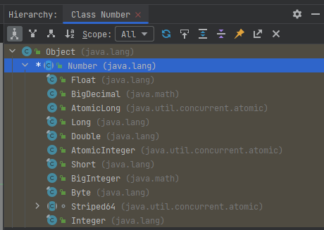
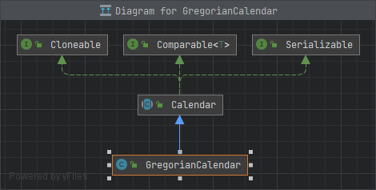
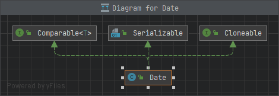

# CheckPoint Answers

## Table of Contents

* [13.2 Abstract Classes](#132-abstract-classes)
  * [13.2.1](#1321)
  * [13.2.2](#1322)
  * [13.2.3](#1323)
* [13.3 Case Study: The Abstract `Number` Class](#133-case-study-the-abstract-number-class)
  * [13.3.1](#1331)
  * [13.3.2](#1332)
  * [13.3.3](#1333)
  * [13.3.4](#1334)
  * [13.3.5](#1335)
* [13.4 Case Study: `Calendar` and `GregorianCalendar`](#134-case-study-calendar-and-gregoriancalendar)
  * [13.4.1](#1341)
  * [13.4.2](#1342)
  * [13.4.3](#1343)
  * [13.4.4](#1344)
* [13.5 Interfaces](#135-interfaces)
  * [13.5.1](#1351)
  * [13.5.2](#1352)
  * [13.5.3](#1353)
  * [13.5.4](#1354)
* [13.6 The `Comparable` Interface](#136-the-comparable-interface)
  * [13.6.1](#1361)
  * [13.6.2](#1362)
  * [13.6.3](#1363)
  * [13.6.4](#1364)
  * [13.6.5](#1365)
  * [13.6.6](#1366)
  * [13.6.7](#1367)
* [13.7 The `Cloneable` Interface](#137-the-cloneable-interface)
  * [13.7.1](#1371)
  * [13.7.2](#1372)
  * [13.7.3](#1373)
  * [13.7.4](#1374)
  * [13.7.5](#1375)
  * [13.7.6](#1376)
* [13.8 Interfaces vs. Abstract Classes](#138-interfaces-vs-abstract-classes)
  * [13.8.1](#1381)
  * [13.8.2](#1382)
  * [13.8.3](#1383)
* [13.9 Case Study: The `Rational` Class](#139-case-study-the-rational-class)
  * [13.9.1](#1391)
  * [13.9.2](#1392)
  * [13.9.3](#1393)
  * [13.9.4](#1394)
  * [13.9.5](#1395)
  * [13.9.6](#1396)
  * [13.9.7](#1397)
* [13.10 Class-Design Guidelines](#1310-class-design-guidelines)
  * [13.10.1](#13101)

## 13.2 Abstract Classes

<p align="right">
  <a href="#table-of-contents">Back to Table of Contents 👆</a>
</p>

### 13.2.1

> Which of the following classes defines a legal abstract class?
> ```java
> class A {
>     abstract void unfinished() { }
> }
> // (a)
> 
> public class abstract A {
>     abstract void unfinished();
> }
> // (b)
> 
> class A {
>     abstract void unfinished();
> }
> 
> // (c)
> 
> abstract class A {
>     protected void unfinished();
> }
> // (d)
> 
> abstract class A {
>     abstract void unfinished();
> }
> 
> // (e)
> 
> abstract class A {
>     abstract int unfinished();
> }
> // (f)
> ```

The correct options for defining a legal abstract class are (e) and (f):

(e)

```java
abstract class A {
    abstract void unfinished();
}
```

(f)

```java
abstract class A {
    abstract int unfinished();
}
```

In option (e), the class is declared as `abstract`, and it contains an abstract method without an implementation.

In option (f), the class is declared as `abstract`, and it contains an abstract method with a return type of `int`.

Options (a), (b), (c), and (d) are not legal definitions of an abstract class. Option (a) has an abstract method with a method body, option (b) has an incorrect placement of `abstract` and `public` keywords, option (c) has an abstract method with no access specifier, and option (d) has an abstract method with the access specifier `protected` but no `abstract` keyword.

<p align="right">
  <a href="#table-of-contents">Back to Table of Contents 👆</a>
</p>

### 13.2.2

> The `getArea()` and `getPerimeter()` methods may be removed from the `GeometricObject` class.  
> What are the benefits of defining `getArea()` and `getPerimeter()` as abstract methods in the `GeometricObject` class?

Defining the `getArea()` and `getPerimeter()` methods as abstract methods in the `GeometricObject` class provides several benefits:

1. Polymorphism: By defining these methods as abstract in the `GeometricObject` class, you can enforce that all subclasses of `GeometricObject` must provide their own implementation for calculating the area and perimeter. This allows you to treat objects of different geometric shapes uniformly, as instances of the `GeometricObject` class, and invoke the `getArea()` and `getPerimeter()` methods on them without knowing their specific types. This promotes code reusability and enhances polymorphism.

2. Consistent Interface: Abstract methods provide a contract that all subclasses must adhere to. By specifying the `getArea()` and `getPerimeter()` methods in the `GeometricObject` class as abstract, you ensure that all subclasses of `GeometricObject` must implement these methods. This enforces a consistent interface across all subclasses, making it easier to work with different geometric objects in a unified manner.

3. Forced Implementation: Abstract methods act as placeholders that force subclasses to provide their own implementation. By making `getArea()` and `getPerimeter()` abstract, you require each subclass to implement these methods according to its specific shape and calculation logic. This ensures that all subclasses provide meaningful implementations for calculating area and perimeter, avoiding potential mistakes or omissions.

Overall, defining `getArea()` and `getPerimeter()` as abstract methods in the `GeometricObject` class promotes code structure, encourages consistent behavior across subclasses, and enables polymorphic usage of geometric objects.

<p align="right">
  <a href="#table-of-contents">Back to Table of Contents 👆</a>
</p>

### 13.2.3

> True or false?  
> a. An abstract class can be used just like a nonabstract class except that you cannot use the `new` operator to create an instance from the abstract class.  
> b. An abstract class can be extended.  
> c. A subclass of a nonabstract superclass cannot be `abstract`.  
> d. A subclass cannot override a concrete method in a superclass to define it as `abstract`.  
> e. An `abstract` method must be nonstatic.

a. An abstract class can be used just like a nonabstract class except that you cannot use the `new` operator to create an instance from the abstract class.

True. Abstract classes can have constructors, fields, and non-abstract methods just like non-abstract classes. However, you cannot directly create an instance of an abstract class using the `new` operator. Abstract classes are meant to be extended by subclasses, and you can create instances of the subclasses.

b. An abstract class can be extended.

True. An abstract class is designed to be extended by subclasses. Subclasses of an abstract class inherit its fields and methods and can provide their own implementations for the abstract methods. By extending an abstract class, a subclass can specialize and add functionality to the abstract class.

c. A subclass of a nonabstract superclass cannot be `abstract`.

False. A subclass of a nonabstract superclass can be declared as abstract. However, if a subclass extends a nonabstract superclass, it must implement all the abstract methods inherited from the superclass. Failure to implement the abstract methods will result in a compilation error.

d. A subclass cannot override a concrete method in a superclass to define it as `abstract`.

False. A subclass can override a concrete (non-abstract) method in a superclass and redefine it as abstract. This allows the subclass to provide its own abstract implementation of the method, forcing its subclasses to provide their own specific implementations. However, the subclass itself must be declared as abstract if it contains any abstract methods.

e. An `abstract` method must be nonstatic.

True. Abstract methods are by definition nonstatic. They are meant to be overridden and implemented by subclasses, so they cannot be static. Static methods are associated with the class itself and do not depend on the specific instance of the class, whereas abstract methods require instantiation and polymorphic behavior through subclassing.

Overall, the answers are:
a. True
b. True
c. False
d. False
e. True

<p align="right">
  <a href="#table-of-contents">Back to Table of Contents 👆</a>
</p>

## 13.3 Case Study: The Abstract `Number` Class

<p align="right">
  <a href="#table-of-contents">Back to Table of Contents 👆</a>
</p>

### 13.3.1

> Why do the following two lines of code compile but cause a runtime error?
>
> ```java
> class Test {
>     public static void main(String[] args) {
>         Number numberRef = Integer.valueOf(0);
>         Double doubleRef = (Double) numberRef;
>     }
> }
> ```

The reason why the code compiles but causes a runtime error is because it involves incompatible types and violates the type safety of the Java language.

The first line declares a variable `numberRef` of type `Number` and assigns an `Integer` object to it. Since `Integer` is a subclass of `Number`, this assignment is allowed.

The second line attempts to cast `numberRef` to `Double` using `(Double)` casting. However, `numberRef` actually refers to an `Integer` object, which cannot be cast to `Double` because they are unrelated types in the inheritance hierarchy. This results in a runtime `ClassCastException` being thrown.

The compilation is successful because the code follows the correct syntax and type rules for assignments and casting. However, the error occurs at runtime when the incompatible cast is attempted, leading to the `ClassCastException`.

To fix this issue, you would need to ensure that the casting is done between compatible types, such as casting `numberRef` to `Integer` instead of `Double`:

```java
class Test {
    public static void main(String[] args) {
        Number numberRef = Integer.valueOf(0);
        Integer integerRef = (Integer) numberRef;
    }
}
```

Or you can use appropriate conversion methods or operations to achieve the desired result without violating type compatibility.



<p align="right">
  <a href="#table-of-contents">Back to Table of Contents 👆</a>
</p>

### 13.3.2

> Why do the following two lines of code compile but cause a runtime error?
>
> ```java
> class Test {
>     public static void main(String[] args) {
>         Number[] numberArray = new Integer[2];
>         numberArray[0] = Double.valueOf(1.5);
>     }
> }
> ```

The reason why the code compiles but causes a runtime error is because it violates the type safety of arrays in Java.

The first line declares an array variable `numberArray` of type `Number[]` and assigns a new `Integer` array to it. This is allowed because arrays in Java are covariant, which means that an array of a subtype can be assigned to a variable of the supertype array. In this case, `Integer` is a subtype of `Number`.

At runtime, the code throws an `ArrayStoreException` because the actual type of the array element (`Double`) does not match the expected type (`Integer` or its subclasses) for the array.

Although the code compiles without any compile-time errors, the runtime error occurs due to the incompatible assignment of a `Double` value to an element of the `Number[]` array.

To fix this issue, you would need to ensure that the assignments to the array elements match the declared type of the array. In this case, you should assign `Integer` objects or objects of its subclasses to the elements of `numberArray`.

<p align="right">
  <a href="#table-of-contents">Back to Table of Contents 👆</a>
</p>

### 13.3.3

> Show the output of the following code:
>
> ```java
> public class Test {
>     public static void main(String[] args) {
>         Number x = 3;
>         System.out.println(x.intValue());    // => 3
>         System.out.println(x.doubleValue()); // => 3.0
>     }
> }
> ```

<p align="right">
  <a href="#table-of-contents">Back to Table of Contents 👆</a>
</p>

### 13.3.4

> What is wrong in the following code? (Note the `compareTo` method for the `Integer` and `Double` classes was introduced in Section 10.7.)
>
> ```java
> public class Test {
>     public static void main(String[] args) {
>         Number x = Integer.valueOf(3);
>         System.out.println(x.intValue());
>         System.out.println(x.compareTo(4));
>     }
> }
> ```

The `Number` class itself does not implement the `Comparable` interface, so it does not have the `compareTo` method.

The first line declares a variable `x` of type `Number` and assigns an `Integer` object to it.

The second line calls the `intValue` method on `x` to obtain the integer value of the `Integer` object. This will correctly print `3`.

However, the third line attempts to invoke the `compareTo` method on `x` and pass `4` as an argument. Since the `Number` class does not implement the `Comparable` interface, it does not have a `compareTo` method. Therefore, this line of code will cause a compilation error.

To compare the value of `x` with `4`, you would need to cast `x` to the appropriate subclass (`Integer` in this case) and then call the `compareTo` method on the subclass object. Here's an example of the corrected code:

```java
public class Test {
    public static void main(String[] args) {
        Number x = Integer.valueOf(3);
        System.out.println(x.intValue());
        System.out.println(((Integer) x).compareTo(4)); // => -1
    }
}
```

Now the code will compile and execute without errors, comparing the value of `x` with `4` using the `compareTo` method of the `Integer` class.

<p align="right">
  <a href="#table-of-contents">Back to Table of Contents 👆</a>
</p>

### 13.3.5

What is wrong in the following code?

```java
public class Test {
    public static void main(String[] args) {
        Number x = Integer.valueOf(3);
        System.out.println(x.intValue());
        System.out.println((Integer) x.compareTo(4));
    }
}
```

Same answer as [13.3.4](#1334).

<p align="right">
  <a href="#table-of-contents">Back to Table of Contents 👆</a>
</p>

## 13.4 Case Study: `Calendar` and `GregorianCalendar`

<p align="right">
  <a href="#table-of-contents">Back to Table of Contents 👆</a>
</p>

### 13.4.1

> Can you create a `Calendar` object using the `Calendar` class?

No, you cannot create a `Calendar` object directly using the `Calendar` class because the `Calendar` class is an abstract class in Java.

The `Calendar` class provides methods for manipulating dates and times, but you cannot create an instance of it directly. Instead, you can use the `getInstance()` method of the `Calendar` class to obtain a `Calendar` object. The `getInstance()` method returns an instance of a concrete subclass of `Calendar`, such as `GregorianCalendar`, based on the default locale and time zone settings of the system.

Here's an example of creating a `Calendar` object using the `getInstance()` method:

```java
import java.util.Calendar;

public class Example {
    public static void main(String[] args) {
        Calendar calendar = Calendar.getInstance();
        // Now you can use the calendar object to work with dates and times
        // ...
    }
}
```

In this example, the `getInstance()` method returns a `Calendar` object based on the default settings of the system.  
We can then use the `calendar` object to perform various operations and manipulations on dates and times.



<p align="right">
  <a href="#table-of-contents">Back to Table of Contents 👆</a>
</p>

### 13.4.2

> Which method in the `Calendar` class is abstract?

The following methods are abstract:

* java.util.Calendar#add
* java.util.Calendar#computeFields
* java.util.Calendar#computeTime
* java.util.Calendar#getGreatestMinimum
* java.util.Calendar#getLeastMaximum
* java.util.Calendar#getMaximum
* java.util.Calendar#getMinimum
* java.util.Calendar#roll(int, boolean)

<p align="right">
  <a href="#table-of-contents">Back to Table of Contents 👆</a>
</p>

### 13.4.3

> How do you create a `Calendar` object for the current time?

```java
import java.util.Calendar;
import java.util.Date;

class Scratch {
    public static void main(String[] args) {
        Calendar calendar = Calendar.getInstance();
        calendar.setTime(new Date());
        System.out.println("calendar.getTime() = " + calendar.getTime());
    }
}
```

<p align="right">
  <a href="#table-of-contents">Back to Table of Contents 👆</a>
</p>

### 13.4.4

> For a `Calendar` object `c`, how do you get its year, month, date, hour, minute, and second?

```java
import java.util.Calendar;
import java.util.Date;

import static java.util.Calendar.*;

class Scratch {
    public static void main(String[] args) {
        Calendar c = Calendar.getInstance();
        c.setTime(new Date());

        System.out.println("c.get(Calendar.YEAR) = " + c.get(YEAR));
        System.out.println("c.get(Calendar.MONTH) = " + c.get(MONTH));
        System.out.println("c.get(DATE) = " + c.get(DATE));
        System.out.println("c.get(HOUR_OF_DAY) = " + c.get(HOUR_OF_DAY));
        System.out.println("c.get(MINUTE) = " + c.get(MINUTE));
        System.out.println("c.get(SECOND) = " + c.get(SECOND));
    }
}
```

<p align="right">
  <a href="#table-of-contents">Back to Table of Contents 👆</a>
</p>

## 13.5 Interfaces

<p align="right">
  <a href="#table-of-contents">Back to Table of Contents 👆</a>
</p>

### 13.5.1

> Suppose `A` is an interface. Can you create an instance using `new A()`?

No, you cannot create an instance of an interface using the `new` keyword. An interface in Java represents a contract of methods that a class implementing the interface must define. It cannot be instantiated on its own.

To create an instance of a class that implements the `A` interface, you need to create a concrete class that implements the interface and then instantiate that class. Here's an example:

```java
interface A {
    void methodA();
}

class MyClass implements A {
    @Override
    public void methodA() {
        System.out.println("Implementation of methodA");
    }
}

public class InterfaceExample {
    public static void main(String[] args) {
        A myObj = new MyClass();
        myObj.methodA();
    }
}
```

Output:

```
Implementation of methodA
```

In this example, the `A` interface declares the `methodA()` method. The `MyClass` class implements the `A` interface and provides an implementation for the `methodA()` method. In the `main()` method, an instance of `MyClass` is created and assigned to the `myObj` reference variable of type `A`, which is the interface type. The `methodA()` method is then called on `myObj` to invoke the implementation defined in `MyClass`.

<p align="right">
  <a href="#table-of-contents">Back to Table of Contents 👆</a>
</p>

### 13.5.2

> Suppose A is an interface. Can you declare a reference variable x with type A like this?
>
> ```java
> class InterfaceTest {
>     public static void main(String[] args) {
>         A x;
>     }
> }
> ```

Yes, you can declare a reference variable `x` with type `A` in the given code snippet. However, since `A` is an interface, you need to assign it an instance of a class that implements the `A` interface before you can use it.

Here's an example of how you can declare the reference variable `x` of type `A` and assign it an instance of a class that implements `A`:

```java
interface A {
    void methodA();
}

class MyClass implements A {
    @Override
    public void methodA() {
        System.out.println("Implementation of methodA");
    }
}

public class InterfaceTest {
    public static void main(String[] args) {
        A x;               // Declaration of reference variable x of type A
        x = new MyClass(); // Assigning an instance of MyClass to x
        x.methodA();       // Invoking the methodA() method
    }
}
```

Output:

```
Implementation of methodA
```

In this example, the reference variable `x` of type `A` is declared. Later, an instance of the `MyClass` class, which implements the `A` interface, is assigned to `x`. The `methodA()` method can then be invoked on `x` to call the implementation defined in `MyClass`.

<p align="right">
  <a href="#table-of-contents">Back to Table of Contents 👆</a>
</p>

### 13.5.3

> Which of the following is a correct interface?
>
> ```java
> // (a)
> interface A {
>     void print() {
>     }
> }
> 
> // (b)
> abstract interface A {
>     abstract void print() {
>     }
> }
> 
> // (c)
> abstract interface A {
>     print();
> }
> 
> // (d)
> interface A {
>     void print();
> }
> 
> // (e)
> interface A {
>     default void print() {
>     }
> }
> 
> // (f)
> interface A {
>     static int get() {
>         return 0;
>     }
> }
> ```

The correct interfaces among the given options are:

```java
// (d)
interface A {
    void print();
}

// (e)
interface A {
    default void print() {
        // default implementation
    }
}

// (f)
interface A {
    static int get() {
        return 0;
    }
}
```

Explanation:

Option (d) is correct because it defines an interface `A` with a method `print()`. Interfaces can have abstract methods that are implemented by classes that implement the interface.

Option (e) is correct because it defines an interface `A` with a default method `print()`. Default methods were introduced in Java 8 and provide a default implementation for the method. Classes that implement the interface can choose to override the default implementation if needed.

Option (f) is correct because it defines an interface `A` with a static method `get()`. Static methods in interfaces were introduced in Java 8 and can be called directly on the interface itself.

Now, let's discuss the incorrect options and why they do not compile:

Option (a) is incorrect because it defines an interface `A` with a method `print()` that has a body. Interfaces cannot have method implementations. Methods in interfaces are by default abstract and do not have a body.

Option (b) is incorrect because method that marked as `abstract` should not have a body.

Option (c) is incorrect because it does not provide a return type for the `print()` method. All methods in Java must have a return type explicitly specified, even if it is `void`.

<p align="right">
  <a href="#table-of-contents">Back to Table of Contents 👆</a>
</p>

### 13.5.4

> Show the error in the following code:
>
> ```java
> interface A {
>     void m1();
> }
> 
> class B implements A {
>     void m1() {
>         System.out.println("m1");
>     }
> }
> ```

In the given code, class `B` implements interface `A` and attempts to override the `m1()` method. However, there is an error in the code. Interface methods are implicitly `public`, so when overriding them, the access modifier in the implementing class should also be `public`. In this case, the access modifier of the `m1()` method in class `B` is package-private, which is narrower than `public`. This causes a compilation error because the access modifier cannot be narrower than the superclass or interface method being overridden.

To fix this error, we should change the access modifier of the `m1()` method in class `B` to `public`, matching the access level of the interface method. The corrected code would be:

```java
interface A {
    void m1();
}

class B implements A {
    @Override
    public void m1() {
        System.out.println("m1");
    }
}
```

By making this change, the code will compile successfully, and the `m1()` method in class `B` will correctly override the method from interface `A`.

Using the `@Override` annotation when overriding methods is also a good practice as it helps the compiler verify that the method is indeed correctly overriding the superclass or interface method.

<p align="right">
  <a href="#table-of-contents">Back to Table of Contents 👆</a>
</p>

## 13.6 The Comparable Interface

<p align="right">
  <a href="#table-of-contents">Back to Table of Contents 👆</a>
</p>

### 13.6.1

> True or false? If a class implements `Comparable`, the object of the class can invoke the `compareTo` method.

True. If a class implements the `Comparable` interface, objects of that class can invoke the `compareTo` method. The `compareTo` method is defined in the `Comparable` interface and is used to compare objects of the implementing class with other objects.

```java
package java.lang;

public interface Comparable<T> {
    public int compareTo(T o);
}
```

By implementing the `Comparable` interface, a class defines a natural ordering for its objects. The `compareTo` method allows for comparison of two objects and returns a negative integer if the invoking object is less than the specified object, zero if they are equal, or a positive integer if the invoking object is greater.

Here's an example to illustrate how an object can invoke the `compareTo` method:

```java
class Person implements Comparable<Person> {

    private String name;
    private int age;

    // Constructor and other methods...

    @Override
    public int compareTo(Person other) {
        return Integer.compare(this.age, other.age);
    }

    // Other methods...
}

public class Main {
    public static void main(String[] args) {
        Person person1 = new Person("Alice", 25);
        Person person2 = new Person("Bob", 30);

        int result = person1.compareTo(person2);

        if (result < 0) {
            System.out.println("person1 is younger than person2");
        } else if (result > 0) {
            System.out.println("person1 is older than person2");
        } else {
            System.out.println("person1 and person2 have the same age");
        }
    }
}
```

In this example, the `Person` class implements the `Comparable` interface, allowing objects of the `Person` class to invoke the `compareTo` method. The `compareTo` method compares the ages of two `Person` objects. In the `main` method, we create two `Person` objects and invoke the `compareTo` method to compare their ages. The result is then used to print an appropriate message based on the comparison result.

Therefore, it is true that if a class implements `Comparable`, objects of that class can invoke the `compareTo` method for comparison purposes.

<p align="right">
  <a href="#table-of-contents">Back to Table of Contents 👆</a>
</p>

### 13.6.2

> Which of the following is the correct method header for the `compareTo` method in the `String` class?  
> `public int compareTo(String o)`  
> `public int compareTo(Object o)`

The correct method header for the `compareTo` method in the `String` class is:

`public int compareTo(String o)`

The `compareTo` method in the `String` class is specifically designed to compare `String` objects with other `String` objects. It takes a single parameter of type `String`, representing the object to be compared with the invoking `String` object. The method compares the lexicographic order of the strings and returns an integer value indicating the result of the comparison.

The other option:

`public int compareTo(Object o)`

is the method signature for the general `compareTo` method defined in the `Comparable` interface. It accepts an `Object` type parameter, allowing for comparisons with objects of any class. However, when invoking the `compareTo` method on a `String` object, it is more appropriate and efficient to use the version with the `String` parameter, as it is specifically tailored for comparing strings.

Therefore, the correct method header for the `compareTo` method in the `String` class is `public int compareTo(String o)`.

<p align="right">
  <a href="#table-of-contents">Back to Table of Contents 👆</a>
</p>

### 13.6.3

> Can the following code be compiled? Why?
>
> ```java
> class DoesCompile {
>     public static void main(String[] args) {
>         Integer n1 = 3;
>         Object n2 = 4;
>         System.out.println(n1.compareTo(n2));
>     }
> }
> ```

No, the provided code snippet will not compile. The reason is that the `compareTo` method expects an argument of the same type as the invoking object or a compatible type. In this case, `n1` is of type `Integer`, and `n2` is of type `Object`.

The `compareTo` method defined in the `Integer` class is not applicable for comparing an `Integer` object with an `Object` object. The compiler detects this type mismatch and reports an error stating that it "cannot find symbol" for the `compareTo` method with the given argument types.

To fix the compilation error, you need to ensure that both objects being compared are of compatible types. In this case, you could either change the type of `n2` to `Integer` or perform a type conversion from `Object` to `Integer` before invoking the `compareTo` method. For example:

```java
class DoesCompile {
    public static void main(String[] args) {
        Integer n1 = 3;
        Object n2 = 4;
        System.out.println(n1.compareTo((Integer) n2)); // Compiles successfully with type conversion
    }
}
```

By explicitly casting `n2` to `Integer`, the code will compile without errors, allowing the comparison between two `Integer` objects.

<p align="right">
  <a href="#table-of-contents">Back to Table of Contents 👆</a>
</p>

### 13.6.4

> You can define the `compareTo` method in a class without implementing the `Comparable` interface. What are the benefits of implementing the `Comparable` interface?

Implementing the `Comparable` interface in a class provides several benefits:

1. Natural ordering: By implementing the `Comparable` interface, you define a natural ordering for objects of that class. The `compareTo` method allows you to specify how instances of the class should be compared to each other based on their inherent properties.

2. Sorting: Implementing `Comparable` enables you to easily sort objects of the class using sorting algorithms or data structures that rely on the natural ordering. For example, you can use the `Collections.sort()` method or directly use sorting algorithms like merge sort or quicksort.

3. Collections and data structures: Implementing `Comparable` allows you to use instances of the class in various collections and data structures that rely on the natural ordering. Examples include sorted sets, sorted maps, and binary search trees.

4. Enhanced functionality: By implementing `Comparable`, you gain access to utility methods and APIs that make use of the natural ordering. For instance, you can leverage methods like `min()`, `max()`, `binarySearch()`, and others from the `Collections` class to perform common operations efficiently.

5. Interoperability: Implementing `Comparable` promotes interoperability with other classes and libraries that expect objects to have a defined natural ordering. For example, when using custom objects in data structures or algorithms provided by external libraries, having a well-defined `compareTo` method allows seamless integration.

Overall, implementing the `Comparable` interface provides a standardized way to compare and order objects, making them more versatile and enabling compatibility with a wide range of APIs, algorithms, and data structures that rely on natural ordering.

<p align="right">
  <a href="#table-of-contents">Back to Table of Contents 👆</a>
</p>

### 13.6.5

> What is wrong in the following code?
>
> ```java
> public class Test {
>     public static void main(String[] args) {
>         Person[] persons = { new Person(3), new Person(4), new Person(1) };
>         java.util.Arrays.sort(persons);
>     }
> }
> 
> class Person {
>     private int id;
> 
>     Person(int id) {
>         this.id = id;
>     }
> }
> ```

The code will compile without any issues, but it will fail at runtime with a `ClassCastException` when the `java.util.Arrays.sort()` method is called.

```text
Exception in thread "main" java.lang.ClassCastException: class Person cannot be cast to class java.lang.Comparable (Person is in unnamed module of loader 'app'; java.lang.Comparable is in module java.base of loader 'bootstrap')
	at java.base/java.util.ComparableTimSort.countRunAndMakeAscending(ComparableTimSort.java:320)
	at java.base/java.util.ComparableTimSort.sort(ComparableTimSort.java:188)
	at java.base/java.util.Arrays.sort(Arrays.java:1041)
	at Test.main(Test.java:7)
```

To fix this issue, the `Person` class needs to implement the `Comparable` interface correctly and provide a valid `compareTo` method implementation. Here's an updated version of the code:

```java
import java.util.Arrays;

public class Test {
    public static void main(String[] args) {
        Person[] persons = { new Person(3), new Person(4), new Person(1) };
        Arrays.sort(persons);
    }
}

class Person implements Comparable<Person> {
    private int id;

    Person(int id) {
        this.id = id;
    }

    @Override
    public int compareTo(Person other) {
        return Integer.compare(this.id, other.id);
    }
}
```

In this updated code, the `Person` class correctly implements the `Comparable<Person>` interface, and the `compareTo` method compares the `id` field of two `Person` objects. Now, the `Arrays.sort()` method will work correctly without causing a `ClassCastException` at runtime.

<p align="right">
  <a href="#table-of-contents">Back to Table of Contents 👆</a>
</p>

### 13.6.6

> Simplify the code in lines 10–15 in Listing 13.9 using one line of code. Also override the `equals` method in this class.

```java
package utils.chapter_13;

import utils.chapter_11.Rectangle;

public class ComparableRectangle
        extends Rectangle
        implements Comparable<ComparableRectangle> {

    public ComparableRectangle(double width, double height) {
        super(width, height);
    }

    @Override
    public int compareTo(ComparableRectangle o) {
        return Double.compare(getArea(), o.getArea());
    }

    @Override
    public boolean equals(Object other) {
        if (other == this) {
            return true;
        }
        if (other == null || other.getClass() != getClass()) {
            return false;
        }

        return getArea() == ((ComparableRectangle) other).getArea();
    }

    @Override
    public String toString() {
        return "Width: %s Height: %s Area: %s".formatted(getWidth(), getHeight(), getArea());
    }
}
```

<p align="right">
  <a href="#table-of-contents">Back to Table of Contents 👆</a>
</p>

### 13.6.7

> Listing 13.5 has an error. If you add `list.add(new BigInteger("3432323234344343102"));` in line 11, you will see the result is incorrect.  
> This is due to the fact that a `double` value can have up to 17 significant digits.  
> When invoking `doubleValue()` on a `BigInteger` object in line 24, precision is lost.  
> Fix the error by converting the numbers into `BigDecimal`, and compare them using the `compareTo` method in line 24.

```java
package chapter_13_abstract_classes_and_interfaces;

import java.math.BigDecimal;
import java.util.ArrayList;
import java.util.Comparator;
import java.util.List;
import java.util.function.Function;

class LargestNumber {
    public static void main(String[] args) {
        List<Number> list = new ArrayList<>();
        list.add(45);
        list.add(3445.53);
        list.add(new BigDecimal("3432323234344343101"));
        list.add(new BigDecimal("3432323234344343102"));
        list.add(new BigDecimal("2.0909090989091343433344343"));

        Function<Number, BigDecimal> numberBigDecimalFunction = number -> new BigDecimal(number.toString());
        System.out.println("The largest number is " + list.stream()
                                                          .max(Comparator.comparing(numberBigDecimalFunction))
                                                          .orElseThrow());
    }
}
```

<p align="right">
  <a href="#table-of-contents">Back to Table of Contents 👆</a>
</p>

## 13.7 The `Cloneable` Interface

<p align="right">
  <a href="#table-of-contents">Back to Table of Contents 👆</a>
</p>

### 13.7.1

> Can a class invoke `super.clone()` when implementing the `clone()` method if the class does not implement `java.lang.Cloneable`? Does the `Date` class implement `Cloneable`?

No, a class cannot invoke `super.clone()` in its `clone()` method if the class does not implement the `java.lang.Cloneable` interface. The `Cloneable` interface acts as a marker interface, indicating that the class supports cloning.

The `clone()` method in the `Object` class checks if the object being cloned implements the `Cloneable` interface. If it does not, it throws a `CloneNotSupportedException`. Therefore, if a class wants to use `super.clone()` to create a shallow copy of an object, it must implement the `Cloneable` interface.

Regarding the `Date` class, yes, it does implement the `Cloneable` interface. You can verify this by checking the Java API documentation for the `Date` class, where it is stated that `Date` implements `Cloneable`. Therefore, you can invoke `super.clone()` in the `clone()` method of a class that extends `Date` to create a shallow copy.



<p align="right">
  <a href="#table-of-contents">Back to Table of Contents 👆</a>
</p>

### 13.7.2

> What would happen if the `House` class (defined in Listing 13.11) did not override the `clone()` method or if `House` did not implement `java.lang.Cloneable`?
>
> ```java
> package utils.chapter_13;
> 
> import lombok.Getter;
> 
> import java.util.Date;
> 
> @Getter
> public class House implements Cloneable, Comparable<House> {
> 
>     private final int id;
>     private double area;
>     private final Date whenBuilt;
> 
>     public House(int id, double area) {
>         this.id = id;
>         this.area = area;
>         whenBuilt = new Date();
>     }
> 
>     @Override
>     public Object clone() {
>         try {
>             return super.clone();
>         } catch (CloneNotSupportedException ex) {
>             return null;
>         }
>     }
> 
>     @Override
>     public int compareTo(House o) {
>         return Double.compare(area, o.area);
>     }
> }
> ```

If the `House` class did not override the `clone()` method or if it did not implement the `java.lang.Cloneable` interface, attempting to invoke the `clone()` method on a `House` object would result in a `CloneNotSupportedException`.

The `clone()` method in the `Object` class checks if the object being cloned implements the `Cloneable` interface. If it does not, it throws a `CloneNotSupportedException`. By implementing the `Cloneable` interface and overriding the `clone()` method in the `House` class, you are indicating that instances of `House` can be cloned and providing the logic for the cloning process.

In the given code, the `House` class correctly implements the `Cloneable` interface and overrides the `clone()` method to call `super.clone()`. This allows the `clone()` method to create a shallow copy of a `House` object using the default cloning mechanism.

<p align="right">
  <a href="#table-of-contents">Back to Table of Contents 👆</a>
</p>

### 13.7.3

> Show the output of the following code:
>
> ```java
> import java.util.Date;
> 
> class Test {
>     public static void main(String[] args) {
>         Date date = new Date();
>         Date date1 = date;
>         Date date2 = (Date) (date.clone());
>         System.out.println(date == date1);
>         System.out.println(date == date2);
>         System.out.println(date.equals(date2));
>     }
> }
> ```

The output of the given code would be:

```
true
false
true
```

Explanation:

- `System.out.println(date == date1);` compares the references of `date` and `date1`. Since they both refer to the same object, the result is `true`.
- `System.out.println(date == date2);` compares the references of `date` and `date2`. The `clone()` method creates a new object with the same content as `date`, so the references are different. Hence, the result is `false`.
- `System.out.println(date.equals(date2));` invokes the `equals()` method of the `Date` class to compare the content of `date` and `date2`. Since both objects have the same content (the same date and time), the result is `true`.

<p align="right">
  <a href="#table-of-contents">Back to Table of Contents 👆</a>
</p>

### 13.7.4

> Show the output of the following code:
>
> ```java
> import java.util.ArrayList;
> import java.util.List;
> 
> class Test {
>     public static void main(String[] args) {
>         List<String> list = new ArrayList<>();
>         list.add("New York");
>         List<String> list1 = list;
>         List<String> list2 = (List<String>) (((ArrayList<String>) list).clone());
>         list.add("Atlanta");
>         System.out.println(list == list1);
>         System.out.println(list == list2);
>         System.out.println("list is " + list);
>         System.out.println("list1 is " + list1);
>         System.out.println("list2.get(0) is " + list2.get(0));
>         System.out.println("list2.size() is " + list2.size());
>     }
> }
> ```

The output of the given code would be:

```
true
false
list is [New York, Atlanta]
list1 is [New York, Atlanta]
list2.get(0) is New York
list2.size() is 1
```

- `System.out.println(list == list1);` compares the references of `list` and `list1`. Since they both refer to the same object, the result is `true`.
- `System.out.println(list == list2);` compares the references of `list` and `list2`. The `clone()` method creates a new object with the same content as `list`, so the references are different. Hence, the result is `false`.
- After adding the element "Atlanta" to `list`, both `list` and `list1` reflect the change because they refer to the same object. So, the output for `list` and `list1` is the same: `[New York, Atlanta]`.
- The `clone()` method creates a shallow copy of the `ArrayList`, so the content of `list2` is initially the same as `list`. Hence, `list2.get(0)` returns "New York".
- However, when we add an element to `list` after cloning, it doesn't affect the content of `list2`. Therefore, `list2.size()` returns 1, indicating that it still contains only one element.

The ArrayList class clone is as follows:

```java
public class ArrayList<E>
        extends AbstractList<E>
        implements List<E>, RandomAccess, Cloneable, java.io.Serializable {

    // ...

    public Object clone() {
        try {
            ArrayList<?> v = (ArrayList<?>) super.clone();
            v.elementData = Arrays.copyOf(elementData, size);
            v.modCount = 0;
            return v;
        } catch (CloneNotSupportedException e) {
            // this shouldn't happen, since we are Cloneable
            throw new InternalError(e);
        }
    }

    // ...
}
```

The `clone()` method in the `ArrayList` class is overridden to create a shallow copy of the list. This means that the new list will contain the same elements as the original list, but the two lists will not share the same underlying data structures. This is why adding an element to the original list does not affect the cloned list.

The `clone()` method first calls the `super.clone()` method to create a shallow copy of the object. This copy will contain all of the fields from the original object, including the `elementData` array. The `clone()` method then calls the `Arrays.copyOf()` method to create a new array that contains the same elements as the `elementData` array. This new array is then assigned to the `elementData` field of the cloned list.

Finally, the `modCount` field of the cloned list is set to 0. This field is used to track the number of times the list has been modified. Setting the `modCount` field to 0 ensures that the cloned list will not be considered modified until it is actually modified.

<p align="right">
  <a href="#table-of-contents">Back to Table of Contents 👆</a>
</p>

### 13.7.5

> What is wrong in the code in (a)? Why does the code in (b) have no compile errors?
>
> ```java
> // (a)
> public class Test {
>     public static void main(String[] args) {
>         GeometricObject x = new Circle(3);
>         GeometricObject y = x.clone();
>         System.out.println(x == y);
>     }
> }
> 
> // (b)
> public class Test5 {
>     public static void main(String[] args) throws CloneNotSupportedException {
>         Test5 x = new Test5();
>         GeometricObject y = (GeometricObject) x.clone();
>     }
> }
> ```

In (a), the code will not compile because the `clone()` method in the `GeometricObject` class is not overridden, and the `GeometricObject` class does not implement the `Cloneable` interface. The `clone()` method is declared as `protected` in the `Object` class, so it needs to be overridden and made accessible in order to use it. Additionally, the class implementing `clone()` should also implement the `Cloneable` interface. Without these changes, the `clone()` method cannot be invoked, resulting in a compilation error.

In (b), the code does not have any compile errors because the `clone()` method is already defined in the `Object` class, and the `Test5` class implicitly extends `Object`. Therefore, the `clone()` method is accessible in the `Test5` class. However, when you run the code, a `CloneNotSupportedException` will be thrown because the `clone()` method is not implemented in the `Test5` class, and the `Test5` class does not implement the `Cloneable` interface. In order to avoid the exception, the `clone()` method should be overridden in the `Test5` class and the `Test5` class should implement the `Cloneable` interface.

Corrected code for (b):

```java
public class Test5 implements Cloneable {
    // ...

    @Override
    public Object clone() throws CloneNotSupportedException {
        return super.clone();
    }

    // ...
}
```

With these changes, the code in (b) will compile without errors and the `CloneNotSupportedException` will be resolved when running the code.

<p align="right">
  <a href="#table-of-contents">Back to Table of Contents 👆</a>
</p>

### 13.7.6

> Show the output of the following code:
>
> ```java
> public class Test {
>     public static void main(String[] args) {
>         House house1 = new House(1, 1750);
>         House house2 = (House) house1.clone();
>         System.out.println(house1.equals(house2));
>     }
> }
> ```

The output of the code will be `false` by default because the `equals()` method in the `Object` class is used. Since the `House` class does not override the `equals()` method, it inherits the default implementation from `Object`. The default `equals()` method compares the references of the objects, not their contents.

If you were to override the `equals()` method in the `House` class to consider two houses equal if they have the same id and area, then the output would be `true`. However, in the given code, where the `equals()` method is not overridden, the default behavior will be used, resulting in `false`.

<p align="right">
  <a href="#table-of-contents">Back to Table of Contents 👆</a>
</p>

## 13.8 Interfaces vs. Abstract Classes

<p align="right">
  <a href="#table-of-contents">Back to Table of Contents 👆</a>
</p>

### 13.8.1

> Give an example to show why interfaces are preferred over abstract classes.

One example that illustrates why interfaces are preferred over abstract classes is the scenario involving multiple inheritance or the need for a class to implement multiple types of behavior.

Let's consider a scenario where we have different types of vehicles: cars and boats. We want to define common behavior for these vehicles, such as starting the engine and stopping the engine. We can use either an abstract class or an interface to define this behavior.

First, let's see how using an abstract class might lead to limitations:

```java
abstract class Vehicle {
    public abstract void startEngine();

    public abstract void stopEngine();
}

class Car extends Vehicle {
    @Override
    public void startEngine() {
        // Start the car engine
    }

    @Override
    public void stopEngine() {
        // Stop the car engine
    }
}

class Boat extends Vehicle {
    @Override
    public void startEngine() {
        // Start the boat engine
    }

    @Override
    public void stopEngine() {
        // Stop the boat engine
    }
}
```

In this case, the `Vehicle` class serves as a common base class for both cars and boats. However, what if we also want to include behavior for another aspect, such as moving? Cars move on land, while boats move on water. Since Java does not support multiple inheritance for classes, we cannot inherit from both the `Vehicle` class and another class that defines the behavior for moving.

To overcome this limitation, we can use interfaces instead:

```java
interface EngineStartable {
    void startEngine();

    void stopEngine();
}

interface Moveable {
    void move();
}

class Car implements EngineStartable, Moveable {
    @Override
    public void startEngine() {
        // Start the car engine
    }

    @Override
    public void stopEngine() {
        // Stop the car engine
    }

    @Override
    public void move() {
        // Move the car
    }
}

class Boat implements EngineStartable, Moveable {
    @Override
    public void startEngine() {
        // Start the boat engine
    }

    @Override
    public void stopEngine() {
        // Stop the boat engine
    }

    @Override
    public void move() {
        // Move the boat
    }
}
```

With interfaces, we can define separate interfaces for each behavior (engine start/stop and moving) and have the classes implement multiple interfaces. This allows us to achieve a more flexible and modular design. Now, the `Car` and `Boat` classes can implement both the `EngineStartable` and `Moveable` interfaces, providing the necessary behavior for each aspect.

Using interfaces allows for better code organization, reusability, and the ability to mix and match different behaviors across unrelated classes. It avoids the limitations of single inheritance and enables the implementation of multiple types of behavior in a more flexible manner.

<p align="right">
  <a href="#table-of-contents">Back to Table of Contents 👆</a>
</p>

### 13.8.2

> Define the terms abstract classes and interfaces. What are the similarities and differences between abstract classes and interfaces?

Abstract Classes:

- An abstract class is a class that cannot be instantiated and is typically used as a base class for other classes.
- It is declared using the `abstract` keyword in Java.
- An abstract class can have abstract methods (methods without a body) and concrete methods (methods with a body).
- Subclasses of an abstract class must either implement all the abstract methods or be declared as abstract themselves.
- Abstract classes can have instance variables and constructors.
- It provides a common base implementation for its subclasses, allowing code reuse and promoting code organization.

Interfaces:

- An interface is a collection of abstract methods that defines a contract for a class to follow.
- It is declared using the `interface` keyword in Java.
- All methods declared in an interface are implicitly `public` and `abstract`.
- Interfaces can also include `default` methods (methods with a default implementation) and `static` methods.
- A class implements an interface by providing implementations for all the methods declared in the interface.
- Interfaces cannot have instance variables, but they can have constant variables (implicitly `public`, `static`, and `final`).
- It allows multiple inheritance, as a class can implement multiple interfaces.

Similarities:

- Both abstract classes and interfaces cannot be instantiated on their own.
- They can define abstract methods that must be implemented by their subclasses or implementing classes.
- They provide a way to define a common behavior that can be shared by multiple classes.
- They promote code reuse, modularity, and separation of concerns.

Differences:

- Abstract classes can have constructors, while interfaces cannot.
- A class can extend only one abstract class, but it can implement multiple interfaces.
- Abstract classes can have instance variables, while interfaces cannot.
- Abstract classes can have both abstract and concrete methods, while interfaces can only have `abstract` methods (except for `default` and `static` methods introduced in Java 8+).
- Subclasses of an abstract class must explicitly call the superclass constructor, while classes implementing an interface are not required to do so.
- Abstract classes are used when there is a strong "is-a" relationship between the base class and its subclasses, while interfaces are used for a weak "is-a" or "has-a" relationship, where a class may possess a certain property or provide a certain behavior.
- Interfaces provide more flexibility than abstract classes, as a class can implement multiple interfaces, allowing for greater code modularity and extensibility.

<p align="right">
  <a href="#table-of-contents">Back to Table of Contents 👆</a>
</p>

### 13.8.3

> True or false?
> a. An interface is compiled into a separate bytecode file.
> b. An interface can have `static` methods.
> c. An interface can extend one or more interfaces.
> d. An interface can extend an `abstract` class.
> e. An interface can have `default` methods.

a. True. An interface is compiled into a separate bytecode file.

```java
// Interface definition
public interface MyInterface {
    void doSomething();
}

// Usage of the interface
public class MyClass implements MyInterface {
    @Override
    public void doSomething() {
        // Implementation of the method
        System.out.println("Doing something...");
    }
}
```

When the code is compiled, the `MyInterface` interface will be compiled into a separate bytecode file named `MyInterface.class`.

b. True. An interface can have `static` methods.

```java
public interface MyInterface {
    static void staticMethod() {
        System.out.println("This is a static method in the interface.");
    }
}

public class MyClass {
    public static void main(String[] args) {
        MyInterface.staticMethod();
    }
}
```

The `staticMethod()` is a static method defined in the interface `MyInterface`. It can be called directly using the interface name without the need for an instance of a class implementing the interface.

c. True. An interface can extend one or more interfaces.

```java
public interface InterfaceA {
    void methodA();
}

public interface InterfaceB {
    void methodB();
}

public interface InterfaceC extends InterfaceA, InterfaceB {
    void methodC();
}

public class MyClass implements InterfaceC {
    @Override
    public void methodA() {
        System.out.println("Implementing methodA");
    }

    @Override
    public void methodB() {
        System.out.println("Implementing methodB");
    }

    @Override
    public void methodC() {
        System.out.println("Implementing methodC");
    }
}
```

The interface `InterfaceC` extends both `InterfaceA` and `InterfaceB`, inheriting their method signatures. The class `MyClass` implements `InterfaceC` and provides the implementations for all three methods.

d. False. An interface cannot extend an `abstract` class.

```java
public abstract class AbstractClass {
    public abstract void abstractMethod();
}

public interface MyInterface extends AbstractClass { // Compile error: Cannot extend AbstractClass
    void interfaceMethod();
}
```

In this example, attempting to have the interface `MyInterface` extend the `AbstractClass` will result in a compilation error. An interface can only extend other interfaces using the `extends` keyword.

e. True. An interface can have `default` methods.

```java
public interface MyInterface {
    void regularMethod();

    default void defaultMethod() {
        System.out.println("This is a default method in the interface.");
    }
}

public class MyClass implements MyInterface {
    @Override
    public void regularMethod() {
        System.out.println("Implementing regularMethod");
    }
}

public class Main {
    public static void main(String[] args) {
        MyClass myObject = new MyClass();
        myObject.regularMethod(); // Output: Implementing regularMethod
        myObject.defaultMethod(); // Output: This is a default method in the interface.
    }
}
```

The `MyInterface` interface has a `defaultMethod()` which provides a default implementation. The class `MyClass` implements the interface and overrides the `regularMethod()`. The default method can be called on an instance of `MyClass` because it is inherited from the interface.

<p align="right">
  <a href="#table-of-contents">Back to Table of Contents 👆</a>
</p>

## 13.9 Case Study: The Rational Class

<p align="right">
  <a href="#table-of-contents">Back to Table of Contents 👆</a>
</p>

### 13.9.1

> Show the output of the following code:
>
> ```java
> class TestRationalClass {
>     public static void main(String[] args) {
>         Rational r1 = new Rational(-2, 6);
>         System.out.println(r1.getNumerator());
>         System.out.println(r1.getDenominator());
>         System.out.println(r1.intValue());
>         System.out.println(r1.doubleValue());
>     }
> }
> ```

```text
-1
3
0
-0.3333333333333333
```

<p align="right">
  <a href="#table-of-contents">Back to Table of Contents 👆</a>
</p>

### 13.9.2

> Why is the following code wrong?
>
> ```java
> class Test {
>     public static void main(String[] args) {
>         Rational r1 = new Rational(-2, 6);
>         Object r2 = new Rational(1, 45);
>         System.out.println(r2.compareTo(r1));
>     }
> }
> ```

The `compareTo` method is not defined for the `Object` class, so you cannot directly invoke it on an `Object` reference.

To fix the issue, you need to perform a type cast from `Object` to `Rational` before calling the `compareTo` method. Here's the corrected code:

```java
class Test {
    public static void main(String[] args) {
        Rational r1 = new Rational(-2, 6);
        Object obj = new Rational(1, 45);
        Rational r2 = (Rational) obj; // Perform type cast
        System.out.println(r2.compareTo(r1));
    }
}
```

In this code, we assign the `Rational` object to an `Object` reference (`obj`). Then, we explicitly cast `obj` back to a `Rational` object using `(Rational) obj` before calling the `compareTo` method. This ensures that the correct method is invoked, and the code should compile and run without errors.

<p align="right">
  <a href="#table-of-contents">Back to Table of Contents 👆</a>
</p>

### 13.9.3

> Why is the following code wrong?
>
> ```java
> class Test {
>     public static void main(String[] args) {
>         Object r1 = new Rational(-2, 6);
>         Rational r2 = new Rational(1, 45);
>         System.out.println(r2.compareTo(r1));
>     }
> }
> ```

The code is incorrect because the `compareTo` method is not defined for the `Object` class. In the given code, we are trying to invoke the `compareTo` method on an `Object` reference (`r1`), which doesn't have that method.

The `compareTo` method is specifically implemented in the `Rational` class, so it can only be invoked on `Rational` objects. In the given code, we should change the type of `r1` to `Rational` to make the code work correctly. Here's the corrected code:

```java
class Test {
    public static void main(String[] args) {
        Rational r1 = new Rational(-2, 6);
        Rational r2 = new Rational(1, 45);
        System.out.println(r2.compareTo(r1)); // Rational#compareTo(Rational)
    }
}
```

In this corrected code, both `r1` and `r2` are of type `Rational`, allowing us to invoke the `compareTo` method on `r2` and compare it with `r1` correctly.

<p align="right">
  <a href="#table-of-contents">Back to Table of Contents 👆</a>
</p>

### 13.9.4

> Simplify the code in lines 82–85 in Listing 13.13, `Rational.java`, using one line of code without using the `if` statement.  
> Simplify the code in lines 110–115 using a conditional operator.

```java
class Rational {
    // ...

    // lines 82–85
    @Override
    public boolean equals(Object other) {
        if (other == this) {
            return true;
        }
        if (other == null || getClass() != other.getClass()) {
            return false;
        }

        return (this.subtract((Rational) (other))).getNumerator() == 0;
    }

    // ...

    // lines 110–115
    @Override
    public int compareTo(Rational o) {
        return Double.compare(this.subtract(o).getNumerator(), 0);
    }
}
```

<p align="right">
  <a href="#table-of-contents">Back to Table of Contents 👆</a>
</p>

### 13.9.5

> Trace the program carefully and show the output of the following code:
>
> ```java
> class Test {
>     public static void main(String[] args) {
>         Rational r1 = new Rational(1, 2);
>         Rational r2 = new Rational(1, -2);
>         System.out.println(r1.add(r2));
>     }
> }
> ```

```text
0/4
```

The result should be 0 if numerator is 0 - [BUG]

<p align="right">
  <a href="#table-of-contents">Back to Table of Contents 👆</a>
</p>

### 13.9.6

> The preceding question shows a bug in the `toString` method. Revise the `toString()` method to fix the error.

```java
class Rational {

    // ...

    @Override
    public String toString() {
        if (denominator == 1 || numerator == 0) {
            return String.valueOf(numerator);
        }

        return "%d/%d".formatted(numerator, denominator);
    }

    // ...
}
```

<p align="right">
  <a href="#table-of-contents">Back to Table of Contents 👆</a>
</p>

### 13.9.7

> What happens if you create a `Rational` using `new Rational(1, 0)`? Discuss the appropriate ways for handling this case.

If you create a `Rational` object using `new Rational(1, 0)`, it means you are trying to create a rational number with a denominator of 0. This scenario is problematic because dividing any number by zero is undefined in mathematics and leads to mathematical errors.

Handling this case depends on the design and requirements of your application. Here are a few possible approaches:

1. Throw an Exception: One way to handle this case is by throwing an exception, such as an `IllegalArgumentException`, when attempting to create a `Rational` object with a denominator of 0. This informs the caller that the input is invalid and prevents the creation of an inconsistent or undefined rational number.

```java
class Rational {

    // ...

    public Rational(int numerator, int denominator) {
        if (denominator == 0) {
            throw new IllegalArgumentException("Denominator cannot be zero");
        }
        // Rest of the constructor logic
    }
}
```

1. Normalize the Input: Another approach is to handle the case by normalizing the input to avoid creating an inconsistent `Rational` object. For example, you can check if the denominator is 0 and automatically set it to 1 or a default value to create a valid `Rational` object.

```java
class Rational {

    // ...

    public Rational(int numerator, int denominator) {
        if (denominator == 0) {
            denominator = 1; // Set denominator to 1 by default
            // Alternatively, you can choose a different default value or apply a different normalization logic.
        }
        // Rest of the constructor logic
    }
}
```

1. Use Optional or Nullable Types: If your programming language supports optional or nullable types, you can consider using them to represent the possibility of an invalid or undefined rational number. This allows you to handle the case explicitly and avoid unexpected errors.

```java
class Rational {

    // ...

    public Optional<Rational> createRational(int numerator, int denominator) {
        if (denominator == 0) {
            return Optional.empty(); // Indicate the absence of a valid rational number
        }
        // Create and return a valid Rational object
        return Optional.of(new Rational(numerator, denominator));
    }
}
```

Throwing an exception is commonly used to handle such cases and ensure the correctness of the code.

<p align="right">
  <a href="#table-of-contents">Back to Table of Contents 👆</a>
</p>

## 13.10 Class-Design Guidelines

<p align="right">
  <a href="#table-of-contents">Back to Table of Contents 👆</a>
</p>

### 13.10.1

> Describe class-design guidelines.

Class-design guidelines provide principles and recommendations for creating well-structured and maintainable classes in object-oriented programming. These guidelines aim to improve code clarity, maintainability, reusability, and flexibility. Here are some key points of class-design guidelines:

1. Cohesion: A class should have a single coherent purpose and should be responsible for a specific entity or functionality. It should encapsulate related data and operations together. Separate classes should be used for different entities or responsibilities.

2. Consistency: Follow standard Java programming style and naming conventions. Choose informative and meaningful names for classes, data fields, and methods. Ensure consistency in naming across similar operations or methods. Provide a public no-arg constructor if possible and document the reason if no constructors are defined.

3. Encapsulation: Hide the internal details and data of a class by using the private access modifier. Provide getter methods to access the data fields if necessary, and setter methods to update them if needed. This promotes information hiding and improves maintainability.

4. Clarity: Design classes with a clear contract that is easy to explain and understand. Methods should be independent and not rely on specific order of occurrence. Choose intuitive and meaningful method names that are easy to understand. Avoid declaring data fields that can be derived from other fields.

5. Completeness: Provide a variety of ways for customization through properties and methods. Consider the potential use cases of the class and provide a comprehensive set of methods and functionality to accommodate different needs. Aim for completeness in terms of functionality and usability.

6. Instance vs. Static: Use instance variables and methods when the behavior or data is dependent on a specific instance of the class. Use static variables and methods when the behavior or data is shared among all instances of the class.

7. Inheritance vs. Aggregation: Use inheritance when there is a strong "is-a" relationship, where one class is a specialized version of another class. Use aggregation when there is a "has-a" relationship, where one class has another class as a property.

8. Interfaces vs. Abstract Classes: Use abstract classes when there is a strong parent-child relationship and you want to provide common behavior and default implementations. Use interfaces when there is a weak "is-a" relationship or when you want to define contracts and allow classes to implement multiple interfaces.

These guidelines promote code reusability, flexibility, and adaptability, making your codebase more robust and scalable.

<p align="right">
  <a href="#table-of-contents">Back to Table of Contents 👆</a>
</p>
