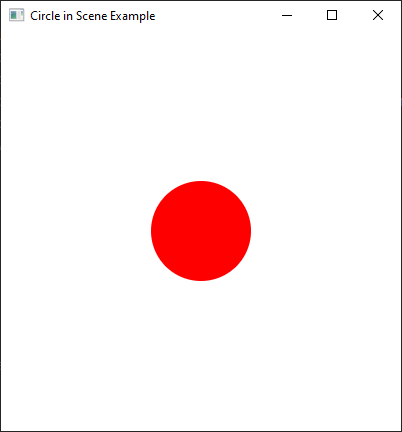

# CheckPoint Answers

## Table of Contents

* [CheckPoint Answers](#checkpoint-answers)
  * [14.2 JavaFX vs Swing and AWT](#142-javafx-vs-swing-and-awt)
    * [14.2.1](#1421)
    * [14.2.2](#1422)
  * [14.3 The Basic Structure of a JavaFX Program](#143-the-basic-structure-of-a-javafx-program)
    * [14.3.1](#1431)
    * [14.3.2](#1432)
  * [14.4 Panes, Groups, UI Controls, and Shapes](#144-panes-groups-ui-controls-and-shapes)
    * [14.4.1](#1441)
    * [14.4.2](#1442)
    * [14.4.3](#1443)
    * [14.4.4](#1444)
  * [14.5 Property Binding](#145-property-binding)
    * [14.5.1](#1451)
    * [14.5.2](#1452)
    * [14.5.3](#1453)
    * [14.5.4](#1454)
  * [14.6 Common Properties and Methods for Nodes](#146-common-properties-and-methods-for-nodes)
    * [14.6.1](#1461)
    * [14.6.2](#1462)
  * [14.7 The `Color` Class](#147-the-color-class)
    * [14.7.1](#1471)
    * [14.7.2](#1472)
    * [14.7.3](#1473)
  * [14.8 The `Font` Class](#148-the-font-class)
    * [14.8.1](#1481)
    * [14.8.2](#1482)
  * [14.9 The `Image` and `ImageView` Classes](#149-the-image-and-imageview-classes)
    * [14.9.1](#1491)
    * [14.9.2](#1492)
    * [14.9.3](#1493)
  * [14.10 Layout Panes and Groups](#1410-layout-panes-and-groups)
    * [14.10.1](#14101)
    * [14.10.2](#14102)
    * [14.10.3](#14103)
    * [14.10.4](#14104)
    * [14.10.5](#14105)
  * [14.11 Shapes](#1411-shapes)
    * [14.11.1](#14111)
    * [14.11.2](#14112)
    * [14.11.3](#14113)
    * [14.11.4](#14114)
    * [14.11.5](#14115)
    * [14.11.6](#14116)
    * [14.11.7](#14117)
    * [14.11.8](#14118)
    * [14.11.9](#14119)
    * [14.11.10](#141110)
    * [14.11.11](#141111)
  * [14.12 Case Study: The `ClockPane` Class](#1412-case-study-the-clockpane-class)
    * [14.12.1](#14121)

## 14.2 JavaFX vs Swing and AWT

### 14.2.1

> Explain the evolution of Java GUI technologies.

The evolution of Java GUI technologies can be summarized as follows:

1. Abstract Windows Toolkit (AWT): When Java was first introduced, the GUI classes were bundled in AWT. AWT provided basic GUI components and relied on the underlying platform's native widgets. However, AWT had limitations, such as platform-specific bugs and a lack of advanced features.

2. Swing: To overcome the limitations of AWT, Swing was introduced as a more powerful and flexible GUI library. Swing components are lightweight, as they are painted directly on canvases using Java code. Swing offered a rich set of UI components, advanced features like customizable look and feel, and improved cross-platform consistency.

3. JavaFX: In recent years, JavaFX has emerged as the successor to Swing for developing Java GUI applications. JavaFX provides a modern and feature-rich platform for creating rich and interactive user interfaces. It offers a wide range of UI components, advanced styling and theming capabilities, support for animations, 2D and 3D graphics, multimedia playback, and multi-touch support for touch-enabled devices.

JavaFX provides a more declarative approach to UI design through FXML, an XML-based language for defining UI layouts. It also integrates well with other Java technologies and frameworks, making it suitable for building complex applications.

JavaFX is designed to be cross-platform, allowing developers to create GUI applications that run on various operating systems. Additionally, JavaFX provides the ability to deploy applications on devices running iOS or Android through third-party software.

Overall, the evolution of Java GUI technologies has progressed from AWT to Swing and finally to JavaFX, with each iteration offering improved capabilities, flexibility, and ease of use for developers.

### 14.2.2

> Explain why this book teaches Java GUI using JavaFX.

1. Simplicity: JavaFX is simpler and more intuitive for beginners in GUI programming.
2. OOP Demonstrations: JavaFX aligns well with object-oriented programming principles.
3. Future Development: JavaFX is actively maintained and updated, unlike Swing.
4. Rich GUI Capabilities: JavaFX offers advanced features like 2D/3D graphics, animations, and multimedia support.
5. Cross-Platform: JavaFX enables development of GUI applications that run on multiple operating systems.

<p align="right">
  <a href="#table-of-contents">Back to Table of Contents 👆</a>
</p>

## 14.3 The Basic Structure of a JavaFX Program

### 14.3.1

> How do you define a JavaFX main class?
> What is the signature of the start method?
> What is a stage?
> What is a primary stage?
> Is a primary stage automatically created?
> How do you display a stage?
> Can you prevent the user from resizing the stage?
> Can you replace Application.launch(args) by launch(args) in line 22 in Listing 14.1?

1. To define a JavaFX main class, you need to create a class that extends `javafx.application.Application`. This class will serve as the entry point for your JavaFX application. NOTE: this project is using the Gradle built tool thus the `mainClassSet` property should be set to the class that we want to run.
    ```kotlin
    application {
       mainClass.set("fully-qualified-name-from-sources")
    }
    ```

2. The signature of the `start` method in a JavaFX main class is:
    ```java
    import javafx.application.Application;
    
    class MyFxClass extends Application {
    
       @Override
       public void start(Stage primaryStage) {
          // Code to set up and display the JavaFX application
       }
    }
    ```
   The `start` method is called by the JavaFX system when the application is launched. It takes a `Stage` object as a parameter, which represents the primary stage (main window) of the JavaFX application.

3. In JavaFX, a `Stage` represents a **top-level window or container
   **. It acts as a container for scenes and other UI elements. It can have a title, dimensions, and other properties that define its appearance and behavior.

4. Yes, a primary stage is automatically created by the JavaFX system when the application is launched. It is the
   **main window** of the JavaFX application and serves as the entry point for the UI.

5. To display a stage, you need to set a scene to it using the `setScene` method and then call the `show` method on the stage object. For example:
   ```java
   import javafx.application.Application;
   
   class MyFxClass extends Application {
   
      @Override
      public void start(Stage primaryStage) {
         primaryStage.setScene(scene); // Set the scene to the primary stage
         primaryStage.show(); // Display the primary stage
      }
   }
   ```

6. Yes, you can prevent the user from resizing the stage by setting the `resizable` property of the `Stage` object to `false`. For example:
   ```java
   import javafx.application.Application;
   
   class MyFxClass extends Application {
   
      @Override
      public void start(Stage primaryStage) {
         primaryStage.setScene(scene); // Set the scene to the primary stage
         primaryStage.setResizable(false); // Prevent resizing of the stage
         primaryStage.show(); // Display the primary stage
      }
   }
   ```

7. No, you cannot replace `Application.launch(args)` with `launch(args)` in line 22 of Listing 14.1. The `launch` method is a `static` method of the `Application` class and should be called using the class name `Application.launch(args)`. It is responsible for launching the JavaFX application and invoking the `start` method.

### 14.3.2

> Show the output of the following JavaFX program:
> ```java
> import javafx.application.Application;
> import javafx.stage.Stage;
> 
> public class Test extends Application {
>    public Test() {
>       System.out.println("Test constructor is invoked");
>    }
> 
>    @Override // Override the start method in the Application class
>    public void start(Stage primaryStage) {
>       System.out.println("start method is invoked");
>    }
> 
>    public static void main(String[] args) {
>       System.out.println("launch application");
>       Application.launch(args);
>    }
> }
> ```

```text
launch application
Test constructor is invoked
start method is invoked
```

<p align="right">
  <a href="#table-of-contents">Back to Table of Contents 👆</a>
</p>

## 14.4 Panes, Groups, UI Controls, and Shapes

### 14.4.1

> How do you create a `Scene` object?
> How do you set a scene in a stage?
> How do you place a circle into a scene?

1. Creating a `Scene` object:
   - You can create a `Scene` object by providing the root node (the top-level node) and specifying the width and height of the scene.
   - The constructor for creating a scene is `Scene(Node root, double width, double height)`.

2. Setting a scene in a stage:
   - To set a `Scene` object in a `Stage`, you use the `setScene()` method of the `Stage` class.
   - The `setScene()` method takes the `Scene` object as a parameter.

3. Placing a circle into a scene:
   - To place a circle into a `Scene`, you first need to create a `Circle` object and set its properties such as position, radius, and color.
   - Once the circle is created, you can add it as a child node to a parent node (e.g., `Pane`, `Group`, etc.) that is set as the root node of the `Scene`.

Here's an example that demonstrates the creation of a `Scene` object and placing a circle in it:

```java
import javafx.application.Application;
import javafx.scene.Scene;
import javafx.scene.layout.Pane;
import javafx.scene.paint.Color;
import javafx.scene.shape.Circle;
import javafx.stage.Stage;

public class CircleInSceneExample extends Application {
   @Override
   public void start(Stage primaryStage) {
      primaryStage.setTitle("Circle in Scene Example");

      // Create a circle
      Circle circle = new Circle();
      circle.setCenterX(200);
      circle.setCenterY(200);
      circle.setRadius(50);
      circle.setFill(Color.RED);

      // Create a pane and add the circle to it
      Pane pane = new Pane();
      pane.getChildren().add(circle);

      // Create a scene with the pane as the root node
      Scene scene = new Scene(pane, 400, 400);

      // Set the scene in the stage
      primaryStage.setScene(scene);
      primaryStage.show(); // Display the stage
   }

   public static void main(String[] args) {
      launch(args);
   }
}
```

In this example, a `Circle` is created with a center at (200, 200) and a radius of 100. The circle is filled with the color red. A `Pane` is created as the root node, and the circle is added as a child node to the pane. Finally, a `Scene` is created with the pane as the root node, and the scene is set in the stage using `setScene()`.

When you run this program, a window with a red circle will be displayed, positioned at the center of the scene.



### 14.4.2

> What is a pane?
> What is a node?
> How do you place a node in a pane?
> Can you directly place a `Shape` or an `ImageView` into a `Scene`?
> Can you directly place a `Control` or a `Pane` into a `Scene`?

A pane is used to hold and organize nodes. A node is a visual component that can be displayed. You can place a node into a pane using the pane.getChildren().add(node). You cannot directly place a Shape or an ImageView into a scene. You can directly place a Control or a Pane into a scene when constructing a Scene using new Scene(Parent, width, height) or new Scene(Parent). Parent is the superclass for Control and Pane.

1. A pane:
   - A pane in JavaFX is a container class that provides a layout for placing and organizing nodes.
   - Panes are used to control the positioning and sizing of nodes within a scene.
   - Examples of panes in JavaFX include `StackPane`, `VBox`, `HBox`, `BorderPane`, and more.

2. A node:
   - A node in JavaFX represents a visual component that can be added to the scene graph.
   - Nodes can be UI controls, shapes, images, groups, or other types of visual elements.
   - Each node can have properties, such as position, size, color, and style, which determine its appearance and behavior.

3. Placing a node in a pane:
   - To place a node in a pane, you can add the node as a child of the pane.
   - Panes have a `getChildren()` method that returns an `ObservableList<Node>`, allowing you to add or remove nodes.
   - By adding nodes to a pane's children list, you control their positioning and order within the pane.

4. Placing a `Shape` or an `ImageView` into a `Scene`:
   - Directly placing a `Shape` or an `ImageView` into a `Scene` is not possible.
   - Instead, you need to add a `Shape` or an `ImageView` as a child node to a parent node (e.g., `Pane`, `Group`, etc.), and then add the parent node to the `Scene`.

5. Placing a `Control` or a `Pane` into a `Scene`:
   - Yes, you can directly place a `Control` or a `Pane` into a `Scene`.
   - `Control` is a superclass for various UI controls like buttons, labels, checkboxes, etc., and they can be added directly to a `Scene`.
   - `Pane` is a container class that implements the `Parent` interface and can contain other nodes. It can also be added directly to a `Scene`.


Example illustrating placing nodes in a pane and adding them to a scene:

```java
import javafx.application.Application;
import javafx.scene.Scene;
import javafx.scene.control.Button;
import javafx.scene.layout.StackPane;
import javafx.stage.Stage;

public class NodeInPaneExample extends Application {
   @Override
   public void start(Stage primaryStage) {
      primaryStage.setTitle("Node in Pane Example");

      Button button = new Button("Click Me!");

      StackPane pane = new StackPane();
      pane.getChildren().add(button); // Adding the button to the pane

      Scene scene = new Scene(pane, 400, 300); // Creating a scene with the pane

      primaryStage.setScene(scene);
      primaryStage.show(); // Display the stage
   }

   public static void main(String[] args) {
      launch(args);
   }
}
```

In this example, a `Button` is placed in a `StackPane` by adding it to the pane's children list using `getChildren().add()`. The `StackPane` is then set as the root node of the `Scene`. Finally, the scene is set in the stage, and the button is displayed within the scene when the application runs.

Please note that placing shapes or image views directly into a `Scene` is not possible. You need to use a `Pane` or `Group` as a container for the shapes or image views, and then add the container node to the `Scene`.


### 14.4.3

> How do you create a `Circle`?
> How do you set its center location and radius?
> How do you set its stroke color and fill color?

To create a `Circle` in JavaFX and set its properties, you can follow these steps:

1. Create a `Circle` object:
   - Use the `new` keyword to create a new instance of the `Circle` class.

2. Set the center location and radius:
   - Use the `setCenterX()` and `setCenterY()` methods to specify the X and Y coordinates of the center of the circle.
   - Use the `setRadius()` method to set the radius of the circle.

3. Set the stroke color and fill color:
   - Use the `setStroke()` method to set the stroke color of the circle.
   - Use the `setFill()` method to set the fill color of the circle.

Here's an example that demonstrates these steps:

```java
import javafx.application.Application;
import javafx.scene.Group;
import javafx.scene.Scene;
import javafx.scene.paint.Color;
import javafx.scene.shape.Circle;
import javafx.stage.Stage;

public class CircleExample extends Application {
   @Override
   public void start(Stage primaryStage) {
      primaryStage.setTitle("Circle Example");

      Circle circle = new Circle();
      circle.setCenterX(200); // Set X coordinate of the center
      circle.setCenterY(200); // Set Y coordinate of the center
      circle.setRadius(100); // Set the radius
      circle.setStroke(Color.BLACK); // Set the stroke color
      circle.setFill(Color.RED); // Set the fill color

      Group group = new Group(circle);

      Scene scene = new Scene(group, 400, 400);

      primaryStage.setScene(scene);
      primaryStage.show();
   }

   public static void main(String[] args) {
      launch(args);
   }
}
```

In this example, a `Circle` is created and its center location is set to (200, 200) using `setCenterX()` and `setCenterY()`. The radius is set to 100 using `setRadius()`. The stroke color is set to black using `setStroke()`, and the fill color is set to red using `setFill()`. The circle is then added to a `Group`, and the `Group` is added to the `Scene`. Finally, the scene is set in the stage and displayed.

When you run this program, a window with a circle will appear, positioned at the specified center location with the given radius, stroke color, and fill color.


### 14.4.4

> How do you replace the code in lines 20 and 21 in Listing 14.4 using one statement?

```java
package org.mrdrprof.solutions.chapter_14_javafx_basics.theory;

import javafx.application.Application;
import javafx.scene.Scene;
import javafx.scene.layout.Pane;
import javafx.scene.paint.Color;
import javafx.scene.shape.Circle;
import javafx.stage.Stage;

public class ShowCircle extends Application {

   public static final int SCENE_WIDTH = 200;
   public static final int SCENE_HEIGHT = 200;

   public static void main(String[] args) {
      launch(args);
   }

   @Override
   public void start(Stage primaryStage) {
      Circle circle = new Circle(SCENE_HEIGHT / 2.0,
                                 SCENE_WIDTH / 2.0,
                                 SCENE_HEIGHT / 4.0,
                                 Color.WHITE);
      circle.setStroke(Color.BLACK); // Set circle stroke color

      // ANSWER: use the overloaded constructor that takes vararg of Node
      // new Pane(Node... children)
      Pane pane = new Pane(circle);

      Scene scene = new Scene(pane, SCENE_WIDTH, SCENE_HEIGHT);
      primaryStage.setTitle("ShowCircleKt");
      primaryStage.setScene(scene);
      primaryStage.show();
   }
}
```

<p align="right">
  <a href="#table-of-contents">Back to Table of Contents 👆</a>
</p>

## 14.5 Property Binding

### 14.5.1

> What is a binding property?
> What interface defines a binding property?
> What interface defines a source object?
> What are the binding object types for `int`, `long`, `float`, `double`, and `boolean`?
> Are `Integer` and `Double` binding properties?
> Can `Integer` and `Double` be used as source objects in a binding?

1. What is a binding property?
   - A binding property is like a special container that holds a value and allows other objects to observe and automatically update when the value changes. It's like a magical box that keeps everything in sync.

   Example:
   ```java
   import javafx.beans.property.IntegerProperty;
   import javafx.beans.property.SimpleIntegerProperty;

   public class BindingPropertyExample {
       public static void main(String[] args) {
           IntegerProperty property = new SimpleIntegerProperty(10);
           property.addListener((observable, oldValue, newValue) -> System.out.println("Value changed to: " + newValue));
           property.set(20);
       }
   }
   ```

   When the value of the `property` changes, this lambda expression will be executed, printing the message `Value changed to: ` followed by the new value.

2. What interface defines a binding property?
   - The `javafx.beans.property.Property` interface defines a binding property in JavaFX. It provides methods for getting and setting the value of the property, as well as additional functionality for binding, listening, and observing changes.

   Example:
   ```java
   import javafx.beans.property.IntegerProperty;
   import javafx.beans.property.SimpleIntegerProperty;

   public class BindingPropertyInterfaceExample {
       public static void main(String[] args) {
           IntegerProperty property = new SimpleIntegerProperty(10);

           int value = property.get();
           property.set(20);
       }
   }
   ```

   

3. What interface defines a source object?
   - The `javafx.beans.value.ObservableValue` interface defines a source object. It's like a magical crystal ball that allows other objects to watch and observe changes to its value. It provides the ability to register listeners and receive notifications when the value changes.

   Example:
   ```java
   import javafx.beans.value.ObservableValue;
   import javafx.beans.property.IntegerProperty;
   import javafx.beans.property.SimpleIntegerProperty;

   public class SourceObjectInterfaceExample {
       public static void main(String[] args) {
           IntegerProperty source = new SimpleIntegerProperty(10);

           ObservableValue<? extends Number> observable = source;
           observable.addListener((observableValue, oldValue, newValue) -> System.out.println("Value changed to: " + newValue));

           source.set(20);
       }
   }
   ```

4. What are the binding object types for `int`, `long`, `float`, `double`, and `boolean`?
   - The binding object types for these primitive types are specific implementations of the `Property` interface in JavaFX. They are:
      - `int`: `javafx.beans.property.IntegerProperty`
      - `long`: `javafx.beans.property.LongProperty`
      - `float`: `javafx.beans.property.FloatProperty`
      - `double`: `javafx.beans.property.DoubleProperty`
      - `boolean`: `javafx.beans.property.BooleanProperty`

   Example:
   ```java
   import javafx.beans.property.IntegerProperty;
   import javafx.beans.property.SimpleIntegerProperty;

   public class BindingObjectTypesExample {
       public static void main(String[] args) {
           IntegerProperty property = new SimpleIntegerProperty(10);
           int value = property.get();
           property.set(20);
       }
   }
   ```

   

5. Are `Integer` and `Double` binding properties?
   - No, `Integer` and `Double` themselves are not binding properties. They are wrapper classes for the primitive types `int` and `double`, respectively. However, JavaFX provides corresponding binding property types (`IntegerProperty` and `DoubleProperty`) for these wrapper classes.

   Example:
   ```java
   import javafx.beans.property.IntegerProperty;
   import javafx.beans.property.SimpleIntegerProperty;

   public class IntegerDoubleBindingPropertiesExample {
       public static void main(String[] args) {
           IntegerProperty property = new SimpleIntegerProperty(10);

           int value = property.get();
           property.set(20);
       }
   }
   ```

6. Can `Integer` and `Double` be used as source objects in a binding?
   - Yes, `Integer` and `Double` can be used as source objects in a binding. Although they are not binding properties themselves, they implement the `ObservableValue` interface, which means they can be observed and used in bindings. So, they can participate in establishing binding relationships between properties.

   Example:
   ```java
   import javafx.beans.binding.Bindings;
   import javafx.beans.property.IntegerProperty;
   import javafx.beans.property.SimpleIntegerProperty;

   public class IntegerDoubleSourceObjectsExample {
       public static void main(String[] args) {
           IntegerProperty source = new SimpleIntegerProperty(10);
           IntegerProperty target = new SimpleIntegerProperty(0);

           target.bind(source);

           source.set(20);

           int targetValue = target.get();
           System.out.println("Target value: " + targetValue);
       }
   }
   ```

### 14.5.2

> Following the JavaFX binding property naming convention, for a binding property named `age` of the `IntegerProperty` type, what is its value getter method, value setter method, and property getter method?

According to the JavaFX binding property naming convention:

```java
import javafx.beans.property.IntegerProperty;
import javafx.beans.property.SimpleIntegerProperty;

public class BindingPropertyNamingConventionExample {
   public static void main(String[] args) {
      IntegerProperty age = new SimpleIntegerProperty(25);
      Integer value = age.getValue();
      System.out.println("Age: " + value);

      age.setValue(30);
      System.out.println("Age: " + value);

      System.out.println("Age Property: " + age);
   }
}
```

### 14.5.3

> Can you create an object of `IntegerProperty` using `new IntegerProperty(3)`?
> If not, what is the correct way to create it?
> What will be the output if line 8 is replaced by `d1.bind(d2.multiply(2))` in Listing 14.6?
> What will be the output if line 8 is replaced by `d1.bind(d2.add(2))` in Listing 14.6?

No, you cannot create an object of `IntegerProperty` using `new IntegerProperty(3)`. The `IntegerProperty` class in JavaFX follows a specific design pattern that requires the use of its static factory methods to create instances.

The correct way to create an `IntegerProperty` is by using the `SimpleIntegerProperty` class, which is a subclass of `IntegerProperty`. You can create an instance of `SimpleIntegerProperty` and assign it to an `IntegerProperty` variable, as shown below:

```java
import javafx.beans.property.IntegerProperty;
import javafx.beans.property.SimpleIntegerProperty;

public class IntegerPropertyCreationExample {
   public static void main(String[] args) {
      IntegerProperty myIntegerProperty = new SimpleIntegerProperty(3);
      System.out.println("Initial Value: " + myIntegerProperty.getValue());
      myIntegerProperty.set(5);
      System.out.println("Updated Value: " + myIntegerProperty.getValue());
   }
}
```


Listing 14.6:

```java
import javafx.beans.property.DoubleProperty;
import javafx.beans.property.SimpleDoubleProperty;

class BindingDemo {

   private static final String TEMPLATE = "d1 is %s and d2 is %s%n";

   public static void main(String[] args) {
      DoubleProperty d1 = new SimpleDoubleProperty(1);
      DoubleProperty d2 = new SimpleDoubleProperty(2);

      d1.bind(d2);
      System.out.printf(TEMPLATE, d1.getValue(), d2.getValue()); // -> d1 is 2.0 and d2 is 2.0
      d2.setValue(70.2);
      System.out.printf(TEMPLATE, d1.getValue(), d2.getValue()); // -> d1 is 70.2 and d2 is 70.2

      d1.bind(d2.multiply(2));
      System.out.printf(TEMPLATE, d1.getValue(), d2.getValue()); // -> d1 is 140.4 and d2 is 70.2
      d2.setValue(10);
      System.out.printf(TEMPLATE, d1.getValue(), d2.getValue()); // -> d1 is 20.0 and d2 is 10.0

      d1.bind(d2.add(2));
      System.out.printf(TEMPLATE, d1.getValue(), d2.getValue()); // -> d1 is 12.0 and d2 is 10.0
      d2.setValue(5);
      System.out.printf(TEMPLATE, d1.getValue(), d2.getValue()); // -> d1 is 7.0 and d2 is 5.0
   }
}
```

```text
d1 is 2.0 and d2 is 2.0
d1 is 70.2 and d2 is 70.2

d1 is 140.4 and d2 is 70.2
d1 is 20.0 and d2 is 10.0

d1 is 12.0 and d2 is 10.0
d1 is 7.0 and d2 is 5.0
```

### 14.5.4

> What is unidirectional binding and what is bidirectional binding?
> Are all binding properties capable of bidirectional binding?
> Write a statement to bind property `d1` with property `d2` bidirectionally.

Unidirectional binding and bidirectional binding are concepts in JavaFX that describe different types of relationships between properties.

1. Unidirectional binding:
   - Unidirectional binding establishes a one-way relationship between a source property and a target property. It means that changes in the source property will automatically be reflected in the target property, but not vice versa. The **target property is dependent on the source property**, and any changes in the source will be propagated to the target.

2. Bidirectional binding:
   - Bidirectional binding establishes a two-way relationship between two properties. It allows changes in either property to automatically update the other property. If one property changes, the change is propagated to the other property, and vice versa. **Both properties are synchronized** and kept in sync.

Not all binding properties in JavaFX support bidirectional binding. Only specific property types, such as `javafx.beans.property.Property`, `javafx.beans.property.ObjectProperty`, and their subtypes, support bidirectional binding.

To bind property `d1` with property `d2` bidirectionally, you can use the `bindBidirectional()` method:

```java
import javafx.beans.property.DoubleProperty;
import javafx.beans.property.SimpleDoubleProperty;

public class BidirectionalBindingExample {
   public static void main(String[] args) {
      DoubleProperty d1 = new SimpleDoubleProperty(10);
      DoubleProperty d2 = new SimpleDoubleProperty(20);

      d1.bindBidirectional(d2);

      // Now any changes in d1 will be reflected in d2, and vice versa
      d1.set(30);
      System.out.println("d2 value: " + d2.get()); // -> d2 value: 30

      d2.set(40);
      System.out.println("d1 value: " + d1.get()); // -> d1 value: 40
   }
}
```

<p align="right">
  <a href="#table-of-contents">Back to Table of Contents 👆</a>
</p>

## 14.6 Common Properties and Methods for Nodes

### 14.6.1

> How do you set a style of a node with border color red?
> Modify the code to set the text color for the button to red.

To set the style of a node with a border color of red, we can use the `-fx-border-color` style property and set its value to red. Here's an example of how you can achieve this:

```java
import javafx.scene.shape.Rectangle;

public class NodeStyleExample {
   public static void main(String[] args) {
      Rectangle rectangle = new Rectangle(100, 50);
      rectangle.setStyle("-fx-border-color: red;");
   }
}
```

To modify the code to set the text color for a button to red, we can use the `-fx-text-fill` style property and set its value to red. Here's an updated example:

```java
import javafx.application.Application;
import javafx.scene.control.Button;

public class NodeStyleRotateDemo extends Application {
   public static void main(String[] args) {
      // ...

      Button btOK = new Button("OK");
      btOK.setStyle("-fx-border-color: blue; " +
                    "-fx-text-fill: red");

      // ...
   }
}
```


### 14.6.2

> Can you rotate a pane, a text, or a button?
> Modify the code to rotate the button 15 degrees counterclockwise?
> How do you test if a point is inside a node?
> How do you scale up or down a node?

Yes, we can rotate a pane, a text, or a button in JavaFX. The ability to rotate these elements is provided by the rotate property, which is a common property inherited by most nodes in JavaFX.

```java
import javafx.application.Application;
import javafx.scene.control.Button;

public class NodeStyleRotateDemo extends Application {
   public static void main(String[] args) {
      // ...

      Button btOK = new Button("OK");
      btOK.setStyle("-fx-border-color: blue; " +
                    "-fx-text-fill: red; " +
                    "-fx-rotate: -15;" +
                    "-fx-scale-x: 1.5;" +
                    "-fx-scale-y: 1.5");

      // ...
   }
}
```


<p align="right">
  <a href="#table-of-contents">Back to Table of Contents 👆</a>
</p>

## 14.7 The `Color` Class

### 14.7.1

> How do you create a color?
> What is wrong about creating a `Color` using `new Color(1.2, 2.3, 3.5, 4)`?
> Which of two colors is darker, `new Color(0, 0, 0, 1)` or `new Color(1, 1, 1, 1)`?
> Does invoking `c.darker()` change the color value in `c`?

To create a color in JavaFX, you can use the `Color` class from the `javafx.scene.paint` package. There are several ways to create a color:

1. Using RGB Values: You can specify the color using RGB values ranging from 0 to 1, representing the intensity of red, green, and blue components. For example, `Color color = Color.rgb(255, 0, 0);` creates a red color.

2. Using RGBA Values: Similar to RGB, you can also include an additional alpha value representing the transparency of the color. The alpha value ranges from 0 to 1, where 0 is fully transparent and 1 is fully opaque. For example, `Color color = Color.rgb(255, 0, 0, 0.5);` creates a semi-transparent red color.

3. Using Predefined Colors: JavaFX provides a set of predefined colors as constants in the `Color` class. For example, `Color color = Color.RED;` creates a color object representing the red color.

Creating a color using `new Color(1.2, 2.3, 3.5, 4)` is incorrect because the RGB values should be in the range of 0 to 1. Values exceeding this range will result in an `IllegalArgumentException` being thrown. To create a valid color, ensure that the RGB values are between 0 and 1.

Between the two colors `new Color(0, 0, 0, 1)` (black) and `new Color(1, 1, 1, 1)` (white), the darker color is black. In JavaFX, the darker color can be obtained by invoking the `darker()` method on a `Color` object. For example, `Color darkColor = Color.BLACK.darker();` will give you a darker shade of black.

Invoking `c.darker()` does not change the color value in `c`. The `darker()` method returns a new `Color` object that is a darker shade of the original color. The original `Color` object remains unchanged. If you want to update the color value in `c`, you would need to assign the result of `c.darker()` back to `c`.


### 14.7.2

> How do you create a `Color` object with a random color?

```java
import javafx.scene.paint.Color;

import java.util.Random;

public class RandomColorExample {
   public static void main(String[] args) {
      Random random = new Random();

      int red = random.nextInt(256);
      int green = random.nextInt(256);
      int blue = random.nextInt(256);
      double alpha = random.nextDouble();

      Color randomColor = Color.rgb(red, green, blue, alpha);

      System.out.println("Random Color: " + randomColor);
   }
}
```

### 14.7.3

> How do you set a circle object `c` with blue fill color using the `setFill` method and the `setStyle` method?

```java
import javafx.scene.paint.Color;
import javafx.scene.shape.Circle;

class Test {
   public static void main(String[] args) {
      Circle circle = new Circle();

      circle.setRadius(50);
      circle.setFill(Color.BLUE);
      circle.setStyle("-fx-fill: blue;");
   }
}
```

<p align="right">
  <a href="#table-of-contents">Back to Table of Contents 👆</a>
</p>

## 14.8 The `Font` Class

### 14.8.1

> How do you create a `Font` object with font name `Courier`, size 20, and weight bold?

```java
import javafx.scene.text.Font;
import javafx.scene.text.FontWeight;

class FontExample {
   public static void main(String[] args) {
      Font.font("Courier", FontWeight.BOLD, 20);
   }
}
```


### 14.8.2

> How do you find all available fonts on your system?

```java
import javafx.scene.text.Font;

class Example {
   public static void main(String[] args) {
      Font.getFamilies().forEach(System.out::println);
   }
}
```

```text
Aharoni Bold
Alef Bold
Alef Regular
Amiri Bold
...
...
Yu Gothic UI Light
Yu Gothic UI Regular
Yu Gothic UI Semibold
Yu Gothic UI Semilight
```

<p align="right">
  <a href="#table-of-contents">Back to Table of Contents 👆</a>
</p>

## 14.9 The `Image` and `ImageView` Classes

### 14.9.1

> How do you create an `Image` from a URL or a filename?

```java
import javafx.application.Application;
import javafx.scene.image.Image;

public class ImageCreationExample extends Application {

   @Override
   public void start(Stage primaryStage) {
      Image urlImage = new Image("https://example.com/image.jpg");
      Image fileImage = new Image("file:/path/to/image.jpg");

      // Alternatively, create an Image from a File object
      File file = new File("/path/to/image.jpg");
      Image fileImage2 = new Image(file.toURI().toURL().toString());

      System.out.println("URL Image Dimensions: " + urlImage.getWidth() + "x" + urlImage.getHeight());
      System.out.println("File Image Dimensions: " + fileImage.getWidth() + "x" + fileImage.getHeight());
      System.out.println("File Image Dimensions 2: " + fileImage2.getWidth() + "x" + fileImage2.getHeight());
   }
}
```

### 14.9.2

> How do you create an `ImageView` from an `Image` or directly from a file or a URL?

You can directly pass the file path or URL as a string parameter to the `ImageView` constructor without explicitly creating an `Image` object.

Here's an example code snippet that demonstrates both approaches:

```java
import javafx.application.Application;
import javafx.scene.image.Image;
import javafx.scene.image.ImageView;

public class ImageViewCreationExample extends Application {

   @Override
   public void start(Stage primaryStage) {
      Image image = new Image("https://example.com/image.jpg");

      // Create an ImageView from an existing Image object
      ImageView imageView1 = new ImageView(image);

      // Create an ImageView directly from a file or URL
      ImageView imageView2 = new ImageView("file:/path/to/image.jpg");
      ImageView imageView3 = new ImageView("https://example.com/image.jpg");

      // Set the dimensions of the ImageView (optional)
      imageView2.setFitWidth(200);
      imageView2.setFitHeight(200);

      // Add the ImageViews to a layout or scene for display
      // ...
   }
}
```


### 14.9.3

> Can you set an `Image` to multiple `ImageViews`?
> Can you display the same `ImageView` multiple times?

In JavaFX, an `Image` object can be set to multiple `ImageViews` to display the same image in different places within your application. However, you cannot directly display the same `ImageView` multiple times within a scene or pane.

Here's an example to illustrate this:

```java
import javafx.application.Application;
import javafx.geometry.Insets;
import javafx.scene.Scene;
import javafx.scene.image.Image;
import javafx.scene.image.ImageView;
import javafx.scene.layout.HBox;
import javafx.stage.Stage;

public class ImageViewExample extends Application {

   @Override
   public void start(Stage primaryStage) {
      Image image = new Image("https://liveexample.pearsoncmg.com/book/image/us.gif");

      ImageView imageView1 = new ImageView(image);
      ImageView imageView2 = new ImageView(image);

      HBox hbox = new HBox(imageView1, imageView2);
      hbox.setPadding(new Insets(10));
      hbox.setSpacing(10);
      Scene scene = new Scene(hbox);

      primaryStage.setScene(scene);
      primaryStage.show();
   }
}
```


In this example, we create an `Image` object from a file path and then create two `ImageViews` (`imageView1` and `imageView2`) using the same `Image` object. We then add both `ImageViews` to an `HBox` layout container. When we display the scene, both `ImageViews` will show the same image.

In JavaFX, a node can only have one parent. Therefore, if you try to add the same `ImageView` instance to multiple parent containers, you will encounter an `IllegalArgumentException` with the message "Children: duplicate children added."

```text
Caused by: java.lang.IllegalArgumentException: Children: duplicate children added: parent = HBox@52a79e8c
```

<p align="right">
  <a href="#table-of-contents">Back to Table of Contents 👆</a>
</p>

## 14.10 Layout Panes and Groups

### 14.10.1

> How do you add a node to a `Pane`, `StackPane`, `FlowPane`, `GridPane`, `BorderPane`, `HBox`, and `VBox`?
> How do you remove a node from these panes?

To add a node to various panes in JavaFX, you can use the `getChildren()` method of the corresponding pane and then call the `add()` method to add the desired node as a child. The process for adding and removing nodes is similar for most panes:

```java
import javafx.application.Application;
import javafx.scene.Node;
import javafx.scene.Scene;
import javafx.scene.control.Button;
import javafx.scene.layout.Pane;
import javafx.stage.Stage;

public class PaneExample extends Application {
   @Override
   public void start(Stage primaryStage) {
      Node node = new Button("Click me!");

      Pane pane = new Pane();
      pane.getChildren().add(node);
      pane.getChildren().remove(node);

      StackPane stackPane = new StackPane();
      stackPane.getChildren().add(node);
      stackPane.getChildren().remove(node);

      FlowPane flowPane = new FlowPane();
      flowPane.getChildren().add(node);
      flowPane.getChildren().remove(node);
      flowPane.setPadding(new Insets(10));
      flowPane.setHgap(10);
      flowPane.setVgap(10);

      GridPane gridPane = new GridPane();
      gridPane.add(node, 0, 0); // Add to column 0, row 0
      gridPane.getChildren().remove(node);

      // Use the `setTop()`, `setBottom()`, `setLeft()`, `setRight()`, or `setCenter()` methods to add nodes to the corresponding regions.
      // To remove a node, use the respective `set...()` method and pass `null`.
      BorderPane borderPane = new BorderPane();
      borderPane.setTop(node); // Add to top region
      borderPane.setTop(null); // Remove node from border pane

      HBox hBox = new HBox();
      hBox.getChildren().add(node);
      hBox.getChildren().remove(node);

      VBox vBox = new VBox();
      vBox.getChildren().add(node);
      vBox.getChildren().remove(node);

      primaryStage.setScene(new Scene(pane, 200, 200));
      primaryStage.show();
   }
}
```

### 14.10.2

> How do you set the alignment to right for nodes in a `FlowPane`, `GridPane`, `HBox`, and `VBox`?

To set the alignment to right for nodes in different layout panes, you can use the following methods:

1. FlowPane:
   - `flowPane.setAlignment(Pos.CENTER_RIGHT);`

2. GridPane:
   - `gridPane.setAlignment(Pos.CENTER_RIGHT);`

3. HBox:
   - `hBox.setAlignment(Pos.CENTER_RIGHT);`

4. VBox:
   - `vBox.setAlignment(Pos.CENTER_RIGHT);`

These methods allow you to set the alignment of the nodes within the respective layout pane. The `Pos.CENTER_RIGHT` value aligns the nodes to the right horizontally.

Here's an example code snippet that demonstrates setting the alignment to right for nodes in each layout pane:

```java
import javafx.application.Application;
import javafx.geometry.Pos;
import javafx.scene.control.Button;
import javafx.scene.layout.FlowPane;
import javafx.scene.layout.GridPane;
import javafx.scene.layout.HBox;
import javafx.scene.layout.VBox;
import javafx.stage.Stage;

public class AlignmentExample extends Application {

   @Override
   public void start(Stage primaryStage) {
      Button button1 = new Button("Button 1");
      Button button2 = new Button("Button 2");

      FlowPane flowPane = new FlowPane();
      flowPane.setAlignment(Pos.CENTER_RIGHT);
      flowPane.getChildren().addAll(button1, button2);

      GridPane gridPane = new GridPane();
      gridPane.setAlignment(Pos.CENTER_RIGHT);
      gridPane.add(new Button("Button 1"), 0, 0);
      gridPane.add(new Button("Button 2"), 1, 0);

      HBox hBox = new HBox();
      hBox.setAlignment(Pos.CENTER_RIGHT);
      hBox.getChildren().addAll(button1, button2);

      VBox vBox = new VBox();
      vBox.setAlignment(Pos.CENTER_RIGHT);
      vBox.getChildren().addAll(button1, button2);
   }
}
```

Running this code will create four windows, each demonstrating the alignment to the right for nodes in the respective layout panes.

### 14.10.3

> How do you set the horizontal gap and vertical gap between nodes in 8 pixels in a `FlowPane` and `GridPane` and set spacing in 8 pixels in an `HBox` and `VBox`?

```java
import javafx.application.Application;
import javafx.scene.control.Button;
import javafx.scene.layout.FlowPane;
import javafx.scene.layout.GridPane;
import javafx.scene.layout.HBox;
import javafx.scene.layout.VBox;
import javafx.stage.Stage;

public class AlignmentExample extends Application {

   private static final double GAP_BETWEEN_NODES = 8;

   @Override
   public void start(Stage primaryStage) {
      Button button1 = new Button("Button 1");
      Button button2 = new Button("Button 2");

      FlowPane flowPane = new FlowPane();
      flowPane.setHgap(GAP_BETWEEN_NODES);
      flowPane.setVgap(GAP_BETWEEN_NODES);
      flowPane.getChildren().addAll(button1, button2);

      GridPane gridPane = new GridPane();
      gridPane.add(button1, 0, 0);
      gridPane.add(button2, 1, 0);
      gridPane.setHgap(GAP_BETWEEN_NODES);
      gridPane.setVgap(GAP_BETWEEN_NODES);

      HBox hBox = new HBox();
      hBox.setSpacing(GAP_BETWEEN_NODES);
      hBox.getChildren().addAll(button1, button2);

      VBox vBox = new VBox();
      vBox.setSpacing(GAP_BETWEEN_NODES);
      vBox.getChildren().addAll(button1, button2);

      primaryStage.setScene(new Scene(vBox, 200, 200));
      primaryStage.show();
   }
}
```

### 14.10.4

> How do you get the column and row index of a node in a `GridPane`?
> How do you reposition a node in a `GridPane`?

To get the column and row index of a node in a `GridPane`, you can use the `GridPane.getColumnIndex(Node)` and `GridPane.getRowIndex(Node)` methods, respectively. These methods return the column and row index of the specified node in the `GridPane`. Here's an example:

```java
import javafx.application.Application;
import javafx.scene.control.Button;
import javafx.scene.layout.GridPane;
import javafx.stage.Stage;

public class GridPaneExample extends Application {

   @Override
   public void start(Stage primaryStage) {
      GridPane gridPane = new GridPane();

      Button button1 = new Button("Button 1");
      GridPane.setConstraints(button1, 0, 0); // Set the column and row index for button1
      gridPane.getChildren().add(button1);

      // Get the column and row index of button1
      int columnIndex = GridPane.getColumnIndex(button1);
      int rowIndex = GridPane.getRowIndex(button1);

      System.out.println("Button 1 is located at column " + columnIndex + ", row " + rowIndex);

      primaryStage.setScene(new Scene(gridPane, 400, 400));
      primaryStage.show();
   }
}
```

To reposition a node in a `GridPane`, you can use the `GridPane.setConstraints(Node node, int columnIndex, int rowIndex)` method. This method allows you to specify the new column and row index for the node. Here's an example:

```java
import javafx.application.Application;
import javafx.scene.control.Button;
import javafx.scene.layout.GridPane;
import javafx.stage.Stage;

public class GridPaneRepositionExample extends Application {

   @Override
   public void start(Stage primaryStage) {
      GridPane gridPane = new GridPane();

      Button button1 = new Button("Button 1");
      GridPane.setConstraints(button1, 0, 0); // Set the initial position of button1
      gridPane.getChildren().add(button1);

      // Reposition button1 to a new column and row
      GridPane.setConstraints(button1, 1, 1);

      // Alternatively, you can use the convenience methods:
      // GridPane.setColumnIndex(button1, 1);
      // GridPane.setRowIndex(button1, 1);

      primaryStage.setScene(new Scene(gridPane, 400, 400));
      primaryStage.show();
   }
}
```

In this example, the `button1` is initially placed at column 0 and row 0 in the `GridPane`. Later, it is repositioned to column 1 and row 1 using the `GridPane.setConstraints()` method.

### 14.10.5

> What are the differences between a `FlowPane` and an `HBox` or a `VBox`?

The main differences between a `FlowPane` and an `HBox`/`VBox` are as follows:

1. Layout Behavior:

   - `FlowPane`: A `FlowPane` arranges its children in a flow-like manner, which means the children can flow in multiple rows or columns. If there is not enough horizontal space, the children will wrap to the next row or column automatically. This allows the `FlowPane` to adapt to different screen sizes and accommodate varying numbers of children.

   - `HBox`/`VBox`: An `HBox` arranges its children in a single horizontal row, while a `VBox` arranges its children in a single vertical column. Both `HBox` and `VBox` can only display their children in a single row or column, and they do not wrap or flow to multiple rows or columns.

2. Orientation:

   - `FlowPane`: A `FlowPane` can be configured to have either horizontal or vertical orientation using the `setOrientation()` method. This allows you to control whether the children flow horizontally or vertically.

   - `HBox`/`VBox`: `HBox` is always horizontally oriented, arranging its children in a single row from left to right. `VBox` is always vertically oriented, arranging its children in a single column from top to bottom.

3. Resizing Behavior:

   - `FlowPane`: `FlowPane` automatically resizes its children to fit the available space. If the `FlowPane` itself is resized, the children will also adjust their size accordingly. This can lead to varying sizes of children within a `FlowPane`.

   - `HBox`/`VBox`: `HBox` and `VBox` do not automatically resize their children. The children maintain their preferred sizes, and if the `HBox`/`VBox` is resized, the children will not automatically adjust their size to fit the available space. You can use alignment and other layout properties to control the positioning of children within an `HBox` or `VBox`.

In summary, a `FlowPane` provides more flexibility in arranging its children by allowing them to flow in multiple rows or columns based on available space. On the other hand, `HBox` and `VBox` are limited to a single row or column and do not have automatic wrapping or flowing behavior. The choice between them depends on your specific layout requirements and the desired behavior of your UI components.

<p align="right">
  <a href="#table-of-contents">Back to Table of Contents 👆</a>
</p>

## 14.11 Shapes

### 14.11.1

> How do you display a text, line, rectangle, circle, ellipse, arc, polygon, and polyline?

```java
import javafx.application.Application;
import javafx.geometry.Insets;
import javafx.scene.Scene;
import javafx.scene.layout.GridPane;
import javafx.scene.paint.Color;
import javafx.scene.shape.*;
import javafx.stage.Stage;

public class Checkpoint141101 extends Application {

   @Override
   public void start(Stage primaryStage) {
      // Create the shapes
      Text text = new Text("Hello, JavaFX!");
      Line line = new Line(50, 50, 200, 50);
      Rectangle rectangle = new Rectangle(50, 100, 150, 100);
      Circle circle = new Circle(150, 300, 50);
      Ellipse ellipse = new Ellipse(300, 200, 100, 50);
      Arc arc = new Arc(450, 200, 100, 100, 0, 270);
      arc.setType(ArcType.OPEN);
      arc.setFill(null);
      arc.setStroke(Color.BLUE);
      Polygon polygon = new Polygon(
              200.0, 450.0,
              400.0, 450.0,
              300.0, 550.0
      );
      Polyline polyline = new Polyline(
              500.0, 450.0,
              700.0, 450.0,
              600.0, 550.0
      );

      // Create the GridPane
      GridPane gridPane = new GridPane();
      gridPane.setPadding(new Insets(10));
      gridPane.setHgap(10);
      gridPane.setVgap(10);

      // Add the shapes to the GridPane
      gridPane.add(text, 0, 0);
      gridPane.add(line, 1, 0);
      gridPane.add(rectangle, 2, 0);
      gridPane.add(circle, 0, 1);
      gridPane.add(ellipse, 1, 1);
      gridPane.add(arc, 2, 1);
      gridPane.add(polygon, 0, 2);
      gridPane.add(polyline, 1, 2);

      // Set the borders of the GridPane visible
      gridPane.setGridLinesVisible(true);

      // Create a Scene and set the GridPane as its root
      Scene scene = new Scene(gridPane, 800, 600);

      // Set the Scene to the Stage and show the Stage
      primaryStage.setScene(scene);
      primaryStage.setTitle("Shape Display Example");
      primaryStage.show();
   }
}
```


### 14.11.2

> Write code fragments to display a string rotated 45 degrees in the center of the pane.

```java
import javafx.application.Application;
import javafx.scene.Scene;
import javafx.scene.layout.StackPane;
import javafx.scene.text.Text;
import javafx.stage.Stage;

public class Checkpoint141102 extends Application {
   @Override
   public void start(Stage primaryStage) {
      Text text = new Text(100, 100, "This is a Text");
      text.setStyle("-fx-rotate: 45; " +
                    "-fx-font-family: 'JetBrains Mono'; " +
                    "-fx-font-size: x-large;");

      StackPane pane = new StackPane(text);

      Scene scene = new Scene(pane, 300, 300);
      primaryStage.setScene(scene);
      primaryStage.setTitle("String Rotated 45 Degrees");
      primaryStage.show();
   }
}
```


### 14.11.3

> Write code fragments to display a thick line of 10 pixels from (10, 10) to (70, 30).

```java
import javafx.application.Application;
import javafx.scene.Scene;
import javafx.scene.layout.Pane;
import javafx.scene.paint.Color;
import javafx.scene.shape.Line;
import javafx.stage.Stage;

class Checkpoint141103 extends Application {

   @Override
   public void start(Stage primaryStage) {

      Pane pane = new Pane();

      Line line = new Line(10, 10, 70, 30);
      line.endXProperty().bind(pane.widthProperty().subtract(70));
      line.endYProperty().bind(pane.heightProperty().subtract(30));
      line.setStrokeWidth(10);
      line.setStroke(Color.BLUE);

      pane.getChildren().add(line);

      Scene scene = new Scene(pane, 300, 200);
      primaryStage.setScene(scene);
      primaryStage.setTitle("String Rotated 45 Degrees");
      primaryStage.show();
   }
}
```


### 14.11.4

> Write code fragments to fill red color in a rectangle of width 100 and height 50 with the upper-left corner at (10, 10).

```java
package org.mrdrprof.solutions.chapter_14_javafx_basics.theory;

import javafx.application.Application;
import javafx.geometry.Insets;
import javafx.scene.Scene;
import javafx.scene.layout.StackPane;
import javafx.scene.paint.Color;
import javafx.scene.shape.Rectangle;
import javafx.stage.Stage;

public class Checkpoint141104 extends Application {

   @Override
   public void start(Stage primaryStage) {
      Rectangle rectangle = new Rectangle(10, 10, 100, 50);
      rectangle.setFill(Color.RED);

      StackPane stackPane = new StackPane(rectangle);
      stackPane.setPadding(new Insets(100));
      stackPane.setStyle("-fx-background-color: lightgrey");

      Scene scene = new Scene(stackPane);
      primaryStage.setScene(scene);
      primaryStage.setTitle("Checkpoint 14.11.04");
      primaryStage.show();
   }
}
```


### 14.11.5

> Write code fragments to display a round-cornered rectangle with width 100, height 200 with the upper-left corner at (10, 10), corner horizontal diameter 40, and corner vertical diameter 20.

```java
package org.mrdrprof.solutions.chapter_14_javafx_basics.theory;

import javafx.application.Application;
import javafx.geometry.Insets;
import javafx.scene.Scene;
import javafx.scene.layout.StackPane;
import javafx.scene.paint.Color;
import javafx.scene.shape.Rectangle;
import javafx.stage.Stage;

public class Checkpoint141105 extends Application {

   @Override
   public void start(Stage primaryStage) {
      Rectangle rectangle = new Rectangle(10, 10, 100, 200);
      rectangle.setArcWidth(40);
      rectangle.setArcHeight(20);
      rectangle.setFill(Color.LIGHTCORAL);

      StackPane stackPane = new StackPane(rectangle);
      stackPane.setPadding(new Insets(100));
      stackPane.setStyle("-fx-background-color: lightgrey");

      Scene scene = new Scene(stackPane);
      primaryStage.setScene(scene);
      primaryStage.setTitle("Checkpoint 14.11.04");
      primaryStage.show();
   }
}
```


### 14.11.6

> Write code fragments to display an ellipse with horizontal radius 50 and vertical radius 100.

```java
package org.mrdrprof.solutions.chapter_14_javafx_basics.theory;

import javafx.application.Application;
import javafx.geometry.Insets;
import javafx.scene.Scene;
import javafx.scene.layout.StackPane;
import javafx.scene.paint.Color;
import javafx.scene.shape.Ellipse;
import javafx.stage.Stage;

public class Checkpoint141106 extends Application {
   @Override
   public void start(Stage primaryStage) {
      Ellipse ellipse = new Ellipse();
      ellipse.setRadiusX(50);
      ellipse.setRadiusY(100);
      ellipse.setFill(Color.DARKORCHID);
      ellipse.setStrokeWidth(10);

      StackPane stackPane = new StackPane(ellipse);
      stackPane.setPadding(new Insets(100));
      stackPane.setStyle("-fx-background-color: lightgrey");

      Scene scene = new Scene(stackPane);
      primaryStage.setScene(scene);
      primaryStage.setTitle("Checkpoint 14.11.06");
      primaryStage.show();
   }
}
```


### 14.11.7

> Write code fragments to display the outline of the upper half of a circle with radius 50.

```java
package org.mrdrprof.solutions.chapter_14_javafx_basics.theory;

import javafx.application.Application;
import javafx.geometry.Insets;
import javafx.scene.Scene;
import javafx.scene.layout.StackPane;
import javafx.scene.paint.Color;
import javafx.scene.shape.Arc;
import javafx.scene.shape.ArcType;
import javafx.stage.Stage;

public class Checkpoint141107 extends Application {

   @Override
   public void start(Stage primaryStage) {
      double radius = 50;
      double startAngle = 0;
      double length = 180;

      Arc arc = new Arc();
      arc.setCenterX(radius);
      arc.setCenterY(radius);
      arc.setRadiusX(radius);
      arc.setRadiusY(radius);
      arc.setStartAngle(startAngle);
      arc.setLength(length);
      arc.setType(ArcType.ROUND);
      arc.setStroke(Color.BLUE);
      arc.setStrokeWidth(2);
      arc.setFill(null);

      StackPane stackPane = new StackPane(arc);
      stackPane.setPadding(new Insets(100));
      stackPane.setStyle("-fx-background-color: lightgrey");

      Scene scene = new Scene(stackPane);
      primaryStage.setScene(scene);
      primaryStage.setTitle("Checkpoint 14.11.07");
      primaryStage.show();
   }
}
```


### 14.11.8

> Write code fragments to display the lower half of a circle with radius 50 filled with the red color.

```java
package org.mrdrprof.solutions.chapter_14_javafx_basics.theory;

import javafx.application.Application;
import javafx.geometry.Insets;
import javafx.scene.Scene;
import javafx.scene.layout.StackPane;
import javafx.scene.paint.Color;
import javafx.scene.shape.Arc;
import javafx.scene.shape.ArcType;
import javafx.stage.Stage;

public class Checkpoint141108 extends Application {
   @Override
   public void start(Stage primaryStage) {
      double radius = 50;
      double startAngle = 0;
      double length = -180;

      Arc arc = new Arc();
      arc.setCenterX(radius);
      arc.setCenterY(radius);
      arc.setRadiusX(radius);
      arc.setRadiusY(radius);
      arc.setStartAngle(startAngle);
      arc.setLength(length);
      arc.setType(ArcType.ROUND);
      arc.setFill(Color.RED);

      StackPane stackPane = new StackPane(arc);
      stackPane.setPadding(new Insets(100));
      stackPane.setStyle("-fx-background-color: lightgrey");

      Scene scene = new Scene(stackPane);
      primaryStage.setScene(scene);
      primaryStage.setTitle("Checkpoint 14.11.07");
      primaryStage.show();
   }
}
```


### 14.11.9

> Write code fragments to display a polygon connecting the following points: (20, 40), (30, 50), (40, 90), (90, 10), and (10, 30), and fill the polygon with green color.

```java
package org.mrdrprof.solutions.chapter_14_javafx_basics.theory;

import javafx.application.Application;
import javafx.geometry.Insets;
import javafx.scene.Scene;
import javafx.scene.layout.StackPane;
import javafx.scene.paint.Color;
import javafx.scene.shape.Polygon;
import javafx.stage.Stage;

public class Checkpoint141109 extends Application {

   @Override
   public void start(Stage primaryStage) {
      double[] points = { 20, 40, 30, 50, 40, 90, 90, 10, 10, 30 };
      Polygon polygon = new Polygon(points);
      polygon.setFill(Color.GREEN);

      StackPane stackPane = new StackPane(polygon);
      stackPane.setPadding(new Insets(100));
      stackPane.setStyle("-fx-background-color: lightgrey");

      Scene scene = new Scene(stackPane);
      primaryStage.setScene(scene);
      primaryStage.setTitle("Checkpoint 14.11.07");
      primaryStage.show();
   }
}
```


### 14.11.10

> Write code fragments to display a polyline connecting the following points: (20, 40), (30, 50), (40, 90), (90, 10), and (10, 30).

```java
package org.mrdrprof.solutions.chapter_14_javafx_basics.theory;

import javafx.application.Application;
import javafx.geometry.Insets;
import javafx.scene.Scene;
import javafx.scene.layout.StackPane;
import javafx.scene.paint.Color;
import javafx.scene.shape.Polyline;
import javafx.stage.Stage;

public class Checkpoint141110 extends Application {

   @Override
   public void start(Stage primaryStage) {
      double[] points = { 20, 40, 30, 50, 40, 90, 90, 10, 10, 30 };
      Polyline polyline = new Polyline(points);
      polyline.setFill(Color.GREEN);

      StackPane stackPane = new StackPane(polyline);
      stackPane.setPadding(new Insets(100));
      stackPane.setStyle("-fx-background-color: lightgrey");

      Scene scene = new Scene(stackPane);
      primaryStage.setScene(scene);
      primaryStage.setTitle("Checkpoint 14.11.10");
      primaryStage.show();
   }
}
```


### 14.11.11

> What is wrong in the following code?
>
> ```java
> class WhatIsWrong {
>    public void start(Stage primaryStage) {
>       // Create a polygon and place it in the scene
>       Scene scene = new Scene(new Polygon(), 400, 400);
>       primaryStage.setScene(scene); // Place the scene in the stage
>       primaryStage.show(); // Display the stage
>    }
> }
> ```

To display a `Polygon` in a JavaFX application, you need to place it inside a `Pane` before adding the pane to the scene.

```java
import javafx.application.Application;
import javafx.scene.Scene;
import javafx.scene.layout.Pane;
import javafx.scene.shape.Polygon;
import javafx.stage.Stage;

public class WhatIsWrong extends Application {

   @Override
   public void start(Stage primaryStage) {
      // Create a polygon
      Polygon polygon = new Polygon(20, 40, 30, 50, 40, 90, 90, 10, 10, 30);
      polygon.setFill(Color.GREEN);

      // Create a pane and add the polygon to it
      Pane pane = new Pane(polygon);

      // Create a scene and add the pane to it
      Scene scene = new Scene(pane, 400, 400);

      // Set the scene on the stage and show the stage
      primaryStage.setScene(scene);
      primaryStage.show();
   }
}
```

<p align="right">
  <a href="#table-of-contents">Back to Table of Contents 👆</a>
</p>

## 14.12 Case Study: The `ClockPane` Class

### 14.12.1

> What will happen if lines 120–130 are removed in Listing 14.21?
> Run the `DisplayClock` class in Listing 14.20 to test it.

The `getWidth()` and `getHeight()` will return 0 in lines 77-78.

<p align="right">
  <a href="#table-of-contents">Back to Table of Contents 👆</a>
</p>
