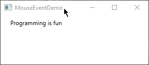
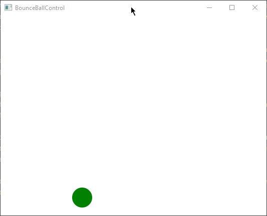

# CheckPoint Answers

* [15.2 Events and Event Sources](#152-events-and-event-sources)
  * [15.2.1](#1521)
  * [15.2.2](#1522)
* [15.3 Registering Handlers and Handling Events](#153-registering-handlers-and-handling-events)
  * [15.3.1](#1531)
  * [15.3.2](#1532)
  * [15.3.3](#1533)
  * [15.3.4](#1534)
* [15.4 Inner Classes](#154-inner-classes)
  * [15.4.1](#1541)
  * [15.4.2](#1542)
* [15.5 Anonymous Inner Class Handlers](#155-anonymous-inner-class-handlers)
  * [15.5.1](#1551)
  * [15.5.2](#1552)
* [15.6 Simplifying Event Handling Using Lambda Expressions](#156-simplifying-event-handling-using-lambda-expressions)
  * [15.6.1](#1561)
  * [15.6.2](#1562)
  * [15.6.3](#1563)
* [15.7 Case Study: Loan Calculator](#157-case-study-loan-calculator)
* [15.8 Mouse Events](#158-mouse-events)
  * [15.8.1](#1581)
  * [15.8.2](#1582)
* [15.9 Key Events](#159-key-events)
  * [15.9.1](#1591)
  * [15.9.2](#1592)
  * [15.9.3](#1593)
  * [15.9.4](#1594)
* [15.10 Listeners for Observable Objects](#1510-listeners-for-observable-objects)
  * [15.10.1](#15101)
* [15.11 Animation](#1511-animation)
  * [15.11.1](#15111)
  * [15.11.2](#15112)
  * [15.11.3](#15113)
  * [15.11.4](#15114)
* [15.12 Case Study: Bouncing Ball](#1512-case-study-bouncing-ball)
  * [15.12.1](#15121)
  * [15.12.2](#15122)
  * [15.12.3](#15123)
  * [15.12.4](#15124)
  * [15.12.5](#15125)
* [15.13 Case Study: US Map](#1513-case-study-us-map)
  * [15.13.1](#15131)
  * [15.13.2](#15132)
  * [15.13.3](#15133)

## 15.2 Events and Event Sources

### 15.2.1

> What is an event source object?  
> What is an event object?  
> Describe the relationship between an event source object and an event object.

**What is an event source object?**

An event source object is an object or component in a software application that has the capability to generate and emit events. These events are typically triggered by user interactions or other external actions, such as clicking a button, moving the mouse, or pressing a key. **The event source object is responsible for creating instances of event objects and notifying registered event handlers when events occur**. In JavaFX, examples of event source objects include buttons, text fields, and other user interface elements.

```java
import javafx.application.Application;
import javafx.event.ActionEvent;
import javafx.scene.Scene;
import javafx.scene.control.Button;
import javafx.scene.layout.StackPane;
import javafx.stage.Stage;

public class EventSourceLambdaExample extends Application {

    @Override
    public void start(Stage primaryStage) {
        primaryStage.setTitle("Event Source Lambda Example");

        Button btn = new Button("Click Me"); // Button is the event source object

        // Event handling for the button click event using lambda expression
        btn.setOnAction(event -> System.out.println("Button Clicked!"));

        StackPane root = new StackPane();
        root.getChildren().add(btn);
        primaryStage.setScene(new Scene(root, 300, 250));
        primaryStage.show();
    }
}
```

**What is an event object?**

An event object is an instance of a specific event class that **carries information** about a particular event that has occurred. When an event source object generates an event, it creates an event object to encapsulate details about that event. Event objects contain data such as the type of event, the source object that triggered it, and any relevant event-specific information. In JavaFX, event objects are usually instances of classes derived from the `javafx.event.Event` class, like `ActionEvent` for button clicks or `MouseEvent` for mouse-related events.

```java
import javafx.application.Application;
import javafx.event.ActionEvent;
import javafx.scene.Scene;
import javafx.scene.control.Button;
import javafx.scene.layout.StackPane;
import javafx.stage.Stage;

public class EventObjectLambdaExample extends Application {

    @Override
    public void start(Stage primaryStage) {
        primaryStage.setTitle("Event Object Lambda Example");

        Button btn = new Button("Click Me");

        // Event handling for the button click event using lambda expression
        btn.setOnAction(eventObject -> {
            // Accessing event information from the event object
            System.out.println("Event Type: " + eventObject.getEventType());
            System.out.println("Source Object: " + eventObject.getSource());
        });

        StackPane root = new StackPane();
        root.getChildren().add(btn);
        primaryStage.setScene(new Scene(root, 300, 250));
        primaryStage.show();
    }
}
```

**Describe the relationship between an event source object and an event object.**

The relationship between an event source object and an event object is that the event source object is responsible for generating and initiating events, while the event object represents a specific occurrence of that event. Here's how the relationship works:

1. **Event Generation:** The event source object, such as a button, detects a user action (e.g., a button click) or an external event (e.g., a mouse movement within its bounds). When this happens, the event source object creates a new event object.

2. **Event Object Information:** The event object contains information about the event, including the type of event and a reference to the event source object itself. It may also include additional data specific to the event type.

3. **Event Notification:** The event source object then notifies any registered event handlers or listeners that an event has occurred. It passes the event object to these handlers.

4. **Event Handling:** Event handlers, which are methods or code blocks designed to respond to specific event types, receive the event object as a parameter. They can extract information from the event object and take appropriate actions in response to the event.

In summary, the event source object initiates events and creates corresponding event objects, while the event object carries information about the event and is passed to event handlers for processing. This relationship allows for the effective handling of user interactions and external events in event-driven programming.

### 15.2.2

> Can a button fire a `MouseEvent`?  
> Can a button fire a `KeyEvent`?  
> Can a button fire an `ActionEvent`?

In JavaFX, a button can fire different types of events, but the events it can fire are specific to the user interactions that are typically associated with buttons.

1. **MouseEvent:** A button can fire `MouseEvent` events, such as `MousePressed`, `MouseReleased`, and `MouseClicked`, when a user interacts with it by clicking or moving the mouse over it. These events are related to mouse actions, and buttons are commonly associated with mouse clicks.

    ```java
    import javafx.application.Application;
    import javafx.event.EventHandler;
    import javafx.scene.Scene;
    import javafx.scene.control.Button;
    import javafx.scene.input.MouseEvent;
    import javafx.scene.layout.StackPane;
    import javafx.stage.Stage;
    
    public class MouseEventExample extends Application {
    
        @Override
        public void start(Stage primaryStage) {
            primaryStage.setTitle("Mouse Click Event Example");
    
            Button btn = new Button("Click Me");
    
            // Event handling for mouse click event
            btn.setOnMouseClicked(mouseEvent -> System.out.println("Mouse Clicked on Button!"));
    
            StackPane root = new StackPane();
            root.getChildren().add(btn);
            primaryStage.setScene(new Scene(root, 300, 250));
            primaryStage.show();
        }
    }
    ```

2. **KeyEvent:** A button does not typically fire `KeyEvent` events, but it is possible to handle keyboard events with buttons using `setOnKeyPressed` and related event handlers. `KeyEvent` events are usually associated with keyboard interactions, like pressing keys on the keyboard. Buttons can be configured to respond to keyboard input if needed.

    ```java
    import javafx.application.Application;
    import javafx.event.EventHandler;
    import javafx.scene.Scene;
    import javafx.scene.control.Button;
    import javafx.scene.input.KeyEvent;
    import javafx.scene.layout.StackPane;
    import javafx.stage.Stage;
    
    public class KeyEventExample extends Application {
    
        @Override
        public void start(Stage primaryStage) {
            primaryStage.setTitle("Key Press Event Example");
    
            Button btn = new Button("Press Spacebar");
    
            // Event handling for key press event (Spacebar)
            btn.setOnKeyPressed(keyEvent -> {
                if (keyEvent.getCode().isWhitespaceKey()) {
                        System.out.println("Spacebar Pressed!");
                }
            });
    
            StackPane root = new StackPane();
            root.getChildren().add(btn);
            primaryStage.setScene(new Scene(root, 300, 250));
            primaryStage.show();
    
            // Enable the button to receive key events
            btn.setFocusTraversable(true);
        }
    }
    ```

3. **ActionEvent:** A button commonly fires an `ActionEvent` when it's clicked. This is the most common event associated with buttons. When a user clicks a button, it generates an `ActionEvent`, and you can register event handlers to respond to this action.

    ```java
    import javafx.application.Application;
    import javafx.event.ActionEvent;
    import javafx.event.EventHandler;
    import javafx.scene.Scene;
    import javafx.scene.control.Button;
    import javafx.scene.layout.StackPane;
    import javafx.stage.Stage;
    
    public class ActionEventExample extends Application {
    
        @Override
        public void start(Stage primaryStage) {
            primaryStage.setTitle("Action Event (Button Click) Example");
    
            Button btn = new Button("Click Me");
    
            // Event handling for button click event
            btn.setOnAction(actionEvent -> System.out.println("Button Clicked!"););
    
            StackPane root = new StackPane();
            root.getChildren().add(btn);
            primaryStage.setScene(new Scene(root, 300, 250));
            primaryStage.show();
        }
    }
    ```

So, to summarize:

- A button can fire `MouseEvent` events related to mouse actions.
- A button does not fire `KeyEvent` events.
- A button commonly fires an `ActionEvent` when clicked.

## 15.3 Registering Handlers and Handling Events

### 15.3.1

> Why must a handler be an instance of an appropriate handler interface?

A handler must be an instance of an appropriate handler interface for several important reasons:

1. **Type Safety:** Handler interfaces define a specific set of methods that must be implemented to handle events of a particular type. This ensures type safety in event handling. When a handler is required to be an instance of a particular handler interface, it guarantees that the handler will have the correct method(s) to handle the associated event type. This prevents runtime errors that could occur if an incorrect handler type were used.

2. **Polymorphism:** By adhering to handler interfaces, Java can achieve polymorphism in event handling. Different objects can implement the same handler interface and handle events in a polymorphic manner. This means that the same code can work with different event handlers as long as they implement the required interface. This promotes code reuse and flexibility.

3. **Clear Contract:** Handler interfaces define a clear contract for how event handling should be implemented. This contract includes the method(s) that must be provided by the handler. This consistency in the interface definition makes it easier for developers to understand how to create custom event handlers and what is expected of them.

4. **Compatibility:** Handler interfaces are used by event source objects to find and invoke the appropriate methods when an event occurs. If a handler were not required to implement a specific interface, it would be challenging for event sources to know which methods to call, leading to ambiguity and potential errors in event handling.

In summary, requiring a handler to be an instance of an appropriate handler interface ensures type safety, enables polymorphism, defines a clear contract for event handling, and promotes compatibility between event sources and handlers. It is a fundamental part of the event-driven programming model and contributes to the robustness and maintainability of event-driven code.

### 15.3.2

> Explain how to register a handler object and how to implement a handler interface.

**Registering a Handler Object:**

Registering a handler object is the process of associating an event handler with an event source object. In Java and JavaFX, you typically register event handlers using methods provided by the event source object. Here's a step-by-step explanation of how to register a handler object:

1. **Create an Event Handler Object:** First, you need to create an instance of an event handler object that implements the appropriate handler interface for the event type you want to handle. This object will contain the code that responds to the event.

2. **Access the Event Source Object:** You should have access to the event source object, which is the component or entity that generates the event. This could be a button, a mouse, a keyboard, or any other entity capable of generating events.

3. **Use the Registration Method:** The event source object provides a registration method specific to the event type. The method typically follows a naming convention like `setOnXYZ`, where `XYZ` represents the event type. For example, to register an event handler for a button click event (`ActionEvent`), you would use the `setOnAction` method.

4. **Pass the Event Handler Object:** When you call the registration method, you pass the event handler object as an argument. This associates the handler with the event source.

5. **Handler Invocation:** When the event source generates the event, it will invoke the appropriate method on the registered handler object, allowing it to respond to the event.

Here's an example of registering an event handler for a button click event in JavaFX:

```java
import javafx.application.Application;
import javafx.event.ActionEvent;
import javafx.event.EventHandler;
import javafx.scene.Scene;
import javafx.scene.control.Button;
import javafx.scene.layout.StackPane;
import javafx.stage.Stage;

public class EventHandlerRegistrationExample extends Application {

   @Override
   public void start(Stage primaryStage) {
      primaryStage.setTitle("Event Handler Registration Example");

      Button button = new Button("Click Me");

      // Step 1: Create an event handler object
      EventHandler<ActionEvent> actionHandler = actionEvent -> {
         // Step 5: Event handling code goes here
         System.out.println("Button Clicked!");
      };

      // Step 3: Register the event handler using setOnAction
      button.setOnAction(actionHandler);

      StackPane root = new StackPane();
      root.getChildren().add(button);
      primaryStage.setScene(new Scene(root, 300, 250));
      primaryStage.show();
   }
}
```

**Implementing a Handler Interface:**

Implementing a handler interface involves creating a class that implements the specific interface associated with the event type you want to handle. Here are the steps to implement a handler interface:

1. **Create a Class:** Start by creating a Java class that will serve as your event handler. This class should implement the appropriate handler interface. The interface defines the method(s) you need to implement to handle the event.

2. **Implement the Interface Method(s):** Within your class, you must implement the method(s) defined by the handler interface. These methods are responsible for responding to the event when it occurs.

3. **Register the Handler:** After implementing the handler class, you can create an instance of it and register it with the event source object using the registration method specific to the event type.

Here's an example of implementing a custom event handler for a button click event (`ActionEvent`) in JavaFX:

```java
import javafx.event.ActionEvent;
import javafx.event.EventHandler;

public class MyActionHandler implements EventHandler<ActionEvent> {

   @Override
   public void handle(ActionEvent event) {
      // Event handling code goes here
      System.out.println("Custom Action Handler: Button Clicked!");
   }
}
```

In this example, `MyActionHandler` is a custom event handler class that implements the `EventHandler<ActionEvent>` interface. The `handle` method is implemented to respond to the button click event.

You can then create an instance of `MyActionHandler` and register it with a button as shown in the previous code example.

### 15.3.3

> What is the handler method for the `EventHandler<ActionEvent>` interface?

```java
package javafx.event;

import java.util.EventListener;

// PENDING_DOC_REVIEW
/**
* Handler for events of a specific class / type.
*
* @param <T> the event class this handler can handle
* @since JavaFX 2.0
*/
@FunctionalInterface
public interface EventHandler<T extends Event> extends EventListener {
    /**
     * Invoked when a specific event of the type for which this handler is
     * registered happens.
     *
     * @param event the event which occurred
     */
    void handle(T event);
}
```

The `handle` method is a single abstract method (SAM) defined by the `EventHandler` interface, which is a functional interface. In the context of `ActionEvent` handling, this method is responsible for processing the action event when it occurs.

Here's how you would typically implement the `handle` method when creating an event handler for `ActionEvent`:

```java
import javafx.event.ActionEvent;
import javafx.event.EventHandler;

public class MyActionHandler implements EventHandler<ActionEvent> {

    @Override
    public void handle(ActionEvent event) {
        // Event handling code goes here
        System.out.println("Button Clicked!");
    }
}
```

In this example, the `handle` method is implemented to respond to the `ActionEvent`. When the event source (e.g., a button) generates an action event, this method will be called, and you can specify the desired event handling logic within it.

### 15.3.4

> What is the registration method for a button to register an `ActionEvent` handler?

The registration method for a JavaFX button to register an `ActionEvent` handler is `setOnAction`. You use this method to associate an event handler with a button's action event.

Here's the typical syntax for registering an `ActionEvent` handler for a button:

```java
public class ControlCircle extends Application {

   private final CirclePane circlePane = new CirclePane();

   @Override
   public void start(Stage primaryStage) {
      // Hold two buttons in an HBox
      HBox hBox = new HBox();
      hBox.setSpacing(10);
      hBox.setAlignment(Pos.CENTER);
      Button btEnlarge = new Button("Enlarge");
      Button btShrink = new Button("Shrink");
      hBox.getChildren().add(btEnlarge);
      hBox.getChildren().add(btShrink);

      // Create and register the handler
      btEnlarge.setOnAction(new EnlargeHandler());
      btShrink.setOnAction(new ShrinkHandler());

      BorderPane borderPane = new BorderPane();
      borderPane.setCenter(circlePane);
      borderPane.setBottom(hBox);
      BorderPane.setAlignment(hBox, Pos.CENTER);

      // Create a scene and place it in the stage
      Scene scene = new Scene(borderPane, 200, 150);
      primaryStage.setTitle("ControlCircle"); // Set the stage title
      primaryStage.setScene(scene); // Place the scene in the stage
      primaryStage.show(); // Display the stage
   }

   class EnlargeHandler implements EventHandler<ActionEvent> {
      @Override
      public void handle(ActionEvent e) {
         circlePane.enlarge();
      }
   }

   class ShrinkHandler implements EventHandler<ActionEvent> {
      @Override
      public void handle(ActionEvent e) {
         circlePane.shrink();
      }
   }
}
```

Where:
- `button` is the JavaFX button for which you want to register the event handler.
- `setOnAction` is the registration method for the button's action event.
- `eventHandler` is the instance of an `EventHandler<ActionEvent>` that you want to register as the event handler.

Once registered, the `myEventHandler` will be invoked when the button is clicked, allowing you to define the desired action or behavior in response to the button click event.

## 15.4 Inner Classes

### 15.4.1

> Can an inner class be used in a class other than the class in which it nests?

Yes, an inner class can be used in a class other than the class in which it nests, but there are some conditions and considerations to keep in mind:

1. **Non-Static Inner Class (Member Inner Class or Method Inner Class):** By default, non-static inner classes have an implicit reference to an instance of the outer class. This means you cannot create an instance of a non-static inner class directly from another class without an instance of the outer class. You must first create an instance of the outer class, and then you can use that instance to create an instance of the inner class.

   ```java
   public class OuterClass {
       class InnerClass {
           // Inner class code
       }
   }

   public class AnotherClass {
       public void someMethod() {
           OuterClass outer = new OuterClass();
           OuterClass.InnerClass inner = outer.new InnerClass();
           // You can create an instance of InnerClass using an instance of OuterClass
       }
   }
   ```

2. **Static Inner Class:** Static inner classes are not tied to instances of the outer class, so you can create an instance of a static inner class directly from another class without needing an instance of the outer class.

   ```java
   public class OuterClass {
       static class StaticInnerClass {
           // Static inner class code
       }
   }

   public class AnotherClass {
       public void someMethod() {
           OuterClass.StaticInnerClass inner = new OuterClass.StaticInnerClass();
           // You can create an instance of StaticInnerClass directly
       }
   }
   ```

In summary, non-static inner classes require an instance of the outer class to be created, making them closely tied to the outer class's instances. Static inner classes, on the other hand, are more independent and can be created without an instance of the outer class. This flexibility allows you to use inner classes in other classes as needed, depending on your design requirements.

### 15.4.2

> Can the modifiers `public`, `protected`, `private`, and `static` be used for inner classes?

Yes, the modifiers `public`, `protected`, `private`, and `static` can be used for inner classes in Java, and they provide different levels of visibility and behavior for the inner classes:

1. **`public` Modifier:**
   - When you declare an inner class as `public`, it can be accessed from any class, both from within the same package and from other packages.

   ```java
   public class OuterClass {
       public class PublicInnerClass {
           // Inner class code
       }
   }
   ```

2. **`protected` Modifier:**
   - A `protected` inner class can be accessed from within the same package and by **subclasses** of the outer class, whether they are in the same package or a different package.

   ```java
   public class OuterClass {
       protected class ProtectedInnerClass {
           // Inner class code
       }
   }
   ```

3. **`private` Modifier:**
   - Declaring an inner class as `private` restricts its visibility to only the outer class in which it is defined. It cannot be accessed from any other class, not even from subclasses.

   ```java
   public class OuterClass {
       private class PrivateInnerClass {
           // Inner class code
       }
   }
   ```

4. **`static` Modifier:**
   - When an inner class is declared as `static`, it becomes a static member of the outer class. Static inner classes are **not tied to instances of the outer class** and can be accessed using the outer class's name. They can also have their own static members.

   ```java
   public class OuterClass {
       static class StaticInnerClass {
           // Static inner class code
       }
   }
   ```

It's important to choose the appropriate modifier based on your design requirements. The choice of visibility and static nature affects how the inner class can be accessed and whether it is tied to instances of the outer class.

## 15.5 Anonymous Inner Class Handlers

### 15.5.1

> If class `A` is an inner class in class `B`, what is the `.class` file for `A`?
> If class `B` contains two anonymous inner classes, what are the `.class` file names for these two classes?

In Java, the `.class` file names for inner classes, including anonymous inner classes, are determined by the following conventions:

1. **Non-Static Inner Class (Member Inner Class or Method Inner Class):**

   If class `A` is a non-static inner class within class `B`, the `.class` file for `A` will be named as follows:

   ```
   B$A.class
   ```

   The `$` symbol is used to separate the outer class (`B`) and the inner class (`A`) in the filename.

2. **Static Inner Class:**

   If class `A` is a static inner class within class `B`, the `.class` file for `A` will be named as follows:

   ```
   B$A.class
   ```

   Similar to non-static inner classes, the `$` symbol is used to separate the outer class (`B`) and the inner class (`A`) in the filename.

3. **Anonymous Inner Classes:**

   For anonymous inner classes, the naming convention is slightly different. If class `B` contains two anonymous inner classes, their `.class` file names will be assigned sequentially as follows:

   ```
   B$1.class
   B$2.class
   ```

   The `$` symbol is used to separate the outer class (`B`) and the sequential number assigned to each anonymous inner class.

These naming conventions are used to distinguish and identify inner classes in Java bytecode.

### 15.5.2

> What is wrong in the following code?
> (a)
> ```java
> public class Test extends Application {
>    public void start(Stage stage) {
>       Button btOK = new Button("OK");
>    }
>    private class Handler implements
>            EventHandler<ActionEvent> {
>       public void handle(Action e) {
>          System.out.println(e.getSource());
>       }
>    }
> }
> ```
>
> (b)
> ```java
> public class Test extends Application {
>      public void start(Stage stage) {
>          Button btOK = new Button("OK");
>          btOK.setOnAction(
>                  new EventHandler<ActionEvent> {
>              public void handle
>              (ActionEvent e) {
>                  System.out.println
>                                    (e.getSource());
>              }
>          } // Something missing here
>      }
>  }
>  ```

**(a) Code Snippet:**

```java
public class Test extends Application {
    public void start(Stage stage) {
        Button btOK = new Button("OK");
    }

    private class Handler implements EventHandler<ActionEvent> {
        public void handle(Action e) { // DOES NOT COMPILE, Action is not a subclass of ActionEvent
            System.out.println(e.getSource());
        }
    }
}
```

Issue in (a):

1. In the `handle` method of the `Handler` inner class, the parameter is incorrectly defined as `Action e` instead of `ActionEvent e`. It should be `public void handle(ActionEvent e)` to match the `EventHandler` interface.

**(b) Code Snippet:**

```java
public class Test extends Application {
    
    public void start(Stage stage) {
        Button btOK = new Button("OK");
        btOK.setOnAction(new EventHandler<ActionEvent> { // DOES NOT COMPILE, () is missing
            public void handle (ActionEvent e){
                System.out.println(e.getSource());
            }
        } // Something missing here
    }
}
```

Issue in (b):

1. In the anonymous inner class created within the `setOnAction` method, there is a comment (`// Something missing here`) but no code following it. It seems like the inner class declaration is incomplete.

To fix issue (b), you need to complete the anonymous inner class declaration correctly. Here's the corrected code snippet (b) with the missing part included:

```java
public class Test extends Application {
    public void start(Stage stage) {
        Button btOK = new Button("OK");
        btOK.setOnAction(new EventHandler<ActionEvent>() { // Added () here
            public void handle(ActionEvent e) {
                System.out.println(e.getSource());
            }
        }); // Added closing parenthesis and semicolon here
    }
}
```

In this corrected code, I added `()` after `ActionEvent` in the anonymous inner class declaration, and I added a closing parenthesis and semicolon at the end of the `setOnAction` method call to complete the anonymous inner class declaration correctly.

## 15.6 Simplifying Event Handling Using Lambda Expressions

### 15.6.1

> What is a lambda expression?  
> What is the benefit of using lambda expressions for event handling?  
> What is the syntax of a lambda expression?

**1. What is a lambda expression?**

A lambda expression in Java is an anonymous function that can be used to define behavior concisely. It is a way to represent a piece of code as an object. Lambda expressions are often used to define inline functions or provide implementations for functional interfaces (interfaces with a single abstract method). They allow you to pass behavior as data and are particularly useful for simplifying event handling and functional programming in Java.

**2. What is the benefit of using lambda expressions for event handling?**

The benefits of using lambda expressions for event handling include:

- **Conciseness:** Lambda expressions provide a more concise syntax for defining event handling logic compared to traditional anonymous inner classes. This makes the code easier to read and maintain.

- **Readability:** Lambda expressions make it clear what should happen when an event occurs without the need for verbose class definitions. This enhances code readability and reduces boilerplate code.

- **Simplification:** Lambda expressions eliminate the need to create separate classes or methods for event handling. They allow you to define event handling logic directly where it's needed.

- **Type Inference:** In many cases, the Java compiler can automatically infer the types of lambda expression parameters, reducing the need for explicit type declarations.

- **Functional Programming:** Lambda expressions promote a more functional programming style by treating behavior as first-class citizens. They allow you to pass behavior as arguments to methods, making your code more modular and flexible.

**3. What is the syntax of a lambda expression?**

The basic syntax of a lambda expression consists of the following components:

```java
(parameters) -> expression
(parameters) -> { statements; }
```

- `parameters`: These are the input parameters to the lambda expression. They can be explicitly declared with their data types, or the compiler can infer the types based on the context. If there's only one parameter and its type can be inferred, you can omit the parentheses.

- `->`: The arrow symbol (`->`) separates the parameters from the body of the lambda expression.

- `expression` or `{ statements; }`: This is the body of the lambda expression, where you define the behavior. It can be a single expression or a block of statements enclosed in curly braces. If there's only one statement, you can omit the curly braces.

Here are some examples of lambda expression syntax:

```java
// Lambda with no parameters and a single expression
() -> "Hello, World!"

// Lambda with one parameter and a single expression
(x) -> x * 2

// Lambda with two parameters and a block of statements
(x, y) -> {
    int sum = x + y;
    return sum;
}
```

Lambda expressions provide a more concise and expressive way to define behavior in Java code, particularly for event handling and functional programming.

### 15.6.2

> What is a functional interface?  
> Why is a functional interface required for a lambda expression?

**1. What is a functional interface?**

A functional interface in Java is an interface that contains exactly one abstract method. It's a special type of interface designed to represent a single unit of behavior. While a functional interface can have multiple default or static methods, it must have only one unimplemented (abstract) method. Functional interfaces are used to define contracts for lambda expressions and method references in Java.

**2. Why is a functional interface required for a lambda expression?**

A functional interface is required for a lambda expression because lambda expressions are used to provide implementations for the single abstract method defined by the functional interface. Here's why functional interfaces and lambda expressions are closely related:

- **Single Abstract Method (SAM):** Lambda expressions are essentially used to implement the abstract method(s) of an interface. A functional interface ensures that there's only one abstract method to implement, making it clear which method the lambda expression should target.

- **Type Inference:** The Java compiler uses the functional interface's method signature to infer the types of lambda expression parameters and the return type. Without a functional interface, the compiler would not know how to match the lambda expression's behavior with a specific method.

- **Conciseness:** Functional interfaces simplify the use of lambda expressions by providing a clear and minimal contract. They allow you to express behavior concisely without the need for a separate class or method declaration.

- **Lambda Expression Compatibility:** When you use a lambda expression, it must match the signature (parameter types and return type) of the single abstract method in the functional interface. This ensures that lambda expressions are compatible with the intended interface and provide the expected behavior.

In summary, functional interfaces are required for lambda expressions in Java to provide a clear contract for behavior implementation. They enforce a single abstract method, making it possible for the compiler to match lambda expressions to the appropriate method, perform type inference, and ensure compatibility. This combination of functional interfaces and lambda expressions simplifies coding, especially in scenarios like event handling and functional programming.

Code examples that demonstrate the usage of the `@FunctionalInterface` annotation in Java:

**Example 1: Creating a Custom Functional Interface**

```java
@FunctionalInterface
interface MathOperation {
    int operate(int a, int b);
}

public class Calculator {
    public static void main(String[] args) {
        // Using a lambda expression to implement the functional interface
        MathOperation addition = (a, b) -> a + b;
        MathOperation subtraction = (a, b) -> a - b;
        
        // Using the functional interface implementations
        System.out.println("Addition: " + performOperation(5, 3, addition));
        System.out.println("Subtraction: " + performOperation(5, 3, subtraction));
    }

    public static int performOperation(int a, int b, MathOperation operation) {
        return operation.operate(a, b);
    }
}
```

In this example, we define a custom functional interface `MathOperation` and annotate it with `@FunctionalInterface`. Then, we use lambda expressions to provide implementations for this interface.

**Example 2: Using Built-In Functional Interfaces**

```java
import java.util.function.Predicate;

public class PredicateExample {
    public static void main(String[] args) {
        // Using a built-in functional interface Predicate
        Predicate<Integer> isEven = n -> n % 2 == 0;
        Predicate<Integer> isPositive = n -> n > 0;

        int num = 6;

        if (isEven.and(isPositive).test(num)) {
            System.out.println(num + " is both even and positive.");
        }
    }
}
```

In this example, we use the built-in functional interface `Predicate` from the Java Standard Library. We create `isEven` and `isPositive` predicates using lambda expressions and then combine them using the `and` method provided by the `Predicate` interface.

**Example 3: Functional Interfaces with Method References**

```java
import java.util.function.Consumer;

public class MethodReferenceExample {
    public static void main(String[] args) {
        // Using a built-in functional interface Consumer with method reference
        Consumer<String> printUpperCase = System.out::println;
        
        printUpperCase.accept("Hello, Java!");
    }
}
```

Here, we use the built-in functional interface `Consumer` along with a method reference (`System.out::println`) to create a lambda expression. The `printUpperCase` consumer will print a string in uppercase.

In these examples, we showcase the usage of `@FunctionalInterface` with custom and built-in functional interfaces, including lambda expressions and method references to provide implementations for single abstract methods. This combination allows for concise and expressive coding in Java.

### 15.6.3

> Replace the code in lines 5 and 6 in `TestLambda.java` using anonymous inner classes.

```java
package org.mrdrprof.solutions.chapter_15_event_driven_programming_and_animations.theory;

public class TestLambda {

    public static void main(String[] args) {
        TestLambda test = new TestLambda();
        test.setAction1(new T1() {
            @Override
            public void m1() {
                System.out.print("Action 1! ");
            }
        });

        test.setAction2(new T2() {
            @Override
            public void m2(Double d) {
                System.out.print(e + " ");
            }
        });

        System.out.println(test.getValue(new T3() {
            @Override
            public int m3(int d1, int d2) {
                return Math.addExact(d1, d2);
            }
        }));
    }

    public void setAction1(T1 t) {
        t.m1();
    }

    public void setAction2(T2 t) {
        t.m2(4.5);
    }

    public int getValue(T3 t) {
        return t.m3(5, 2);
    }
}

@FunctionalInterface
interface T1 {
    void m1();
}

@FunctionalInterface
interface T2 {
    void m2(Double d);
}

@FunctionalInterface
interface T3 {
    int m3(int d1, int d2);
}
```

## 15.7 Case Study: Loan Calculator

```java
package org.mrdrprof.solutions.chapter_15_event_driven_programming_and_animations.theory;

import javafx.application.Application;
import javafx.geometry.HPos;
import javafx.geometry.Pos;
import javafx.scene.Scene;
import javafx.scene.control.Button;
import javafx.scene.control.Label;
import javafx.scene.control.TextField;
import javafx.scene.layout.GridPane;
import javafx.stage.Stage;
import org.mrdrprof.solutions.utils.chapter_10.Loan;

import java.text.NumberFormat;

public class LoanCalculator extends Application {

    private final TextField tfAnnualInterestRate = new TextField();
    private final TextField tfNumberOfYears = new TextField();
    private final TextField tfLoanAmount = new TextField();
    private final TextField tfMonthlyPayment = new TextField();
    private final TextField tfTotalPayment = new TextField();
    private final Button btCalculate = new Button("Calculate");

    @Override
    public void start(Stage primaryStage) {
        // Create UI
        GridPane gridPane = new GridPane();
        gridPane.setHgap(5);
        gridPane.setVgap(5);
        gridPane.add(new Label("Annual Interest Rate:"), 0, 0);
        gridPane.add(tfAnnualInterestRate, 1, 0);
        gridPane.add(new Label("Number of Years:"), 0, 1);
        gridPane.add(tfNumberOfYears, 1, 1);
        gridPane.add(new Label("Loan Amount:"), 0, 2);
        gridPane.add(tfLoanAmount, 1, 2);
        gridPane.add(new Label("Monthly Payment:"), 0, 3);
        gridPane.add(tfMonthlyPayment, 1, 3);
        gridPane.add(new Label("Total Payment:"), 0, 4);
        gridPane.add(tfTotalPayment, 1, 4);
        gridPane.add(btCalculate, 1, 5);

        // Set properties for UI
        gridPane.setAlignment(Pos.CENTER);
        tfAnnualInterestRate.setAlignment(Pos.BOTTOM_RIGHT);
        tfNumberOfYears.setAlignment(Pos.BOTTOM_RIGHT);
        tfLoanAmount.setAlignment(Pos.BOTTOM_RIGHT);
        tfMonthlyPayment.setAlignment(Pos.BOTTOM_RIGHT);
        tfTotalPayment.setAlignment(Pos.BOTTOM_RIGHT);
        tfMonthlyPayment.setEditable(false);
        tfTotalPayment.setEditable(false);
        GridPane.setHalignment(btCalculate, HPos.RIGHT);

        // Process events
        btCalculate.setOnAction(e -> calculateLoanPayment());

        // Create a scene and place it in the stage
        Scene scene = new Scene(gridPane, 400, 250);
        primaryStage.setTitle("LoanCalculator"); // Set title
        primaryStage.setScene(scene); // Place the scene in the stage
        primaryStage.show(); // Display the stage
    }

    private void calculateLoanPayment() {
        // Get values from text fields
        double interest = Double.parseDouble(tfAnnualInterestRate.getText());
        int year = Integer.parseInt(tfNumberOfYears.getText());
        double loanAmount = Double.parseDouble(tfLoanAmount.getText());

        // Create a loan object. Loan defined in Listing 10.2
        Loan loan = new Loan(interest, year, loanAmount);

        // Display monthly payment and total payment
        NumberFormat currencyFormatter = NumberFormat.getCurrencyInstance();
        currencyFormatter.setMaximumFractionDigits(2);
        tfMonthlyPayment.setText(currencyFormatter.format(loan.getMonthlyPayment()));
        tfTotalPayment.setText(currencyFormatter.format(loan.getTotalPayment()));
    }
}
```


## 15.8 Mouse Events



### 15.8.1

> What method do you use to get the mouse-point position for a mouse event?

To get the mouse-point position for a mouse event in JavaFX, you can use the `getX()` and `getY()` methods provided by the `MouseEvent` object. Here's how you can use them:

- `getX()`: This method returns the x-coordinate (horizontal position) of the mouse pointer relative to the source node or scene where the event occurred.

- `getY()`: This method returns the y-coordinate (vertical position) of the mouse pointer relative to the source node or scene where the event occurred.

Here's an example of how to use these methods within a mouse event handler:

```java
node.setOnMouseClicked(event -> {
    double x = event.getX();
    double y = event.getY();
    
    System.out.println("Mouse Clicked at x=" + x + ", y=" + y);
});
```

In this example, when a mouse click event occurs, the `getX()` and `getY()` methods are used to retrieve the mouse's x and y coordinates relative to the `node` where the click event happened. You can then use these coordinates to perform actions or update your application based on the mouse's position.

### 15.8.2

> What methods do you use to register a handler for mouse-pressed, `-released`, `-clicked`, `-entered`, `-exited`, `-moved`, and `-dragged` events?

In JavaFX, you can register event handlers for various mouse events using the following methods for the corresponding events:

1. **Mouse Pressed Event**: To register a handler for a mouse-pressed event, you can use the `setOnMousePressed` method.

```java
node.setOnMousePressed(event -> {
    // Handle mouse-pressed event
});
```

2. **Mouse Released Event**: To register a handler for a mouse-released event, you can use the `setOnMouseReleased` method.

```java
node.setOnMouseReleased(event -> {
    // Handle mouse-released event
});
```

3. **Mouse Clicked Event**: To register a handler for a mouse-clicked event, you can use the `setOnMouseClicked` method.

```java
node.setOnMouseClicked(event -> {
    // Handle mouse-clicked event
});
```

4. **Mouse Entered Event**: To register a handler for a mouse-entered event (when the mouse cursor enters a node's boundaries), you can use the `setOnMouseEntered` method.

```java
node.setOnMouseEntered(event -> {
    // Handle mouse-entered event
});
```

5. **Mouse Exited Event**: To register a handler for a mouse-exited event (when the mouse cursor exits a node's boundaries), you can use the `setOnMouseExited` method.

```java
node.setOnMouseExited(event -> {
    // Handle mouse-exited event
});
```

6. **Mouse Moved Event**: To register a handler for a mouse-moved event (when the mouse cursor is moved within a node's boundaries), you can use the `setOnMouseMoved` method.

```java
node.setOnMouseMoved(event -> {
    // Handle mouse-moved event
});
```

7. **Mouse Dragged Event**: To register a handler for a mouse-dragged event (when the mouse button is held down, and the mouse cursor is moved within a node's boundaries), you can use the `setOnMouseDragged` method.

```java
node.setOnMouseDragged(event -> {
    // Handle mouse-dragged event
});
```

You can attach these event handlers to specific nodes within your JavaFX application to respond to mouse events as needed.


## 15.9 Key Events


### 15.9.1

> What methods do you use to register handlers for key-pressed, key-released, and key-typed events?  
> In which classes are these methods defined?

In JavaFX, you can register handlers for key events using the following methods, and these methods are defined in various classes:

1. **Key Pressed Event Handler**:
  - To register a handler for the key-pressed event, you can use the `setOnKeyPressed` method.
  - This method is typically defined in classes that represent nodes or scenes where you want to capture key presses.
  - For example, you can use it on instances of classes like `Node`, `Scene`, or `Stage`.

2. **Key Released Event Handler**:
  - To register a handler for the key-released event, you can use the `setOnKeyReleased` method.
  - Similar to the key-pressed handler, this method is also typically defined in classes that represent nodes or scenes.
  - You can use it on instances of classes like `Node`, `Scene`, or `Stage`.

3. **Key Typed Event Handler**:
  - To register a handler for the key-typed event, you can use the `setOnKeyTyped` method.
  - This method is also typically defined in classes that represent nodes or scenes.
  - You can use it on instances of classes like `Node`, `Scene`, or `Stage`.

Here's an example of how to use these methods to register key event handlers:

```java
// Register a key pressed event handler
node.setOnKeyPressed(event -> {
    // Handle key pressed event
});

// Register a key released event handler
node.setOnKeyReleased(event -> {
    // Handle key released event
});

// Register a key typed event handler
node.setOnKeyTyped(event -> {
    // Handle key typed event
});
```

In this example, `node` represents an instance of a class like `Node`, `Scene`, or `Stage`, and you can register the appropriate key event handlers based on your requirements.


### 15.9.2

> What method do you use to get the key character for a key-typed event?  
> What method do you use to get the key code for a key-pressed or key-released event?

In JavaFX, you can use the following methods to get key-related information for key events:

1. **Getting the Key Character for a Key-Typed Event**:
   - To retrieve the key character associated with a key-typed event, you can use the `getCharacter()` method of the `KeyEvent` class.
   - This method returns a `String` representing the Unicode character(s) associated with the typed key.
   - It is used specifically for key-typed events.

   ```java
   node.setOnKeyTyped(event -> {
       String typedCharacter = event.getCharacter();
       // Handle the typed character
   });
   ```

2. **Getting the Key Code for Key Pressed or Key Released Events**:
   - To obtain the key code associated with a key-pressed or key-released event, you can use the `getCode()` method of the `KeyEvent` class.
   - This method returns a constant value from the `KeyCode` enum, representing the code of the key that was pressed or released.
   - It is used for key-pressed and key-released events.

   ```java
   node.setOnKeyPressed(event -> {
       KeyCode keyCode = event.getCode();
       // Handle the key code
   });

   node.setOnKeyReleased(event -> {
       KeyCode keyCode = event.getCode();
       // Handle the key code
   });
   ```

In summary, `getCharacter()` is used to retrieve the typed character for key-typed events, and `getCode()` is used to obtain the key code for key-pressed and key-released events.


### 15.9.3

> How do you set focus on a node so it can listen for key events?

To set focus on a JavaFX node so that it can listen for key events, you can use the `requestFocus()` method of the node. This method asks the system to give focus to the specified node, allowing it to receive key events when it's active.

Here's how you can set focus on a node:

```java
Node node = ...; // Your JavaFX node

// Request focus for the node
node.requestFocus();
```

You can call `requestFocus()` on any JavaFX node, such as `Button`, `TextField`, or `Pane`, to ensure that it can listen for and respond to key events. When the node has focus, it will receive key events when the user interacts with the keyboard while the node is active or selected.

Keep in mind that you should call `requestFocus()` when it's appropriate for your application's user interface and user interaction flow to ensure that the desired node is focused at the right time.

### 15.9.4

> If the following code is inserted in line 57 in Listing 15.9, what is the output if the user presses the key for letter A?  
> What is the output if the user presses the up arrow key?
> ```java
> circlePane.setOnKeyPressed(e > System.out.println("Key pressed " + e.getCode()));
> circlePane.setOnKeyTyped(e > System.out.println("Key typed " + e.getCode()));
> ```

If you insert the provided code into line 57 of the given JavaFX code, here's what will happen when the user presses the key for letter A and the up arrow key:

1. **Key Pressed Event (A key)**:
   - When the user presses the A key, the `setOnKeyPressed` event handler will be triggered, and it will print a message indicating that a key was pressed along with the code of the key.
   - The code for the A key is retrieved using `e.getCode()`, which will be `KeyCode.A`.
   - So, it will print: "Key pressed A".

2. **Key Typed Event (A key)**:
   - After the key press event, the key-typed event will also be triggered, and it will print a message indicating that a key was typed along with the code of the key.
   - Again, the code for the A key is retrieved using `e.getCode()`, which will be `KeyCode.A`.
   - So, it will print: "Key typed A".

3. **Key Pressed Event (Up Arrow Key)**:
   - When the user presses the up arrow key, the `setOnKeyPressed` event handler will be triggered, and it will print a message indicating that a key was pressed along with the code of the key.
   - The code for the up arrow key is retrieved using `e.getCode()`, which will be `KeyCode.UP`.
   - So, it will print: "Key pressed UP".

In summary, when the user presses the A key, both the key-pressed and key-typed events will occur and print the corresponding messages. When the user presses the up arrow key, only the key-pressed event will occur and print the corresponding message.

## 15.10 Listeners for Observable Objects

### 15.10.1


> What would happen if you replace `pane` with `scene` or `primaryStage` in lines 3132?

It will work with the scene, because the scene and pane have the same size in this case. When the scene size changes, the pane size changes accordingly. It does not work with a stage, because change the dimension on the stage does not change the height of the scene and pane in this case.

## 15.11 Animation

### 15.11.1

> How do you set the cycle count of an animation to infinite?  
> How do you auto reverse an animation?  
> How do you start, pause, and stop an animation?

In JavaFX, you can control the behavior of animations, including setting the cycle count, enabling auto-reversal, and managing the animation's lifecycle using the following methods and techniques:

1. **Set the Cycle Count to Infinite**:
  - To make an animation run indefinitely, you can set its cycle count to `Animation.INDEFINITE`. This means the animation will keep repeating until you explicitly stop it.
  - Example:
    ```java
    animation.setCycleCount(Animation.INDEFINITE);
    ```

2. **Enable Auto-Reversal**:
  - You can enable auto-reversal for an animation by using the `setAutoReverse(true)` method. When auto-reversal is enabled, the animation will play forward and then automatically reverse itself, creating a ping-pong effect.
  - Example:
    ```java
    animation.setAutoReverse(true);
    ```

3. **Start, Pause, and Stop an Animation**:
  - To control the playback of an animation, you can use the following methods:
    - `play()`: Starts or resumes the animation if it's paused or stopped.
    - `pause()`: Pauses the animation at its current position.
    - `stop()`: Stops the animation and resets it to its initial state.
    - Example:
      ```java
      animation.play();  // Start or resume
      animation.pause(); // Pause
      animation.stop();  // Stop and reset
      ```

Here's a more detailed example demonstrating these concepts:

```java
import javafx.animation.KeyFrame;
import javafx.animation.Timeline;
import javafx.application.Application;
import javafx.event.ActionEvent;
import javafx.event.EventHandler;
import javafx.scene.Scene;
import javafx.scene.layout.StackPane;
import javafx.scene.shape.Circle;
import javafx.stage.Stage;
import javafx.util.Duration;

public class AnimationControlExample extends Application {
    public static void main(String[] args) {
        launch(args);
    }

    @Override
    public void start(Stage primaryStage) {
        Circle circle = new Circle(50);
        circle.setStyle("-fx-fill: blue;");

        StackPane root = new StackPane();
        root.getChildren().add(circle);

        Scene scene = new Scene(root, 400, 400);

        primaryStage.setTitle("Animation Control Example");
        primaryStage.setScene(scene);
        primaryStage.show();

        // Create a simple scaling animation for the circle
        Timeline animation = new Timeline(
            new KeyFrame(Duration.seconds(2), new EventHandler<ActionEvent>() {
                @Override
                public void handle(ActionEvent event) {
                    // Scale the circle up
                    circle.setScaleX(2.0);
                    circle.setScaleY(2.0);
                }
            }),
            new KeyFrame(Duration.seconds(4), new EventHandler<ActionEvent>() {
                @Override
                public void handle(ActionEvent event) {
                    // Reset the scale to normal
                    circle.setScaleX(1.0);
                    circle.setScaleY(1.0);
                }
            })
        );
        animation.setCycleCount(Animation.INDEFINITE);
        animation.setAutoReverse(true);

        // Start the animation
        animation.play();

        // Pause the animation after 6 seconds
        new Timeline(new KeyFrame(Duration.seconds(6), e -> animation.pause())).play();

        // Resume the animation after 10 seconds
        new Timeline(new KeyFrame(Duration.seconds(10), e -> animation.play())).play();

        // Stop the animation after 15 seconds
        new Timeline(new KeyFrame(Duration.seconds(15), e -> animation.stop())).play();
    }
}
```

In this example, we create a simple scaling animation for a circle, set it to run indefinitely with auto-reversal, and then demonstrate pausing, resuming, and stopping the animation at different times.

### 15.11.2

> Are `PathTransition`, `FadeTransition`, and `Timeline` subtypes of `Animation`?

Yes, in JavaFX, `PathTransition`, `FadeTransition`, and `Timeline` are subtypes of the `Animation` class. They all inherit from the `Animation` class, which provides core functionality for animations in JavaFX.

Here's a brief explanation of each of these classes:

1. **PathTransition**:
  - `PathTransition` is a subtype of `Animation` that animates the movement of a node along a path over a specified duration. It is used to create animations where a node follows a predefined path.

2. **FadeTransition**:
  - `FadeTransition` is another subtype of `Animation`. It is used to animate the change in opacity (transparency) of a node over a specified duration. This animation can make a node gradually appear or disappear on the screen.

3. **Timeline**:
  - `Timeline` is also a subtype of `Animation`. Unlike the specialized animations like `PathTransition` and `FadeTransition`, `Timeline` is a more flexible and general-purpose animation class.
  - `Timeline` allows you to define a sequence of animation keyframes, each with its own duration and set of actions. This makes it suitable for creating custom animations with precise control over timing and events.

By inheriting from `Animation`, these classes share common methods and properties related to animation control, such as setting the cycle count, auto-reversal, and controlling the animation's state (start, pause, stop). However, each of them specializes in different types of animations, making it easier to create specific animations in JavaFX.


### 15.11.3

> How do you create a `PathTransition`?  
> How do you create a `FadeTransition`?  
> How do you create a `Timeline`?

In JavaFX, you can create `PathTransition`, `FadeTransition`, and `Timeline` animations using the following steps:

**Creating a PathTransition**:


1. **Create a `Path` object**: First, create a `javafx.scene.shape.Path` object that defines the path along which you want to animate a node.

2. **Create a `PathTransition` object**: Instantiate a `PathTransition` object and specify the node you want to animate, the `Path` object, and the duration of the animation.

3. **Set other properties**: You can optionally set additional properties for the `PathTransition`, such as the cycle count, auto-reverse behavior, and more.

4. **Add to the scene**: Add the `PathTransition` object to your JavaFX scene or layout.

Here's an example code snippet that demonstrates how to create a `PathTransition`:

```java
import javafx.animation.PathTransition;
import javafx.scene.shape.Path;
import javafx.util.Duration;

// Create a Path object
Path path = new Path();
path.getElements().addAll(/* Define path elements */);

// Create a PathTransition object
PathTransition pathTransition = new PathTransition();
pathTransition.setNode(/* Node to be animated */);
pathTransition.setPath(path);
pathTransition.setDuration(Duration.seconds(2));

// Optional: Set other properties like cycle count and auto-reverse
pathTransition.setCycleCount(PathTransition.INDEFINITE);
pathTransition.setAutoReverse(true);

// Add the PathTransition to your scene or layout
```

**Creating a FadeTransition**:


1. **Create a `FadeTransition` object**: Instantiate a `FadeTransition` object and specify the node you want to animate and the duration of the fade animation.

2. **Set other properties**: You can optionally set additional properties for the `FadeTransition`, such as the target opacity values, cycle count, auto-reverse behavior, and more.

3. **Add to the scene**: Add the `FadeTransition` object to your JavaFX scene or layout.

Here's an example code snippet that demonstrates how to create a `FadeTransition`:

```java
import javafx.animation.FadeTransition;
import javafx.util.Duration;

// Create a FadeTransition object
FadeTransition fadeTransition = new FadeTransition();
fadeTransition.setNode(/* Node to be animated */);
fadeTransition.setDuration(Duration.seconds(2));

// Set target opacity values
fadeTransition.setFromValue(1.0);
fadeTransition.setToValue(0.0);

// Optional: Set other properties like cycle count and auto-reverse
fadeTransition.setCycleCount(FadeTransition.INDEFINITE);
fadeTransition.setAutoReverse(true);

// Add the FadeTransition to your scene or layout
```

**Creating a Timeline**:


1. **Create `KeyFrame` objects**: Define one or more `KeyFrame` objects, each specifying a duration and an `EventHandler` that defines the actions to be performed at that point in time.

2. **Create a `Timeline` object**: Instantiate a `Timeline` object and pass the `KeyFrame` objects to its constructor.

3. **Set other properties**: You can optionally set properties for the `Timeline`, such as the cycle count and auto-reverse behavior.

4. **Add to the scene**: Add the `Timeline` object to your JavaFX scene or layout.

Here's an example code snippet that demonstrates how to create a `Timeline`:

```java
import javafx.animation.KeyFrame;
import javafx.animation.Timeline;
import javafx.event.ActionEvent;
import javafx.event.EventHandler;
import javafx.util.Duration;

// Create KeyFrame objects
KeyFrame keyFrame1 = new KeyFrame(Duration.seconds(1), new EventHandler<ActionEvent>() {
    @Override
    public void handle(ActionEvent event) {
        // Define actions for this keyframe
    }
});

// Create a Timeline object and add KeyFrames
Timeline timeline = new Timeline(keyFrame1, /* Add more KeyFrames as needed */);

// Optional: Set other properties like cycle count and auto-reverse
timeline.setCycleCount(Timeline.INDEFINITE);
timeline.setAutoReverse(true);

// Add the Timeline to your scene or layout
```

These examples provide the basic structure for creating `PathTransition`, `FadeTransition`, and `Timeline` animations in JavaFX. You can customize them further to suit your specific animation requirements.

### 15.11.4

> How do you create a `KeyFrame`?

To create a `KeyFrame` in JavaFX, you'll need to follow these steps:

1. **Create an `EventHandler<ActionEvent>`**: First, define an `EventHandler` that specifies the actions to be performed when this `KeyFrame` is reached during the animation.

2. **Create a `KeyFrame` object**: Instantiate a `KeyFrame` object, providing two parameters:
  - `Duration time`: The time at which the `KeyFrame` should be executed.
  - `EventHandler<ActionEvent> onFinished`: The `EventHandler` that defines the actions to be performed when the `KeyFrame` is reached.

3. **Add the `KeyFrame` to your `Timeline`**: If you're creating a `Timeline` animation, add the `KeyFrame` to the `Timeline` using the `getKeyFrames().add(keyFrame)` method.

Here's an example code snippet that demonstrates how to create a `KeyFrame`:

```java
import javafx.animation.KeyFrame;
import javafx.animation.Timeline;
import javafx.event.ActionEvent;
import javafx.event.EventHandler;
import javafx.util.Duration;

// Define an EventHandler for the KeyFrame
EventHandler<ActionEvent> keyFrameHandler = new EventHandler<ActionEvent>() {
    @Override
    public void handle(ActionEvent event) {
        // Define actions to be performed when the KeyFrame is reached
        System.out.println("KeyFrame executed at " + System.currentTimeMillis());
    }
};

// Create a KeyFrame and specify the time and the EventHandler
KeyFrame keyFrame = new KeyFrame(Duration.seconds(2), keyFrameHandler);

// Create a Timeline and add the KeyFrame to it
Timeline timeline = new Timeline(keyFrame);

// Optional: Set properties for the Timeline
timeline.setCycleCount(Timeline.INDEFINITE); // Set cycle count to infinite
timeline.setAutoReverse(true); // Enable auto-reverse

// Start the Timeline to begin the animation
timeline.play();
```

In this example, we first define an `EventHandler` (`keyFrameHandler`) that specifies the actions to be performed when the `KeyFrame` is reached. Then, we create a `KeyFrame` with a specified time (`Duration.seconds(2)`) and associate it with the `keyFrameHandler`. Finally, we create a `Timeline` and add the `KeyFrame` to it, allowing us to control the animation's behavior.


## 15.12 Case Study: Bouncing Ball

### 15.12.1

> How does the program make the ball appear to be moving?

The program makes the ball appear to be moving by using the JavaFX Animation API. Here's how it works:

1. **`BallPane` Class**: This class extends `Pane` and represents the pane where the ball will be displayed. It contains properties and methods to control the ball's movement and animation.

2. **`Timeline` Animation**: Inside the `BallPane` constructor, a `Timeline` animation is created. The `Timeline` class is a part of JavaFX's animation framework and allows you to schedule events at specified time intervals. In this case, it's used to update the ball's position at regular intervals, creating the illusion of motion.

3. **`KeyFrame`**: The `Timeline` animation is configured with a `KeyFrame`. A `KeyFrame` is a specific point in time within the animation. It specifies a duration (in this case, 10 milliseconds) and an event handler (`e -> moveBall()`) to execute when that time is reached.

4. **`moveBall` Method**: The `moveBall` method is called when the `KeyFrame` is executed. Inside this method, the program checks whether the ball has reached the boundaries of the `BallPane`. If it has, the direction of the ball's movement is reversed by changing the sign of the `dx` and `dy` values.

5. **Updating Ball Position**: The `moveBall` method updates the ball's position by adding `dx` to the current x-coordinate (`x += dx`) and `dy` to the current y-coordinate (`y += dy`). This change in position is reflected by setting the `centerX` and `centerY` properties of the `Circle` representing the ball.

6. **Animation Loop**: The animation loop continues to execute the `moveBall` method at the specified time intervals (10 milliseconds in this case), creating the animation effect. This loop repeats indefinitely due to `animation.setCycleCount(Animation.INDEFINITE)`.

7. **User Interaction**: The program also allows user interaction to control the animation. The ball's animation can be paused and resumed by clicking the mouse (`setOnMousePressed` and `setOnMouseReleased`), and the animation speed can be increased or decreased using the up and down arrow keys (`setOnKeyPressed`).

In summary, the program uses JavaFX's animation capabilities to repeatedly update the ball's position, making it appear as if it's bouncing and moving within the `BallPane`. The `Timeline` and `KeyFrame` work together to create this animation loop. User interactions with the mouse and keyboard can control aspects of the animation.



### 15.12.2

> How does the code in Listing 15.17, `BallPane.java`, change the direction of the ball movement?

In the code from Listing 15.17, the `BallPane.java` class, the direction of the ball's movement is changed in response to collisions with the boundaries of the `Pane` where the ball is displayed. Here's how the code accomplishes this:

1. The `moveBall` method is responsible for updating the position of the ball. It is called periodically by a `Timeline` animation.

2. The position of the ball is represented by its coordinates `(x, y)`.

3. The conditional statements in the `moveBall` method check whether the ball has hit the left, right, top, or bottom boundaries of the `Pane`.

4. If the ball's `x` coordinate is less than its radius (`RADIUS`) or greater than the width of the `Pane` minus the radius, it means the ball has hit the left or right boundary. In this case, the `dx` value (horizontal direction) is inverted by multiplying it by `-1`. This change in direction causes the ball to bounce off the left or right wall.

5. Similarly, if the ball's `y` coordinate is less than its radius or greater than the height of the `Pane` minus the radius, it means the ball has hit the top or bottom boundary. In this case, the `dy` value (vertical direction) is inverted by multiplying it by `-1`. This change in direction causes the ball to bounce off the top or bottom wall.

6. After changing the direction based on the boundary collision, the `x` and `y` coordinates are updated by adding the `dx` and `dy` values, respectively, to their current values. This update moves the ball in its new direction.

7. Finally, the `Circle` representing the ball is updated with the new position by setting its center coordinates to `(x, y)`.

By repeatedly calling the `moveBall` method with a short duration between each call, the ball appears to bounce around the `Pane`, changing direction whenever it collides with a boundary. This creates the illusion of a moving ball that bounces off the walls.

```java
package org.mrdrprof.solutions.chapter_15_event_driven_programming_and_animations.theory;

// ...

public class BallPane extends Pane {
    
    // ...

    protected void moveBall() {
        // Check boundaries
        if (x < RADIUS || x > getWidth() - RADIUS) {
            dx *= -1; // Change ball move direction
        }
        if (y < RADIUS || y > getHeight() - RADIUS) {
            dy *= -1; // Change ball move direction
        }

        // Adjust ball position
        x += dx;
        y += dy;
        circle.setCenterX(x);
        circle.setCenterY(y);
    }
}
```

### 15.12.3

> What does the program do when the mouse is pressed on the ball pane?  
> What does the program do when the mouse is released on the ball pane?

In the given code from Listing 15.17, the program responds to mouse events on the `BallPane` as follows:

1. **Mouse Pressed**: When the mouse is pressed on the `BallPane`, the following action is taken:

   ```java
   ballPane.setOnMousePressed(e -> ballPane.pause());
   ```

   The `pause()` method of the `BallPane` is called. This method pauses the animation of the bouncing ball. In other words, when you click (press) the mouse on the ball, it stops bouncing.

2. **Mouse Released**: When the mouse is released on the `BallPane`, the following action is taken:

   ```java
   ballPane.setOnMouseReleased(e -> ballPane.play());
   ```

   The `play()` method of the `BallPane` is called. This method resumes the animation of the bouncing ball. In other words, when you release the mouse click on the ball, it continues bouncing.

These actions allow the user to interact with the animation by pausing and resuming it with mouse clicks.

```java
package org.mrdrprof.solutions.chapter_15_event_driven_programming_and_animations.theory;

import javafx.application.Application;
import javafx.stage.Stage;
import javafx.scene.Scene;
import javafx.scene.input.KeyCode;

public class BounceBallControl extends Application {

    @Override
    public void start(Stage primaryStage) {
        BallPane ballPane = new BallPane();

        // Pause and resume animation
        ballPane.setOnMousePressed(e -> ballPane.pause());
        ballPane.setOnMouseReleased(e -> ballPane.play());

        // Increase and decrease animation   
        ballPane.setOnKeyPressed(keyEvent -> {
            if (keyEvent.getCode() == KeyCode.UP) {
                ballPane.increaseSpeed();
            } else if (keyEvent.getCode() == KeyCode.DOWN) {
                ballPane.decreaseSpeed();
            }
        });
        
        // ...
    }
}
```

### 15.12.4

> If line 32 in Listing 15.19, `BounceBall.java`, is not in the program, what would happen when you press the up or the down arrow key?

```java
package org.mrdrprof.solutions.chapter_15_event_driven_programming_and_animations.theory;

import javafx.application.Application;
import javafx.stage.Stage;
import javafx.scene.Scene;
import javafx.scene.input.KeyCode;

public class BounceBallControl extends Application {

    @Override
    public void start(Stage primaryStage) {
        BallPane ballPane = new BallPane();

        // Pause and resume animation
        ballPane.setOnMousePressed(e -> ballPane.pause());
        ballPane.setOnMouseReleased(e -> ballPane.play());

        // Increase and decrease animation   
        ballPane.setOnKeyPressed(keyEvent -> {
            if (keyEvent.getCode() == KeyCode.UP) {
                ballPane.increaseSpeed();
            } else if (keyEvent.getCode() == KeyCode.DOWN) {
                ballPane.decreaseSpeed();
            }
        });

        // Create a scene and place it in the stage
        Scene scene = new Scene(ballPane, 250, 150);
        primaryStage.setTitle("BounceBallControl"); // Set the stage title
        primaryStage.setScene(scene); // Place the scene in the stage
        primaryStage.show(); // Display the stage

        // Must request focus after the primary stage is displayed
        ballPane.requestFocus(); // -> LINE 32
    }
}
```

If line 32 in Listing 15.19, `BounceBall.java`, is not in the program, the `BallPane` will not receive keyboard focus. Consequently, when you press the up or down arrow keys, the key event handlers defined in the program will not be called, and the animation speed of the bouncing ball will not change.

In the absence of line 32, the `BallPane` would not have keyboard focus by default, and the key event listeners would not be active, resulting in no response to key presses. Therefore, the animation speed of the bouncing ball would remain unaffected by key presses.

### 15.12.5

> If line 23 is not in Listing 15.18, what would happen?

```java
package org.mrdrprof.solutions.chapter_15_event_driven_programming_and_animations.theory;

import javafx.animation.Animation;
import javafx.animation.KeyFrame;
import javafx.animation.Timeline;
import javafx.beans.property.DoubleProperty;
import javafx.scene.layout.Pane;
import javafx.scene.paint.Color;
import javafx.scene.shape.Circle;
import javafx.util.Duration;

public class BallPane extends Pane {

    public static final double RADIUS = 20;
    private double x = RADIUS;
    private double y = RADIUS;
    private double dx = 1;
    private double dy = 1;
    private final Circle circle = new Circle(x, y, RADIUS);
    private final Timeline animation;

    public BallPane() {
        circle.setFill(Color.GREEN); // Set ball color
        getChildren().add(circle); // Place a ball into this pane

        // Create an animation for moving the ball
        animation = new Timeline(new KeyFrame(Duration.millis(10), e -> moveBall()));
        animation.setCycleCount(Animation.INDEFINITE); // -> LINE 23
        animation.play(); // Start animation
    }

    public void play() {
        animation.play();
    }

    public void pause() {
        animation.pause();
    }

    public void increaseSpeed() {
        animation.setRate(animation.getRate() + 0.1);
    }

    public void decreaseSpeed() {
        animation.setRate(animation.getRate() > 0 ? animation.getRate() - 0.1 : 0);
    }

    public DoubleProperty rateProperty() {
        return animation.rateProperty();
    }

    protected void moveBall() {
        // Check boundaries
        if (x < RADIUS || x > getWidth() - RADIUS) {
            dx *= -1; // Change ball move direction
        }
        if (y < RADIUS || y > getHeight() - RADIUS) {
            dy *= -1; // Change ball move direction
        }

        // Adjust ball position
        x += dx;
        y += dy;
        circle.setCenterX(x);
        circle.setCenterY(y);
    }
}
```

In line 23 of the provided code from Listing 15.18, the line `animation.setCycleCount(Animation.INDEFINITE);` is responsible for setting the cycle count of the animation to `Animation.INDEFINITE`. This means that the animation will repeat indefinitely, creating a continuous bouncing effect of the ball.

If line 23 is removed or not present in the code, the animation will have a default cycle count, which is typically set to 1. This means that the animation **will play only once**, and after the ball reaches the boundary of the `BallPane`, it will stop bouncing. The animation will not repeat, and the ball will remain in its final position after the animation completes.

In summary, without line 23, the animation will play once and then stop, whereas with line 23, the animation will continue to repeat indefinitely, creating a continuous bouncing motion for the ball.

## 15.13 Case Study: US Map


### 15.13.1

> What would happen if line 29 in Listing 15.20 is removed?

```java
package org.mrdrprof.solutions.chapter_15_event_driven_programming_and_animations.theory;

import javafx.application.Application;
import javafx.scene.Scene;
import javafx.scene.input.KeyCode;
import javafx.stage.Stage;

public class USMap extends Application {

    @Override
    public void start(Stage primaryStage) {
        MapPane map = new MapPane();
        Scene scene = new Scene(map, 1200, 800);
        primaryStage.setTitle("USMap"); // Set the stage title
        primaryStage.setScene(scene); // Place the scene in the stage
        primaryStage.show(); // Display the stage

        map.setOnKeyPressed(e -> {
            if (e.getCode() == KeyCode.UP) {
                map.enlarge(); // Enlarge the map
            } else if (e.getCode() == KeyCode.DOWN) {
                map.shrink(); // Shrink the map
            }
        });
        map.requestFocus(); // LINE 29
    }
}
```

If line 29 in Listing 15.20 is removed, the `MapPane` will not receive keyboard focus when the `USMap` program starts. As a result, the key event handlers defined in the program (lines 20-24) will not respond to key presses.

Specifically, the key event handlers are responsible for enlarging the map when the up arrow key is pressed (`map.enlarge()`) and shrinking the map when the down arrow key is pressed (`map.shrink()`). Without keyboard focus, these handlers will not be invoked, and the map will not respond to these key presses.

So, removing line 29 would prevent the program from properly functioning with respect to changing the map size using the arrow keys.

### 15.13.2

> What would happen if map is replaced by `Scene` in line 21 in Listing 15.20?

If `map` is replaced by `scene` in line 21 in Listing 15.20, the program would not compile because the `Scene` class does not have the `enlarge()` and `shrink()` methods that are called on `map` in the key event handlers. These methods are specific to the `MapPane` class, not the `Scene` class.


### 15.13.3

> What would happen if map is replaced by `primaryStage` in line 21 in Listing 15.20?

If `map` is replaced by `primaryStage` in line 21 in Listing 15.20, the program would not compile because the `Stage` class does not have the capability to receive key events. The `Scene` or a similar UI element is typically used to handle key events in JavaFX applications.
