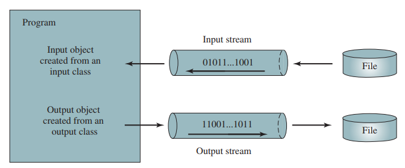

# CheckPoint Answers

## 17.2 How Is Text I/O Handled in Java?

### 17.2.1

> What is a text file and what is a binary file?  
> Can you view a text file or a binary file using a text editor?

**What is a text file and what is a binary file?**

A text file is a file comprised of human-readable characters, typically encoded using a character encoding such as ASCII or UTF-8. Common examples include source code files (like `.java` files) and documents. On the other hand, a binary file contains data in a format that is not directly human-readable, consisting of sequences of bytes that represent various types of information. Examples of binary files include compiled Java class files (`*.class`) and image files.

**Can you view a text file or a binary file using a text editor?**

Yes, you can view and edit text files using a text editor since they contain human-readable characters. However, when it comes to binary files, while you can technically open them with a text editor, the content will likely appear as gibberish because the bytes represent data structures and machine instructions rather than readable text. So, while you can "view" a binary file in a text editor, you can't interpret its contents in a meaningful way without specialized tools.

### 17.2.2

> How do you read or write text data in Java? What is a stream?

In Java, reading or writing text data involves using input and output streams. Input streams are used for reading data, while output streams are used for writing data.

To read text data from a file in Java, one common approach is to use the `Scanner` class. For example:

```java
Scanner scanner = new Scanner(new File("myFile.txt"));
```
This creates a `Scanner` object that reads from the file named "myFile.txt".

To write text data to a file, the `PrintWriter` class is often used. For instance:

```java
try (PrintWriter writer = new PrintWriter(new File("myFile.txt"))) {
        writer.print("Hello, World!");
} catch (FileNotFoundException e) {
        // Handle file not found exception
} catch (IOException e) {
        // Handle IOException
}
```
This snippet creates a `PrintWriter` object to write text to the file "myFile.txt", and then writes the text "Hello, World!" to the file.

Now, regarding streams: A stream in Java represents a continuous flow of data from a source to a destination. In the context of reading and writing files, streams are the pipe through which data is transferred between the file and your Java program. When reading from a file, a stream facilitates the **flow of bytes from the file to your program**. When writing to a file, a stream enables your program to send bytes from memory to the file.

Streams provide a flexible and efficient way to handle input and output operations in Java, allowing you to work with data from various sources and direct it to various destinations in a seamless manner. They abstract away many of the complexities associated with file I/O, making it easier to read and write data in Java programs.



## 17.3 Text I/O vs. Binary I/O

## 17.3.1

> What are the differences between text I/O and binary I/O?

Text I/O involves writing and reading human-readable text data. When you write text using Java's text I/O operations, the characters you write are encoded into bytes according to a specified character encoding (like UTF-8). These bytes are then stored in a file. When you read text from a file, the process is reversed: the bytes are decoded back into characters according to the same encoding, allowing you to interpret the text.

On the other hand, binary I/O deals with machine-readable data. When you write binary data using Java's binary I/O operations, you directly write the binary representation of the data to the file. This can include things like integers, floating-point numbers, and raw byte data. Similarly, when you read binary data, you read the bytes directly from the file without any interpretation or decoding into characters.

The main differences lie in how data is encoded and decoded: text I/O deals with character encoding and decoding, while binary I/O deals with raw binary data.
Text I/O is suitable for handling human-readable text, while binary I/O is more appropriate for machine-readable data or data that requires precise control over its binary representation.

## 17.3.2

> How is a Java character represented in the memory, and how is a character represented in a text file?

In Java, characters are represented using Unicode, typically using the UTF-16 encoding. In memory, each character is represented by one or two 16-bit values, depending on whether the character is within the Basic Multilingual Plane (BMP) or outside of it. UTF-16 allows for the representation of a wide range of characters, including those from various languages, symbols, and special characters.

When characters are written to a text file using text I/O operations in Java, they are encoded into bytes according to a specified character encoding, such as UTF-8 or UTF-16. Each character is represented by one or more bytes, depending on the encoding used. For example, in UTF-8, characters may be represented by one to four bytes, while in UTF-16, characters may be represented by one or two 16-bit values.

In contrast, binary files do not encode characters directly. Instead, they store data in its raw binary form. If you were to interpret the contents of a binary file as characters, you would typically see a sequence of bytes, where each byte represents a character according to the character encoding scheme used. However, binary files can contain any type of data, not just characters, and the interpretation of the data depends on how it is encoded and how it is interpreted by the program reading the file.

Java characters are represented using Unicode, typically using UTF-16 encoding. In a text file, characters are encoded into bytes according to a character encoding scheme. In a binary file, data is stored in its raw binary form, and the interpretation of the data depends on how it is encoded and how it is interpreted by the program reading the file.

## 17.3.3

> If you write the string "ABC" to an ASCII text file, what values are stored in the file?

- 'A' has an ASCII value of 65
- 'B' has an ASCII value of 66
- 'C' has an ASCII value of 67

So, the values stored in the file would be: `65 66 67`

Each value represents the ASCII code for the respective character, and these values would be stored in the file as bytes, with each character encoded as a single byte.

## 17.3.4

> If you write the string "100" to an ASCII text file, what values are stored in the file?  
> If you write a numeric byte-type value 100 using binary I/O, what values are stored in the file?

If you write string `100` to an ASCII text file, the values stored are `0x31 0x30 0x30`.  
If you write a numeric byte-type value 100 using binary I/O, the value stored in the file is `0x64`.

## 17.3.5

> What is the encoding scheme for representing a character in a Java program?  
> By default, what is the encoding scheme for a text file on Windows?

The encoding scheme for representing a character in a Java program is the **Unicode**. By default, a text file is encoded using **ASCII**.

## 17.4 Binary I/O Classes

### 17.4.1

> The read() method in InputStream reads a byte. Why does it return an int instead of a byte? Find the abstract methods in InputStream and OutputStream.

### 17.4.2

> Why do you have to declare to throw IOException in the method or use a try-catch block to handle IOException for Java I/O programs?

### 17.4.3

> Why should you always close streams? How do you close streams?

### 17.4.4

> Does FileInputStream/FileOutputStream introduce any new methods beyond the methods inherited from InputStream/OutputStream? How do you create a FileInputStream/FileOutputStream?

### 17.4.5

> What will happen if you attempt to create an input stream on a nonexistent file? What will happen if you attempt to create an output stream on an existing file? Can you append data to an existing file?

### 17.4.6

> How do you append data to an existing text file using java.io.PrintWriter? 17.4.7 What is written to a file using writeByte(91) on a FileOutputStream? 17.4.8 What is wrong in the following code? import java.io.*;

> ```java
> public class Test {
>     public static void main(String[] args) {
>         try (
>                 FileInputStream fis = new FileInputStream("test.dat");) {
>         } catch (IOException ex) {
>             ex.printStackTrace();
>         } catch (FileNotFoundException ex) {
>             ex.printStackTrace();
>         }
>     }
> }
> ```

### 17.4.9

> Suppose a file contains an unspecified number of double values that were written to the file using the writeDouble method using a DataOutputStream.  
> How do you write a program to read all these values? How do you detect the end of a file?

### 17.4.10

> How do you check the end of a file in an input stream (FileInputStream, DataInputStream)?

### 17.4.11

> Suppose you run the following program on Windows using the default ASCII encoding after the program is finished.  
> How many bytes are there in the file t.txt? Show the contents of each byte.

> ```java
> public class Test {
>     public static void main(String[] args)
>             throws java.io.IOException {
>         try (java.io.PrintWriter output =
>                      new java.io.PrintWriter("t.txt");) {
>             output.printf("%s", "1234");
>             output.printf("%s", "5678");
>             output.close();
>         }
>     }
> }
> ```

17.4.12 After the following program is finished, how many bytes are there in the file t.dat? Show the contents of each byte.

```java
import java.io.DataOutputStream;
import java.io.FileOutputStream;
import java.io.IOException;

public class Test {
    public static void main(String[] args) throws IOException {
        try (DataOutputStream output = new DataOutputStream(
                new FileOutputStream("t.dat"));) {
            output.writeInt(1234);
            output.writeInt(5678);
            output.close();
        }
    }
}
```

17.4.13 For each of the following statements on a DataOutputStream output, how many bytes are sent to the output?

```java
class FooBar {
    public static void main(String[] args) {
        output.writeChar('A');
        output.writeChars("BC");
        output.writeUTF("DEF");
    }
}
```

17.4.14 What are the advantages of using buffered streams? Are the following statements correct?

```java
class FooBarTwo {
    public static void main(String[] args) {
        BufferedInputStream input1 = new BufferedInputStream(new FileInputStream("t.dat"));
        DataInputStream input2 = new DataInputStream(new BufferedInputStream(new FileInputStream("t.dat")));
        DataOutputStream output = new DataOutputStream(new BufferedOutputStream(new FileOutnputStream("t.dat")));
    }
}

```
